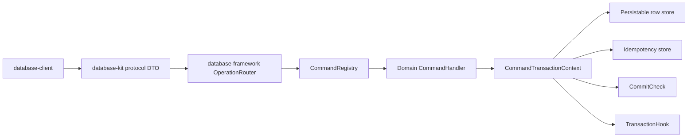
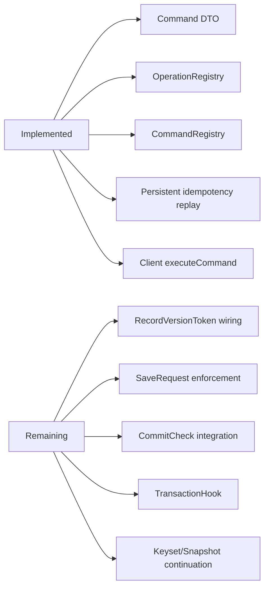
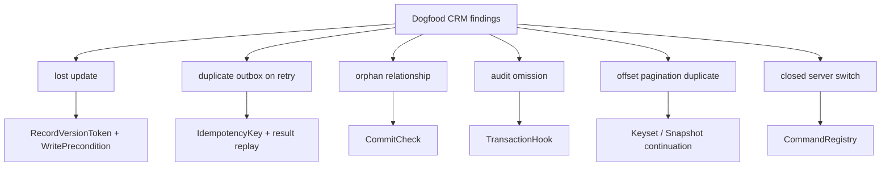
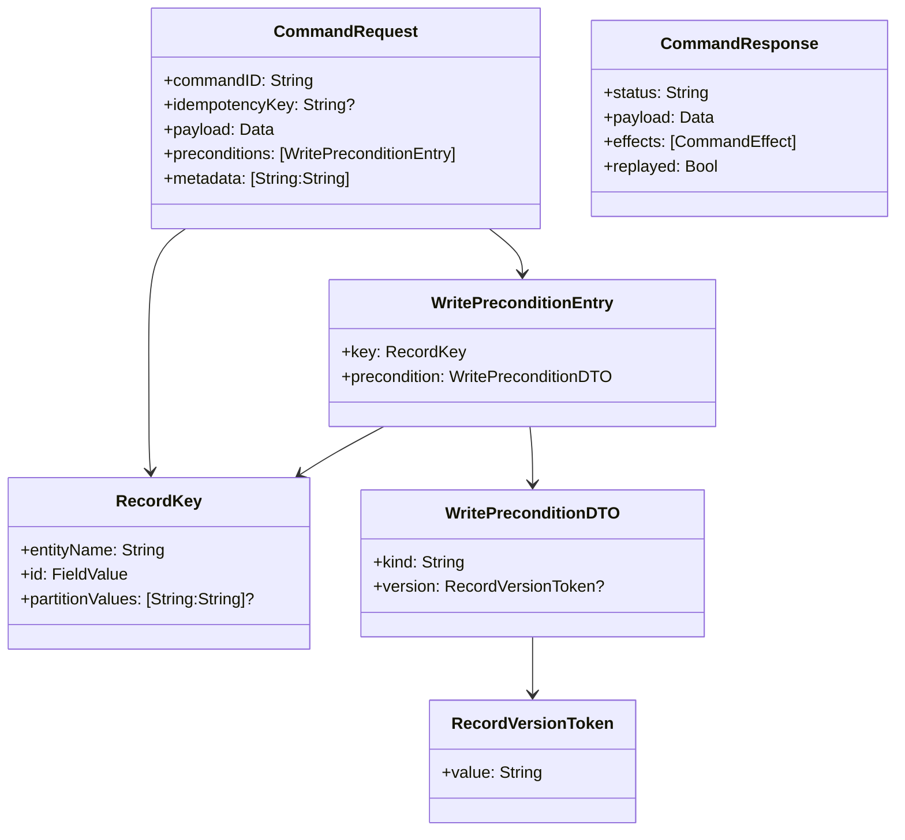
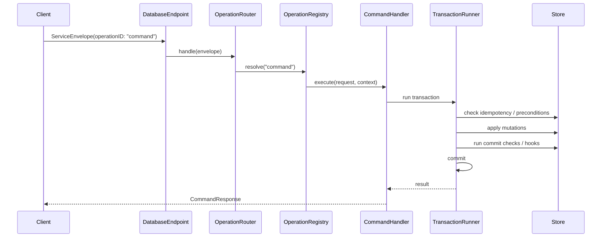
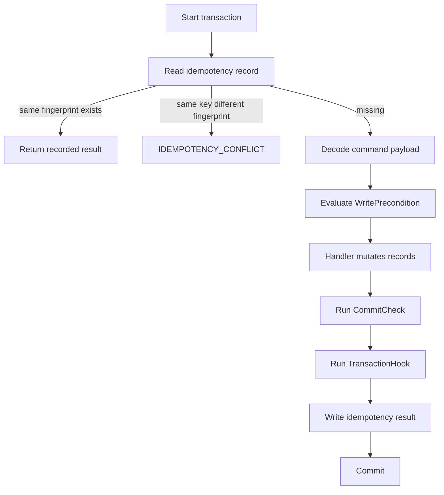
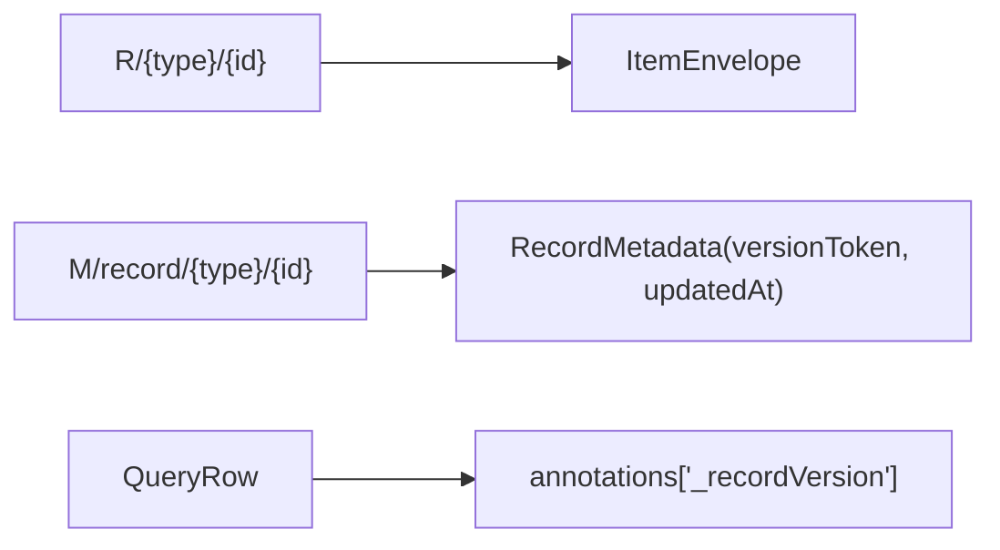
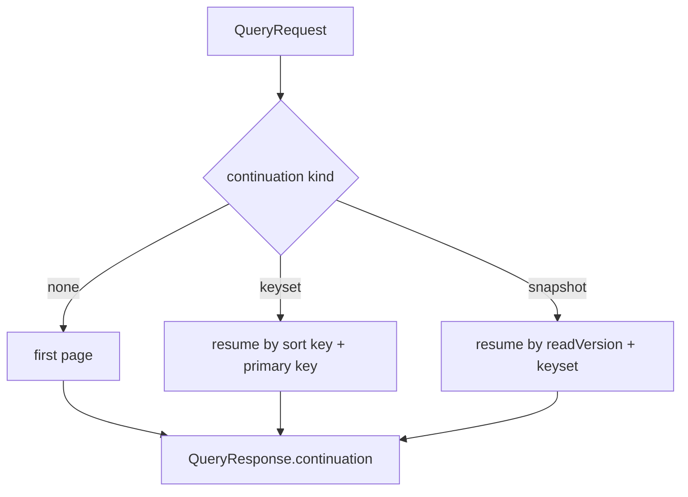

# Transaction Command Design

作成日: 2026-05-09  
対象: `database-kit`, `database-client`, `database-framework`  
目的: dogfood CRM で見えた Database 起因の運用課題を、本番設計として解消する

## 結論

CRM 固有の `ConvertLeadCommand` や `LogActivityCommand` を Database 本体に入れるべきではない。Database が持つべき責務は、業務 command を安全に実行するための汎用基盤である。



| 層 | 持つべき責務 | 持ってはいけない責務 |
|---|---|---|
| `database-kit` | wire-safe DTO、opaque token、client-safe metadata | server runtime、handler registry、backend access |
| `database-client` | typed command 呼び出し、`save` / `query` facade | commit-time validation、relationship enforcement |
| `database-framework` | registry、transaction runner、idempotency、precondition、hook 実行 | CRM 固有の stage rule や audit schema |
| domain package | command handler、業務不変条件、audit/outbox の具体 model | generic transaction / protocol の再実装 |

## Implementation Status

2026-05-09 時点で、command route の最小本番基盤は実装済みである。lost update / relationship / audit / pagination の完全解消には、下表の残作業が必要である。



| 項目 | 状態 | 現在の保証 | 残っていること |
|---|---|---|---|
| protocol DTO | 実装済み | `CommandRequest` / `CommandResponse` / precondition DTO を wire contract として共有 | なし |
| `SaveRequest` additive fields | 実装済み | 旧 payload を壊さず decode でき、changed-record `exists` / `notExists` を server `save` route で enforcement する | raw save idempotency と version precondition を追加する |
| `OperationRegistry` | 実装済み | unknown builtin operation を registry handler に委譲できる | builtin handler 化は段階的に進める |
| `CommandRegistry` | 実装済み | typed handler を `commandID` で解決し、decode / execute / encode できる | domain SDK で handler module を組み立てる |
| idempotency replay | 実装済み | 同一 tenant / command / key / fingerprint は handler 再実行なしで replay する | TTL / cleanup policy を追加する |
| command precondition | 一部実装済み | `exists` / `notExists` を command transaction 内で read conflict 付き評価する | version metadata 対応後に `matchesStored` を有効化する |
| client command API | 実装済み | `DatabaseContext.executeCommandResult` で typed response を取得できる | domain-specific sugar を外部 package に置く |
| version precondition | 未実装 | DTO はある | row metadata と token 発行/照合を実装する |
| commit check | 実装済み | handler が追加した check を idempotency result 保存前に実行する | built-in relationship check helper を追加する |
| transaction hook | 実装済み | handler が追加した hook を same transaction で idempotency result 保存前に実行する | built-in audit/outbox helper を追加する |
| continuation | 未実装 | opaque token の入口はある | keyset/snapshot token を server executor で生成する |

## 現状確認

| 項目 | 現状 | 判断 |
|---|---|---|
| extension operation | `ServiceEnvelope.operationID` は string で拡張可能 | 良い。command route はここに載せられる |
| client extension path | `DatabaseContext.executeOperation` が存在 | 良い。domain SDK の入口にできる |
| save protocol | `SaveRequest` は `[ChangeSet.Change]` のみ | 不足。precondition / idempotency / typed result がない |
| server routing | `OperationRouter` は `"save"`, `"query"`, `"schema"` の switch | 不足。operation registry がない |
| write precondition | server 内部に `WritePrecondition` が存在 | 良い。ただし client protocol へ出ていない |
| version precondition | `.matchesStored` は未対応として失敗 | 不足。record version token が必要 |
| commit check | `CommitCheck` / `CommitCheckRegistry` は存在 | 良い。ただし transaction path に統合されていない |
| read continuation | `QueryContinuation` は opaque string | 良い。ただし keyset / snapshot token 仕様が未確定 |

## 解くべき問題



| 優先度 | 問題 | Database 側の理想 |
|---|---|---|
| P1 | stale update が後勝ちになる | row ごとの opaque `RecordVersionToken` を発行し、write 時に照合する |
| P1 | retry で副作用が重複する | `IdempotencyKey` と request fingerprint で committed result を replay する |
| P1 | command が raw save に分解される | server-side `CommandRegistry` で command を transaction 内に閉じる |
| P2 | relationship が文字列規約になる | `RecordKey` と `CommitCheck` で参照存在性を検証する |
| P2 | audit/outbox を忘れられる | `TransactionHook` が same transaction で append する |
| P2 | offset pagination が運用中の挿入で崩れる | keyset continuation を標準化し、必要な画面に snapshot continuation を提供する |

## Protocol Design

`database-kit` に置く型は、server 実装を含まない wire contract だけにする。



| 型 | 置き場所 | 用途 |
|---|---|---|
| `RecordKey` | `database-kit` | entity/id/partition を文字列規約から型にする |
| `RecordVersionToken` | `database-kit` | backend versionstamp を直接晒さない opaque token |
| `WritePreconditionDTO` | `database-kit` | client/server protocol 上の existence/version 条件 |
| `WritePreconditionEntry` | `database-kit` | `Codable` な precondition list。dictionary key encode を避ける |
| `CommandRequest` | `database-kit` | `operationID == "command"` の payload |
| `CommandResponse` | `database-kit` | typed domain response を包む共通 response |
| `IdempotencyKey` | `database-kit` | retry の同一性を表す opaque key |

`SaveRequest` も additive に拡張する。

| field | 必須 | 意味 |
|---|---:|---|
| `changes` | yes | 既存の mutation list |
| `preconditions` | no | `RecordKey` ごとの write condition |
| `idempotencyKey` | no | raw save retry を安全にする |
| `clientMutationID` | no | UI / trace 用 correlation |

## Server Runtime Design

`OperationRouter` の closed switch は最小 builtin のみ残し、拡張 operation は registry に委譲する。



### OperationRegistry

```swift
public protocol ServiceOperationHandler: Sendable {
    var operationID: String { get }
    func handle(_ envelope: ServiceEnvelope, context: ServiceOperationContext) async throws -> ServiceEnvelope
}

public final class OperationRegistry: Sendable {
    public func register(_ handler: any ServiceOperationHandler)
    public func resolve(_ operationID: String) -> (any ServiceOperationHandler)?
}
```

`"save"`, `"query"`, `"schema"` は builtin handler として登録する。CRM や TicketOps は `"crm.command"` のような operation を外側から登録する。

### CommandRegistry

```swift
public protocol CommandHandler: Sendable {
    associatedtype Request: Decodable & Sendable
    associatedtype Response: Encodable & Sendable

    var commandID: String { get }

    func execute(
        _ request: Request,
        context: CommandTransactionContext
    ) async throws -> Response
}
```

`CommandRegistry` は `commandID` から handler を解決する。`operationID` は transport route、`commandID` は domain operation を表す。`CommandHandler` は associated type を持つため、実装では `AnyCommandHandler` で type erase して registry に格納する。

| 型 | 役割 |
|---|---|
| `CommandHandler` | domain が実装する typed handler |
| `AnyCommandHandler` | decode / execute / encode を閉じ込める type-erased wrapper |
| `CommandRegistry` | `commandID -> AnyCommandHandler` の解決 |

## Transaction Design

command は必ず単一 transaction 内で完結する。



| 機能 | 実装方針 |
|---|---|
| optimistic concurrency | `RecordVersionToken` を row metadata に保存し、write 前に照合 |
| existence precondition | 既存 `WritePrecondition.notExists` / `.exists` を protocol 経由で使う |
| version precondition | `.matchesStored(version:)` を row metadata 対応後に有効化 |
| idempotency | key, tenant, commandID, request fingerprint, encoded response を same transaction で保存 |
| relationship integrity | handler が `CommitCheck` を追加し、commit 前に transaction read で検証 |
| audit/outbox | `TransactionHook` が同じ transaction に `AuditEvent` / `OutboxEvent` を追加 |

handler は transaction closure 内で外部 API を直接呼ばない。外部送信は outbox record として保存し、commit 後の別 worker が配送する。

### Record Version

現状の `.matchesStored` は「versionstamp-based precondition is not yet supported」で失敗する。ここは明確な実装ギャップである。

理想は item value に業務 field と混ぜず、Database 管理の row metadata を持つこと。



| 方針 | 理由 |
|---|---|
| domain の `version` field に依存しない | 全 entity に業務 version を強制しない |
| token は opaque string | FDB versionstamp や backend 差異を client に漏らさない |
| query/get response の annotation に載せる | client が次回 write の expected token として使える |
| metadata write は row write と同じ transaction | lost update 防止の根拠になる |

## Idempotency Design

Idempotency は command handler の任意実装にしてはいけない。Database runtime が共通に保証する。

| key | value |
|---|---|
| `_idempotency/{tenantID}/{operationID}/{idempotencyKey}` | request fingerprint, response payload, status, committedAt |

| ケース | 結果 |
|---|---|
| 初回 request | handler 実行後、result を idempotency record に保存 |
| ACK 喪失後 retry | handler を再実行せず、保存済み result を返す |
| 同じ key で payload 違い | `IDEMPOTENCY_CONFLICT` |
| handler 実行中に競合 retry | 同じ idempotency key への write conflict で片方だけ commit |

## CommitCheck / Hook Design

`CommitCheckRegistry` は存在するが、現在は `FDBContext.save()` や `TransactionRunner` の標準経路に統合されていない。command 用には transaction-scoped registry を持たせる。

```swift
public protocol TransactionHook: Sendable {
    func beforeCommit(context: CommandTransactionContext) async throws
}

public final class CommandTransactionContext: Sendable {
    public func get<T: Persistable>(_ type: T.Type, id: any TupleElement) async throws -> T?
    public func set<T: Persistable>(_ model: T, precondition: WritePrecondition = .none) async throws
    public func delete<T: Persistable>(_ model: T, precondition: WritePrecondition = .none) async throws
    public func addCommitCheck(_ check: any CommitCheck, name: String, priority: Int)
    public func addHook(_ hook: any TransactionHook, priority: Int)
}
```

| 用途 | Database の責務 | domain の責務 |
|---|---|---|
| relationship | check 実行順序、失敗時 abort | どの参照を検証するか |
| audit | hook を同一 transaction で実行 | どの audit record を作るか |
| outbox | hook failure で transaction abort | event payload の内容 |
| quota | commit 前 read と conflict tracking | quota rule |

## Read Continuation Design

`QueryContinuation` は opaque なので、protocol は維持できる。中身の仕様を server runtime に定義する。



| token kind | 目的 | 含める情報 |
|---|---|---|
| keyset | 挿入/削除があっても重複しにくい pagination | query fingerprint, order keys, last sort values, last primary key |
| snapshot | 一覧の時点を固定した pagination | keyset token + read version + expiry |

`database-client` の `keysetPagination()` が現在返す `"keyset:v1"` は seed としては有効だが、本番では server が署名済み opaque token を返す必要がある。

## Error Model

| code | 発生条件 |
|---|---|
| `COMMAND_NOT_FOUND` | registry に `commandID` がない |
| `INVALID_COMMAND` | payload decode / validation failure |
| `PRECONDITION_FAILED` | exists / notExists / version mismatch |
| `IDEMPOTENCY_CONFLICT` | 同じ idempotency key に異なる fingerprint |
| `RELATIONSHIP_NOT_FOUND` | commit check で参照先がない |
| `COMMIT_CHECK_FAILED` | domain check が失敗 |
| `TRANSACTION_HOOK_FAILED` | audit/outbox hook が失敗 |
| `CONTINUATION_INVALID` | token decode / fingerprint mismatch / expiry |

## Migration Plan

| Phase | 実装 | 互換性 |
|---|---|---|
| 1 | `database-kit` に DTO を追加 | additive。既存 decoder を壊さない |
| 2 | `OperationRegistry` を導入し builtin operation を handler 化 | 既存 `"save"`, `"query"`, `"schema"` は維持 |
| 3 | `CommandRegistry` / `CommandTransactionContext` / idempotency store を追加 | domain package が opt-in |
| 4 | row metadata と `RecordVersionToken` を追加 | 旧 row は token absent として扱う migration path が必要 |
| 5 | `SaveRequest` に precondition / idempotency を追加 | old client は従来通り blind save |
| 6 | keyset / snapshot continuation executor を実装 | token は opaque なので client API は維持 |
| 7 | dogfood CRM を production command API に移行 | raw save path の課題解消を再検証 |

## Non-goals

| やらないこと | 理由 |
|---|---|
| Database 本体に CRM command を追加する | domain 固有であり OCP に反する |
| QueryIR に CRM / TicketOps 専用 case を追加する | QueryIR の closed enum 境界を再び狭める |
| client だけで relationship / audit を保証する | 悪意や retry、複数 client で破れる |
| domain の `version` field を標準 concurrency token にする | schema に業務都合を押し付ける |

## Implementation Notes

| File | 変更案 |
|---|---|
| `database-kit/Sources/DatabaseClientProtocol/ClientCommand.swift` | `CommandRequest`, `CommandResponse`, `RecordKey`, `RecordVersionToken` |
| `database-kit/Sources/DatabaseClientProtocol/ClientQuery.swift` | `SaveRequest` の optional field 追加 |
| `database-client/Sources/DatabaseClient/DatabaseContext.swift` | `executeCommand`, `save(options:)` sugar |
| `database-framework/Sources/DatabaseServer/Internal/OperationRouter.swift` | switch から `OperationRegistry` 委譲へ |
| `database-framework/Sources/DatabaseServer/DatabaseEndpoint.swift` | registry 注入 init を追加 |
| `database-framework/Sources/DatabaseEngine/Transaction` | `CommandTransactionContext`, hook registry, idempotency store |
| `database-framework/Sources/DatabaseEngine/Internal/FDBDataStore.swift` | row metadata / version token update |
| `database-framework/Sources/DatabaseEngine/Read` | keyset / snapshot continuation encoder |

## Acceptance Criteria

| シナリオ | 期待結果 |
|---|---|
| stale opportunity update | `PRECONDITION_FAILED` |
| ACK 喪失後 command retry | response replay、outbox は 1 件 |
| 同じ idempotency key で payload 違い | `IDEMPOTENCY_CONFLICT` |
| missing contact activity | `RELATIONSHIP_NOT_FOUND` |
| audit hook が失敗 | business mutation も commit されない |
| hot insert between pages | keyset continuation では duplicate なし |
| fixed report pagination | snapshot continuation では同じ read version を継続 |
| old client save | optional field なしで従来動作 |

## 最終判断

Database 起因として修正すべきものは、CRM 固有 API ではなく次の 6 点である。

1. `CommandRegistry`
2. `IdempotencyKey` と result replay
3. `RecordVersionToken` と version precondition
4. `CommitCheck` の transaction path 統合
5. `TransactionHook`
6. keyset / snapshot continuation

この設計なら、dogfood CRM で発生した lost update、retry duplicate、orphan relationship、audit omission、pagination duplicate を Database の汎用能力として解消できる。
