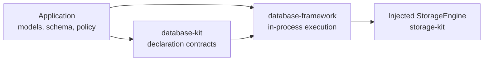

# database-framework

`database-framework` is the backend-neutral, in-process execution layer for
database models and schemas declared with
[`database-kit`](https://github.com/1amageek/database-kit).

It owns `DBContainer`, transaction coordination, model and document
persistence, query planning and execution, index maintenance, relationships,
graph and ontology execution, security enforcement, migrations, and
maintenance primitives. Physical storage is injected through the
`StorageEngine` contract from
[`storage-kit`](https://github.com/1amageek/storage-kit).

The package has no default SwiftPM traits. Backends, index families,
relationships, and `MultiBase` are selected explicitly by the consuming
package.

## Scope

The application owns its concrete schema. `database-kit` owns the declarations
used to describe it, this package executes it, and `storage-kit` performs the
physical storage operations.



| Layer | Responsibility |
|---|---|
| Application | Concrete models, schema, policy, runtime composition, and lifecycle |
| `database-kit` | `@Persistable`, schema metadata, query and mutation contracts, identity, graph and ontology declarations |
| `database-framework` | Registration, validation, transactions, persistence, query execution, indexes, relationships, security, graph, ontology, migrations, and maintenance |
| `storage-kit` | Storage transactions, key ranges, selectors, the Directory catalog, and concrete backend adapters |

This repository does not own application-specific schemas, transport or
protocol dispatch, remote jobs, server listeners, process lifecycle,
deployment hosts, or operator clients. Those layers may call the framework,
but their APIs and deployment instructions do not belong in this README.

## Architecture

`DatabaseRuntime` is the lightweight application-composition import. It
re-exports `DatabaseEngine`, `DatabaseKit` (and therefore `DatabaseTypes`), and
only the runtime feature modules selected by traits. It does not re-export
storage backends or `QueryAST`.

`Database` is the broader umbrella product. It additionally re-exports
`StorageKit`, `QueryAST`, and only the backend modules selected by traits.

```text
database-types
    portable primitive values
        |
        v
database-kit
    model, schema, query, identity, graph, and ontology contracts
        |
        v
database-framework
    DBContainer, DatabaseContext, transactions, execution, and indexes
        |
        v
storage-kit
    StorageEngine and concrete storage adapters
```

The normal lifecycle is:

```text
Schema + DatabaseRuntimeConfiguration + initialized StorageEngine
                              |
                              v
                         DBContainer
                              |
                              v
                 authorization-bound DatabaseContext
                              |
                              v
                    StorageEngine transaction
```

`DBConfiguration(storageEngine:)` transfers the initialized engine to the
configuration and then to `DBContainer`. Opening failure, explicit
`shutdown()`, and container deinitialization converge on the container-owned
shutdown path. Callers must not keep an operational path that reuses or shuts
down the transferred engine independently.

## Requirements

- Swift 6.4 development snapshot
  `swift-6.4.x-DEVELOPMENT-SNAPSHOT-2026-08-14-a` with its matching Swift SDK
- macOS 26 or later, iOS 26 or later, or a supported Linux Swift toolchain
- A `StorageEngine` implementation available for the target runtime

## Installation

Add the package and select the backend and runtime features required by the
application:

```swift
dependencies: [
    .package(
        url: "https://github.com/1amageek/database-framework.git",
        from: "26.0818.0",
        traits: ["SQLite", "ScalarIndexes"]
    )
]
```

Then depend on the umbrella product:

```swift
.target(
    name: "Application",
    dependencies: [
        .product(name: "Database", package: "database-framework")
    ]
)
```

With no traits, `Database` contains the backend-neutral engine and runtime
composition only. SwiftPM unifies traits requested through every dependency
path, so the effective composition is the union selected by the complete
package graph.

## Trait Selection

Backend traits add facade support for adapters implemented by `storage-kit`:

| Trait | Adapter | Package platforms |
|---|---|---|
| `FoundationDB` | `FDBStorageEngine` | macOS, Linux |
| `SQLite` | `SQLiteStorageEngine` | macOS, iOS, Linux |
| `PostgreSQL` | `PostgreSQLStorageEngine` | macOS, iOS, Linux |
| None | Any injected `StorageEngine` | Wherever that engine is available |

Runtime feature traits control which implementations enter `DatabaseRuntime`
and the `Database` umbrella:

| Trait | Added capability |
|---|---|
| `ScalarIndexes` | Scalar and composite indexes |
| `VectorIndexes` | Flat, HNSW, IVF, and PQ vector indexes |
| `FullTextIndexes` | Full-text and autocomplete indexes |
| `SpatialIndexes` | Spatial indexes |
| `RankIndexes` | Ordered rank indexes |
| `BitmapIndexes` | Bitmap indexes |
| `VersionIndexes` | Version-aware indexes |
| `GraphIndexes` | Scalar, graph, ontology, RDF, and SPARQL execution; enables `ScalarIndexes` |
| `AggregationIndexes` | Count, numeric, distinct, and percentile indexes |
| `LeaderboardIndexes` | Time-window leaderboard indexes |
| `Relationships` | Relationship mutation maintenance and reads |
| `AllRuntimeFeatures` | Every index and relationship feature above |
| `MultiBase` | Base lifecycle, placement, persisted Grants, named/derived read-only Composition execution, and same-domain decision transactions |

`AllRuntimeFeatures` does not enable a backend and does not enable
`MultiBase`. Runtime bootstrap validates the selected implementation set
against the complete schema and fails when a required capability is missing;
it does not replace missing capabilities with scans or no-op maintenance.

## Quick Start

The model and schema remain independent of the selected backend:

```swift
import Database

@Persistable
struct User {
    #Directory<User>("app", "users")
    #Index(.ordered(
        name: "User_email",
        keys: [.ascending(\User.email)],
        unique: true
    ))

    var id: String = ""
    var email: String
    var name: String
}

let schema = try Schema(
    entities: [try User.schemaEntity],
    version: .init(1, 0, 0)
)

let runtime = try DatabaseFrameworkRuntime.configuration(
    executionIdentity: DatabaseExecutionRuntimeIdentity(
        identifier: "application",
        revision: 1
    ),
    entityRuntimes: [
        try DatabaseFrameworkRuntime.entity(User.self)
    ]
)

let configuration = DBConfiguration(
    storageEngine: engine,
    monotonicClock: applicationMonotonicClock,
    wallClock: applicationWallClock
)

let container = try await DBContainer.open(
    for: schema,
    configuration: configuration,
    runtimeConfiguration: runtime
)

let context = container.newContext(authorization: .anonymous)
try context.insert(
    User(
        id: "alice",
        email: "alice@example.com",
        name: "Alice"
    )
)
try await context.save()

let users = try await context.fetch(User.self)
    .where(User.fields.name == "Alice")
    .execute()

await container.shutdown()
```

`executionIdentity` identifies application-owned executable behavior that is
not represented by the schema manifest. Keep its identifier stable and increase
the revision whenever authorization policies, entity adapters, mutation
maintainers, or query executors change. A revision change publishes a new
execution generation and invalidates continuations created by the prior one.

`engine`, `applicationMonotonicClock`, and `applicationWallClock` are supplied
by the composition layer. Native facade overloads can construct selected
backend engines from their configurations; custom and host-provided engines
use `DBConfiguration` directly.

Every runtime entity registration must match its complete `Schema.Entity`.
When indexes are supplied outside a model declaration, pass the same ordered
`[IndexDescriptor]` to both `Schema.Entity(from:including:)` and
`DatabaseFrameworkRuntime.entity(_:including:)`.

## Runtime Model

### Container and context

`DBContainer` is a long-lived composition and resource owner. It retains the
schema generation, storage engine, runtime registrations, index services,
security configuration, clocks, and maintenance state.

`DatabaseContext` is an authorization-bound unit of work. It stages inserts,
updates, upserts, and deletes; `save()` commits the staged mutations and their
derived index and relationship changes in one logical transaction. Fetches
read persisted data and do not merge uncommitted staged values into results.

```text
DBContainer
    +-- Schema generation
    +-- DatabaseRuntimeConfiguration
    +-- StorageEngine lifecycle
    `-- DatabaseContext
            +-- AuthorizationContext
            +-- Pending mutations
            +-- Queries and cursors
            `-- Atomic save
```

### Queries

The framework binds and executes type-safe key-path queries and canonical
query contracts from `database-kit`. `QueryAST` supplies SQL and SPARQL parsing
and serialization. Trait-selected modules provide physical readers for
ordered, vector, full-text, spatial, graph, aggregation, rank, bitmap,
history, and leaderboard indexes.

Planning, index admission, and the physical read share the caller-owned
transaction. Unsupported operations, malformed persisted state, and storage
failures propagate as typed failures; they are not converted into empty
results or silent fallback behavior.

See [Query and Fusion](docs/query.md) for query-family responsibilities and
fusion execution.

### Index lifecycle

Index declarations belong to the application schema. The framework validates
their runtime providers, maintains index entries in the model mutation
transaction, manages lifecycle state, and performs online build and scrub
operations. Only a persisted `readable` state can reach a physical index
reader.

See [Index Runtime Design](docs/INDEX_RUNTIME_DESIGN.md) for typed dispatch,
fingerprinted physical generations, lifecycle, and replacement semantics.

Feature-specific APIs are documented with their modules:

| Area | Documentation |
|---|---|
| Scalar | [ScalarIndex](Sources/ScalarIndex/README.md) |
| Vector | [VectorIndex](Sources/VectorIndex/README.md) |
| Full text | [FullTextIndex](Sources/FullTextIndex/README.md) |
| Spatial | [SpatialIndex](Sources/SpatialIndex/README.md) |
| Rank | [RankIndex](Sources/RankIndex/README.md) |
| Graph and ontology | [GraphIndex](Sources/GraphIndex/README.md), [Ontology](docs/ontology.md) |
| Aggregation | [AggregationIndex](Sources/AggregationIndex/README.md) |
| Version | [VersionIndex](Sources/VersionIndex/README.md) |
| Bitmap | [BitmapIndex](Sources/BitmapIndex/README.md) |
| Leaderboard | [LeaderboardIndex](Sources/LeaderboardIndex/README.md) |
| Relationships | [RelationshipIndex](Sources/RelationshipIndex/README.md) |

### Schema and migrations

The application owns schema versions and migration intent. The framework owns
durable schema registration, immutable schema generations, migration execution,
index initialization, and online publication. In-flight operations retain the
generation they acquired; publication does not mutate their schema view.

Compiled applications use `VersionedSchema` and `SchemaMigrationPlan`.
Schema-driven runtimes can restore registrations from canonical schema
metadata. Remote schema administration and request dispatch are outside this
package.

### Security

`DatabaseContext` binds an `AuthorizationContext` to execution. Container-local
runtime configuration registers entity authorization policies, while the
engine evaluates entity and field rules before accepting reads and mutations.
Query authorization is not implemented as client-side or post-query filtering.

See [Security](docs/security.md) for policy registration and production
requirements.

### MultiBase

The standard composition owns one engine and one database root. The optional
`MultiBase` trait instead enables explicit Base data boundaries,
placement, Base-local persisted Grants, and read-only Compositions.

```text
standard composition
    DBContainer(one engine, one root)
        `-- newContext(authorization:)

MultiBase composition
    DBContainer(control and data domains)
        `-- session(authorization:)
                +-- base(id)             -> read and mutation
                +-- composition(id)      -> named read-only selection
                `-- composition(bases:)  -> derived read-only selection
```

Relational Composition planning belongs to `DatabaseEngine`. RDF/SPARQL
Composition planning belongs to the optional `GraphIndex` target. A
standalone server may adapt these same in-process planners to DatabaseWire
pages, but server dispatch, continuations, and jobs are not framework
responsibilities.

This is a separate storage and authorization model, not a general runtime
feature bundle. See [Base and Composition](docs/base-composition.md) for its
contract and current verification status.

### Observability

Logging and metrics are container-scoped and injected through
`DatabaseLoggingConfiguration` and `DatabaseMetricsConfiguration`. The
optional `SwiftLogDatabaseLogging` and `SwiftMetricsDatabaseMetrics` products
adapt those contracts to Swift Log and Swift Metrics without making either a
core engine dependency.

## Products

| Product | Role |
|---|---|
| `Database` | Primary umbrella with trait-selected re-exports |
| `DatabaseEngine` | Container, contexts, transactions, persistence, planning, security, schema, and maintenance |
| `DatabaseRuntime` | Lightweight application composition, with core execution, declarations, primitive values, and trait-selected runtime feature re-exports |
| `QueryAST` | SQL and SPARQL syntax parsing and serialization |
| `DatabaseMath` | Numeric primitives shared by execution features |
| `ScalarIndex`, `VectorIndex`, `FullTextIndex`, `SpatialIndex` | Individual index implementations |
| `RankIndex`, `AggregationIndex`, `VersionIndex` | Individual index implementations |
| `BitmapIndex`, `LeaderboardIndex`, `GraphIndex`, `OntologyIndex`, `RelationshipIndex` | Individual index implementations |
| `SwiftLogDatabaseLogging` | Swift Log adapter |
| `SwiftMetricsDatabaseMetrics` | Swift Metrics adapter |

Use `DatabaseRuntime` when a host adapter supplies storage and the application
needs the framework's declarations and execution runtime. Use `Database` when
the application also wants the storage and query-parser umbrella. Import
individual products when a package intentionally needs a narrower dependency
surface.

## Benchmark ownership

Performance measurement is not part of this package's product or test graph.
The independent [`Benchmarks`](Benchmarks) Swift package owns FoundationDB
workloads, while the sibling `database-framework-benchmark` repository owns
`BenchmarkFramework`, reporters, and executable profiles. Changes under
`Benchmarks` therefore do not make the framework test harness rebuild or run
performance workloads.

## Platform Support

| Platform | Framework support |
|---|---|
| macOS | Core runtime; FoundationDB, SQLite, and PostgreSQL facade adapters |
| iOS | Core runtime; SQLite and PostgreSQL facade adapters |
| Linux | Core runtime; FoundationDB, SQLite, and PostgreSQL adapters where their dependencies are available |
| WASI / Embedded | Backend-neutral runtime with an injected host-provided `StorageEngine`; no native backend facade |

FoundationDB-specific imports require both the `FoundationDB` trait and a
macOS or Linux target. SQLite and PostgreSQL traits do not link the
FoundationDB client.

## Documentation

| Document | Purpose |
|---|---|
| [User Guide](docs/guide.md) | Models, contexts, change tracking, queries, transactions, indexes, and migrations |
| [Architecture and Ownership](docs/architecture.md) | Package boundaries, runtime composition, ownership, transactions, and synchronization |
| [Backend Guide](docs/backends.md) | Adapter selection, configuration, lifecycle, and backend semantics |
| [Query and Fusion](docs/query.md) | Query ownership and execution families |
| [Ontology and Graph](docs/ontology.md) | Graph and ontology persistence and query boundaries |
| [Security](docs/security.md) | Authorization and field-policy execution |
| [Base and Composition](docs/base-composition.md) | Optional multi-base storage and authorization model |
| [Production Readiness](docs/production-readiness.md) | Runtime, backend, observability, and release checks |

## Verification

Repository verification uses `scripts/xcode-test-harness`, which selects the
requested traits in an isolated source copy, invokes Xcode with an external
timeout, and validates the result bundle. Backend services and expected test
counts are part of the maintained harness contract.

Start with the narrowest affected selector, then run the complete affected
backend composition. The authoritative commands and current expected counts
are documented in [Production Readiness](docs/production-readiness.md).

## License

Licensed under the [MIT License](LICENSE).
