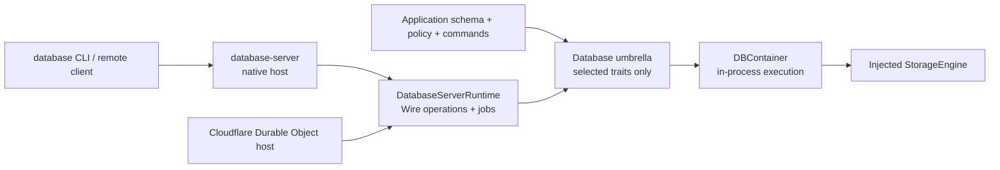

# database-framework

A backend-neutral Swift execution layer for models defined with
[database-kit](https://github.com/1amageek/database-kit).

database-framework owns schema registration, transactions, query planning,
persistence, migrations, and index maintenance. Storage is supplied through
the backend-neutral protocols in
[storage-kit](https://github.com/1amageek/storage-kit).

The package has no default SwiftPM traits. A plain `Database` dependency links
the backend-neutral execution contracts only. Backends, index families, graph
execution, relationships, and `MultipleBases` are explicit opt-ins.
FoundationDB is one storage adapter, not a dependency of the execution engine.
The same execution layer can run with FoundationDB, SQLite, PostgreSQL, an
in-memory engine, or another `StorageEngine` implementation.

## Use the framework first

`database-framework` is the primary application API. An application can import
the `Database` umbrella, select only the backend and feature traits it uses,
define its schema and commands, and own `DBContainer` directly. This is the
lightweight path for an embedded database, an in-process service, or a custom
database product. It does not require the `database-server` package, an HTTP
listener, authentication files, or a child process.

`database-server` is an optional native deployment host. Add it only when the
same framework runtime must run as a standalone process and be reached through
HTTP, WebSocket, or private stdio DatabaseWire transports.



| Requirement | Use |
|---|---|
| Lightweight in-process or Embedded customization | `database-framework` / `Database` |
| Application-specific schema, indexes, commands, or policy | `database-framework` / `Database` |
| Standalone native process or remote DatabaseWire endpoint | add `database-server` |
| Cloudflare deployment | add `database-framework-cloudflare`; it consumes `DatabaseServerRuntime`, not the native host |

Remote operation dispatch is not a framework responsibility. The independent
`database-server` package owns the Foundation-independent
`DatabaseServerRuntime` product and its native `DatabaseServerHost`. Cloudflare
reuses the runtime product without linking Hummingbird, TLS, process, signal,
or stdio implementations.

| Product | Responsibility | Included by `Database` |
|---|---|---|
| `DatabaseEngine` | transactions, persistence, planning, schema and security execution | yes |
| `DatabaseRuntime` | trait-selected runtime registrations | yes |
| `DatabaseMath` | reusable numeric execution primitives used by framework features and server algorithms | no |
| `database-server / DatabaseServerRuntime` | DatabaseWire dispatch, remote commands, durable jobs, schema administration | separate package |
| `database-server / DatabaseServerHost` | native listener, TLS, auth, stdio, signals and shutdown | separate package |

## Architecture

The package separates application behavior from storage deployment:

    database-types
      FieldValue and portable database primitives
            |
            v
    database-kit
      Model contracts, schema metadata, EntityReference, QueryIR, DatabaseWire
            |
            v
    database-framework
      DBContainer, schema generations, query planner, migrations, indexes
            |
            v
    storage-kit
      StorageEngine, Transaction, Tuple, Subspace, NamespaceResolver/Catalog
            |
            +----------------+------------------+------------------+
            v                v                  v                  v
      FoundationDB       SQLite             PostgreSQL          Custom
      distributed       local/embedded     server/Cloud SQL    InMemory/remote

Application model, query, and index declarations stay the same when the
backend changes. A consuming package uses SwiftPM traits to include concrete
backend adapters and optional runtime capabilities. At runtime,
`DBConfiguration(storageEngine:monotonicClock:wallClock:)` injects the
initialized engine and clocks that one container owns.

### Responsibilities

- DBContainer owns the schema, storage engine, directory resolution, and
  index lifecycle. Online schema publication replaces one immutable runtime
  generation; an in-flight operation retains its original generation.
- DatabaseContext is the backend-neutral user-facing change-tracking context
  and application transaction entry point.
- DatabaseEngine provides backend-neutral persistence, transaction
  coordination, query planning, migrations, security, and schema catalog logic.
- Index modules maintain and query Scalar, Vector, FullText, Spatial, Graph,
  Aggregation, Rank, Bitmap, Version, Leaderboard, Permuted, Relationship,
  and Ontology indexes.
- StorageKit defines the storage contract and supplies concrete backend
  engines. Only this layer knows backend-specific transaction APIs.

## Backend Selection

| Backend | Trait | Supported package platforms | Storage engine |
|---|---|---|---|
| FoundationDB | `FoundationDB` | macOS, Linux | `FDBStorageEngine` |
| SQLite | `SQLite` | macOS, iOS, Linux | `SQLiteStorageEngine` |
| PostgreSQL | `PostgreSQL` | macOS, iOS, Linux | `PostgreSQLStorageEngine` |
| Custom | none in database-framework | where the implementation is available | any `StorageEngine` |

The common execution path is:

    Schema + DBConfiguration
                |
                v
           DBContainer
                |
                v
            DatabaseContext
                |
                v
      StorageEngine.withTransaction

The framework does not silently assume FoundationDB when a custom engine is
provided. Backend-specific operations are implemented by StorageKit. When a
backend cannot provide an operation, it must expose an explicit error or a
documented semantic mapping.

## Installation

### Requirements

- Swift 6.4 development snapshot
  `swift-6.4.x-DEVELOPMENT-SNAPSHOT-2026-07-23-a` and its matching Swift SDK
- macOS 26 or later, iOS 26 or later, or a supported Linux Swift toolchain
- One StorageKit backend selected for the target

    dependencies: [
        .package(
            url: "https://github.com/1amageek/database-framework.git",
            from: "26.0814.0"
        )
    ]

`Database` is the package's umbrella product. It always re-exports the
backend-neutral model, storage, execution, runtime-composition, and query
contracts. Index and backend modules enter the `Database` target dependency
graph and its re-exported API only when the corresponding package trait is
active. `Database` is not itself a trait.

The package that consumes database-framework selects that composition:

    .package(
        url: "https://github.com/1amageek/database-framework.git",
        from: "26.0814.0",
        traits: ["GraphIndexes"]
    )

With no traits, no concrete backend or optional index implementation enters the
`Database` dependency graph. Individual products such as `DatabaseEngine` and
`VectorIndex` remain available when an application does not want the umbrella
import. SwiftPM unifies traits requested through different dependency paths,
so the final composition is the union requested by the complete package graph.

DatabaseRuntime selects its index and relationship capabilities with SwiftPM
traits. Applications enable `MultipleBases` only when they need Base lifecycle,
placement, Base-local Grants, or read-only Composition execution. Embedded
applications should pass only the traits they use so unused implementations
never enter the target dependency graph.
`GraphIndexes`, for example, includes the scalar support required by graph
execution without linking vector, full-text, aggregation, or leaderboard
indexes. `Relationships` is independent and is needed only when the application
uses RelationshipIndex. Runtime bootstrap still validates the compiled
composition against the application schema and fails when a required capability
is absent.

## Quick Start

The model and application code are backend-neutral:

    import Database

    @Persistable
    struct User {
        #Directory<User>("app", "users")
        #Index(
            .scalar,
            fields: [\User.email],
            unique: true,
            name: "User_email"
        )

        var id: String = ""
        var email: String
        var name: String
    }

    let schema = try Schema(
        entities: [try User.schemaEntity],
        version: .init(1, 0, 0)
    )
    let runtime = try DatabaseFrameworkRuntime.configuration(
        entityRuntimes: [try DatabaseFrameworkRuntime.entity(User.self)]
    )

    // Supply a backend-specific configuration here.
    let container = try await DBContainer.open(
        for: schema,
        configuration: DBConfiguration(
            storageEngine: engine,
            monotonicClock: applicationMonotonicClock,
            wallClock: applicationWallClock
        ),
        runtimeConfiguration: runtime
    )

    let context = container.newContext(authorization: authorization)
    try context.insert(
        User(id: "alice", email: "alice@example.com", name: "Alice")
    )
    try await context.save()

    let users = try await context.fetch(User.self)
        .where(User.fields.name == "Alice")
        .execute()

The engine and clocks in the example are intentionally abstract. Every runtime
injects a monotonic clock for scheduling and a wall clock for persisted time.
Native applications can use Foundation-backed adapters; Embedded runtimes
provide clocks at their platform boundary. Choose one backend below.

Runtime bootstrap requires every registered entity runtime to match its
complete `Schema.Entity`; sharing only the entity name is insufficient. When
an application adds indexes outside the model declaration, pass the same
ordered `[IndexDescriptor]` to both `Schema.Entity(from:including:)` and
`DatabaseFrameworkRuntime.entity(_:including:)`.

Index reads resolve the exact entity, index name, and index kind from that
schema. For an existing namespace, the selected index must have one valid
persisted `readable` lifecycle state; missing or malformed state is a typed
failure and is never treated as an empty result. Lifecycle admission and the
zero-copy physical cursor share the caller's transaction.

## Backend Examples

### FoundationDB

FoundationDB is an explicit opt-in on macOS and Linux. It provides distributed
transactions, native versionstamps, and the dynamic FoundationDB DirectoryLayer.
The FoundationDB adapter is not compiled for iOS or WASI.

    scripts/fdb-test-env run --clean -- \
      scripts/xcode-test-harness \
        --traits FoundationDB,AllRuntimeFeatures,MultipleBases \
        --skip-testing BenchmarkFrameworkTests \
        --skip-testing PerformanceBenchmarks \
        --expected-count 3681 \
        --require-zero-skips \
        --require-zero-expected-failures \
        --require-zero-runtime-warnings

    import Database

The facade requires both an explicit FoundationDB storage configuration and a
non-empty application Directory. It resolves that Directory once before
transferring the engine and resolved root to the container:

    let container = try await DBContainer.open(
        for: schema,
        configuration: try FDBDatabaseConfiguration(
            storage: FDBStorageEngine.Configuration(),
            directoryPath: ["applications", "calendar"]
        ),
        monotonicClock: applicationMonotonicClock,
        wallClock: applicationWallClock,
        runtimeConfiguration: runtime
    )

For local testing, the repository includes an isolated cluster wrapper:

    scripts/fdb-test-env run --clean -- \
      scripts/xcode-test-harness \
        --traits FoundationDB,AllRuntimeFeatures,MultipleBases \
        --skip-testing BenchmarkFrameworkTests \
        --skip-testing PerformanceBenchmarks \
        --expected-count 3681 \
        --require-zero-skips \
        --require-zero-expected-failures \
        --require-zero-runtime-warnings

### SQLite

SQLite is the local and embedded backend. It does not load libfdb_c and does
not require a FoundationDB process.

    scripts/xcode-test-harness \
      --traits SQLite,AllRuntimeFeatures \
      --only-testing SQLiteTests \
      --expected-count 111 \
      --require-zero-skips \
      --require-zero-expected-failures \
      --require-zero-runtime-warnings

`MultipleBases` adds Base isolation, persisted Grants, and Composition
execution to the same backend suite:

    scripts/xcode-test-harness \
      --traits SQLite,AllRuntimeFeatures,MultipleBases \
      --only-testing SQLiteTests \
      --expected-count 114 \
      --require-zero-skips \
      --require-zero-expected-failures \
      --require-zero-runtime-warnings

    import Database
    import SQLiteStorage

    let container = try await DBContainer.open(
        for: schema,
        configuration: SQLiteStorageEngine.Configuration.file(
            "/path/to/application.sqlite"
        ),
        monotonicClock: applicationMonotonicClock,
        wallClock: applicationWallClock,
        runtimeConfiguration: runtime
    )

For tests and disposable processes:

    let container = try await DBContainer.open(
        for: schema,
        configuration: SQLiteStorageEngine.Configuration.inMemory,
        monotonicClock: applicationMonotonicClock,
        wallClock: applicationWallClock,
        runtimeConfiguration: runtime
    )

### PostgreSQL and Cloud SQL

PostgreSQL is the server-side backend. The default isolation level is
SERIALIZABLE so transaction behavior is aligned with the framework's strong
consistency model. It can connect over TCP, a Unix domain socket, or the
Cloud SQL socket mounted into Cloud Run.

    POSTGRES_TEST_HOST=database.test \
    POSTGRES_TEST_PORT=5432 \
    POSTGRES_TEST_USER=postgres \
    POSTGRES_TEST_PASSWORD=test \
    POSTGRES_TEST_DB=database_framework_test \
    scripts/xcode-test-harness \
      --traits PostgreSQL,AllRuntimeFeatures \
      --only-testing PostgreSQLTests \
      --expected-count 72 \
      --require-zero-skips \
      --require-zero-expected-failures \
      --require-zero-runtime-warnings

    import Database
    import PostgreSQLStorage

    let postgres = PostgreSQLConfiguration(
        host: "127.0.0.1",
        port: 5432,
        username: "app",
        password: password,
        database: "app",
        schemaManagement: .createIfNeeded
    )

    let container = try await DBContainer.open(
        for: schema,
        configuration: postgres,
        monotonicClock: applicationMonotonicClock,
        wallClock: applicationWallClock,
        runtimeConfiguration: runtime
    )

Cloud Run with Cloud SQL uses the same DBContainer API; only the storage
configuration changes:

    let postgres = PostgreSQLConfiguration(
        cloudSQLInstanceConnectionName: "PROJECT:REGION:INSTANCE",
        username: username,
        password: password,
        database: databaseName,
        schemaManagement: .assumeExists
    )

    let container = try await DBContainer.open(
        for: schema,
        configuration: postgres,
        monotonicClock: applicationMonotonicClock,
        wallClock: applicationWallClock,
        runtimeConfiguration: runtime
    )

Use assumeExists when the Cloud SQL role is restricted to DML and the KV table
is provisioned separately. See
[docs/deployment/cloud-run-vapor-postgresql.md](docs/deployment/cloud-run-vapor-postgresql.md) for
the Cloud Run and Vapor deployment shape.

### Custom and In-Memory Engines

DatabaseEngine accepts any StorageEngine. This is the extension point for
tests, local tools, storage proxies, and future backends.

    import Database
    import StorageKit

    let engine = InMemoryEngine()
    let container = try await DBContainer.open(
        for: schema,
        configuration: DBConfiguration(
            storageEngine: engine,
            monotonicClock: applicationMonotonicClock,
            wallClock: applicationWallClock
        ),
        runtimeConfiguration: runtime
    )

The same injection path is used for a custom remote or host-provided engine:

    let configuration = DBConfiguration(
        name: "application-storage",
        storageEngine: customEngine,
        monotonicClock: applicationMonotonicClock,
        wallClock: applicationWallClock,
        indexConfigurations: [vectorConfiguration]
    )
    let container = try await DBContainer.open(
        for: schema,
        configuration: configuration,
        runtimeConfiguration: runtime
    )

## Transaction and Context Model

By default, `DBContainer` owns exactly one injected engine and one ordinary
database root. Its transaction path has no Base catalog lookup, target
TaskLocal, placement resolution, persisted Grant read, or Composition planner.
`DBConfiguration.databaseRoot` is the already-resolved root and defaults to the
engine root. SQLite, PostgreSQL, in-memory, and Durable Object deployments use
that root directly. A host sharing one FoundationDB cluster must first resolve
an explicitly selected Directory and inject its retained `Subspace`; the
framework never performs a Directory lookup on the data path. A populated root
without the current format descriptor is rejected as a typed format failure and
is never interpreted as an empty database.

The optional `MultipleBases` trait replaces that storage composition with a
control domain and explicit Base roots. It adds Base-local persisted Grants and
read-only Compositions; it is not part of `AllRuntimeFeatures`.

    default
      DBContainer(one engine) --> newContext(authorization:) --> data

    MultipleBases
      DBContainer(control + data domains)
          --> session(authorization:)
                +--> base(Base.ID) --> mutable Base root
                `--> composition(ID) --> read-only members

Creating `DBConfiguration(storageEngine:)` transfers the one engine lifecycle
to the configuration and then to `DBContainer`. With `MultipleBases`, the
separate `DBConfiguration(storageTopology:)` initializer transfers every
configured domain engine. Opening failure and terminal shutdown await the
authoritative engine shutdown in either form; the caller must not keep an
operational path that bypasses container ownership.

    let context = container.newContext(authorization: authorization)

    try context.insert(user)
    try context.insert(order)
    try context.delete(previousUser)

    // All staged mutations are committed as one transaction.
    try await context.save()

With `MultipleBases`, select the Base explicitly instead:

    let session = container.session(authorization: authorization)
    let context = session.base(baseID).newContext()

For direct transactional work:

    try await context.withTransaction { transaction in
        let value = try await transaction.getValue(for: key)
        try transaction.setValue(updatedValue, for: key)
        _ = value
    }

Transactions, range scans, key selectors, tuple encoding, and directory
resolution are expressed through StorageKit. The selected backend controls
connection management and physical implementation.

At the host's terminal lifecycle boundary:

    container.shutdown()

## Indexes

Index declarations are part of the model schema. Index maintainers use the
same StorageKit contracts regardless of the selected backend.

| Module | Index | Typical capability |
|---|---|---|
| ScalarIndex | scalar / composite | equality, ranges, sorting, uniqueness |
| VectorIndex | Flat / HNSW / IVF / PQ | exact and approximate similarity search with binary vector payloads |
| FullTextIndex | inverted text | token search and ranking |
| SpatialIndex | S2 / Morton | geospatial queries |
| RankIndex | ordered score keys | ordered rankings and top-K via bounded ordered range reads |
| GraphIndex | graph / SPARQL | traversal, graph patterns, OWL reasoning |
| OntologyIndex | ontology | ontology storage and reasoning |
| AggregationIndex | count / countNotNull / countUpdates / sum / average / min / max / distinct (HyperLogLog++) / percentile (t-digest) | incremental aggregation |
| VersionIndex | temporal versions | history and version-aware reads |
| BitmapIndex | compressed bitmaps | categorical membership |
| LeaderboardIndex | time-windowed ranking | rolling leaderboards |
| PermutedIndex | alternate field order | query-specific key layouts |
| RelationshipIndex | cross-type references | relationship queries |

Index declarations remain independent of backend choice:

    @Persistable
    struct Document {
        #Directory<Document>("app", "documents")
        #Index(
            .vector(dimensions: 1536),
            embedding: \Document.embedding,
            name: "Document_embedding"
        )

        var id: String = ""
        var title: String
        var embedding: Vector
    }

Backend capability differences are handled at the storage boundary. FoundationDB
provides a native distributed DirectoryLayer and versionstamp operations, while
SQLite and PostgreSQL use their own directory and transaction implementations.
An operation that cannot be represented by a backend must fail explicitly; the
framework does not silently downgrade transactional behavior.

## Migrations and Schema

DBContainer registers the schema catalog and initializes declared indexes.
Versioned schemas can provide a migration plan:

    let migration = Migration(
        fromVersion: Schema.Version(1, 0, 0),
        toVersion: Schema.Version(2, 0, 0),
        description: "Add email index"
    ) { context in
        try await context.addIndex(emailIndexDescriptor)
    }

Migration execution uses the same StorageEngine selected for the container.
Backend-specific provisioning remains outside application migration code when
the backend requires administrative setup, such as a DML-only Cloud SQL role.

The framework supports two explicit composition models:

| Model | Schema owner | Evolution contract |
|---|---|---|
| Compiled application | Swift application and `SchemaMigrationPlan` | Redeploy the application with its registered migration plan |
| Schema-driven application | Durable schema catalog | `schemaExecute.plan` and compare-and-swap `schemaExecute.apply` |

`SchemaDrivenDatabaseRuntimeFactory` restores an empty database as schema
version `0.0.0` and builds `PersistedModel` runtime registrations directly from
canonical schema metadata. It does not create a synthetic `Persistable` type.
The native `StandaloneDatabaseOperationApplication` that pairs this factory with a
storage-owned catalog belongs to the separate `database-server` package. A
typed application converts its model to `PersistedModel` once at the persistence
boundary and uses the same canonical index core.

```text
DatabaseWire request
        |
        v
DatabaseSchemaLease ── retains schema + runtime + authorization policy
        |
        v
DBContainer / query / mutation / index execution

schemaExecute.apply
        -> validate target runtime and backend capabilities
        -> commit catalog + fingerprint + generation + optional job atomically
        -> publish the immutable generation
        -> existing leases finish on the old generation
```

Schema apply requires the caller's expected fingerprint and an idempotency key.
Compatible additions publish atomically. Added indexes over existing rows are
kept non-readable and rebuilt by a persistent resumable job while mutations
continue maintaining them. A schema-driven runtime rejects incompatible changes
with a typed migration-required error; it never invents a data migration or
silently substitutes an index implementation. Compiled applications continue
to use their application-owned `SchemaMigrationPlan` through the maintenance
operation family.

## Optional Features

### Graph and Ontology

GraphIndex supports RDF storage, graph traversal, SPARQL-oriented queries,
SHACL data access, and graph algorithms. OntologyIndex owns ontology storage
and reasoning. Persistable handles model storage; OWLClass, OWLDataProperty,
and OWLObjectProperty add ontology metadata.

See [Sources/GraphIndex/README.md](Sources/GraphIndex/README.md) for graph
query and reasoning APIs.

### Remote operation execution

The independent
[`database-server`](https://github.com/1amageek/database-server) repository
owns canonical DatabaseWire operation dispatch. Its `DatabaseServerRuntime`
product contains frame execution, operation handlers, durable server jobs,
schema administration, and server command registries. Its
`DatabaseServerHost` product adds the native HTTP/WebSocket/stdio process,
TLS, authentication storage, signals, and shutdown lifecycle.

`database-framework-cloudflare` links only `DatabaseServerRuntime` and supplies
Durable Object lifecycle and storage adaptation. None of these server products
are declared or re-exported by this package.

### Cloudflare Durable Objects

Cloudflare Durable Object SQLite is a deployment adapter, not a FoundationDB
mode hidden inside this repository. It is maintained in the separate
[database-framework-cloudflare](https://github.com/1amageek/database-framework-cloudflare)
package. That package connects the DatabaseWire boundary to Durable Object
SQLite and provides the Worker/WASM host integration.

`VectorIndexes` remains a single feature containing Flat, HNSW, IVF, and PQ.
The Cloudflare adapter supports Flat, IVF, and PQ but rejects HNSW before
opening the container because the Workers 128 MB isolate budget includes WASM
allocations. The rejection is explicit and never falls back to another vector
algorithm. See [VectorIndex](Sources/VectorIndex/README.md) for the capability
matrix.

    Swift application
          |
          v
    database-framework APIs
          |
          v
    database-framework-cloudflare adapter
          |
          v
    Durable Object SQLite

swift-web itself does not need to depend on the adapter. An application built
with swift-web adds the Cloudflare package only when it selects that storage
deployment.

The web host and the database adapter are separate composition points:

    swift-web application
          |
          +--> swift-web-vapor       -> Vapor 5 / Cloud Run host
          |
          +--> swift-web-cloudflare  -> Workers / Durable Object actor host
          |
          +--> database-framework-cloudflare
                    -> DatabaseWire / Durable Object SQLite

`swift-web-cloudflare` hosts SwiftWeb actors and is not a replacement for
`database-framework-cloudflare`. The former owns web actor execution; the
latter owns database access through Durable Object SQLite. An application may
use either one independently or compose both.

## Data Layout

The logical layout is expressed through `Subspace` and `NamespaceResolver`, then
mapped by the backend:

    [directory]/R/[type]/[id]               -> encoded item envelope
    [directory]/I/[indexName]/[values]/[id] -> index entry
    [directory]/state/[indexName]           -> index state
    [_catalog]/[typeName]                   -> schema catalog

The key-value contract is shared. Physical storage differs by backend: FDB uses
keyspace prefixes and its DirectoryLayer, while SQL backends store the same
logical key/value model in their own tables and indexes.

## Modules

| Product | Role |
|---|---|
| Database | stable umbrella and trait-selected adapter/index re-exports |
| DatabaseEngine | container, context, persistence, planning, migrations |
| DatabaseRuntime | runtime assembly for index maintainers |
| DatabaseMath | numeric primitives shared by execution features |
| ScalarIndex, VectorIndex, FullTextIndex, ... | individual index modules |
| QueryAST | SQL/SPARQL parsing and serialization |

Import Database for the standard application path, or import individual
products when compile time and dependency size matter.

## Command-line client

The authenticated command-line client is owned by the independent
[`database-cli`](https://github.com/1amageek/database-cli) package. It reaches
the independent server runtime through `DatabaseClient` and DatabaseWire; it
does not link this framework or connect a `StorageEngine` directly.
FoundationDB lifecycle and bounded read-only diagnostics are isolated in the
version-matched `database-fdb` companion, which is separate from the main CLI.

The former `DatabaseCLICore` library and `database` executable were removed
from this package. No compatibility product or alias remains.

## Build and Test

    # Lightweight backend-neutral framework (no optional traits)
    swift build

    # FoundationDB
    swift build --traits FoundationDB

    # SQLite: no FoundationDB client or process required
    swift build --traits SQLite

    # PostgreSQL: requires a reachable PostgreSQL instance
    swift build --traits PostgreSQL

    # Native backend suites use the strict commands shown above. The harness
    # applies an external timeout, injects the snapshot testing runtime, and
    # validates counts, skips, warnings, and internal tool failures.

    # Release build for the selected traits
    swift build -c release

Test targets are split by backend. FoundationDB tests require a running
cluster, SQLite tests use isolated in-memory or file databases, and PostgreSQL
tests use the configured PostgreSQL test environment. This allows the
backend-neutral engine and index behavior to be validated without installing
FoundationDB.

## Performance

Performance benchmarks are in the PerformanceBenchmarks test target. Results
depend on the selected backend and must not be compared across backends as if
they were the same deployment.

    scripts/xcode-test-harness \
      --traits FoundationDB,AllRuntimeFeatures \
      --only-testing PerformanceBenchmarks

The latest checked-in snapshot is documented in the individual index READMEs.
FoundationDB benchmark numbers describe a local Docker cluster and are not a
claim about SQLite, PostgreSQL, Cloud SQL, or Durable Object latency.

## Platform and Runtime Notes

| Runtime | Status |
|---|---|
| macOS | core runtime and FoundationDB, SQLite, PostgreSQL adapters |
| iOS | core runtime and native adapters except FoundationDB |
| Linux | core runtime and FoundationDB, SQLite, PostgreSQL adapters where dependencies are available |
| Cloudflare Workers / WASM | no FoundationDB adapter; use database-framework-cloudflare and an injected host storage engine; Flat/IVF/PQ vector indexes are supported and HNSW is rejected at bootstrap |

FoundationDB-specific modules and imports require both the `FoundationDB`
trait and a macOS or Linux target. SQLite and PostgreSQL builds do not link
libfdb_c. `DatabaseEngine` depends only on StorageKit contracts and never
selects or constructs a concrete backend.

## Ecosystem Repositories

The repositories below are related but do not all have the same dependency
direction. The database core stays independent from web hosts and UI tools.

### Core Database Packages

| Repository | Role | Relationship |
|---|---|---|
| [database-types](https://github.com/1amageek/database-types) | Primitive field values and bounded byte ownership | Transitive foundation through database-kit and storage-kit |
| [database-kit](https://github.com/1amageek/database-kit) | Models, schema metadata, IndexKind, QueryIR, and DatabaseWire | Direct dependency |
| [storage-kit](https://github.com/1amageek/storage-kit) | StorageEngine, Transaction, Tuple, directory abstraction, and backend engines | Direct dependency |
| [swift-hnsw](https://github.com/1amageek/swift-hnsw) | Swift HNSW graph index used by VectorIndex | Direct dependency |
| [database-client](https://github.com/1amageek/database-client) | Native client SDK, typed queries, and transport layer | Client of the server layer |
| [database-server](https://github.com/1amageek/database-server) | Native HTTP, WebSocket, and stdio host lifecycle | Hosts DatabaseOperationInstance |
| [database-cli](https://github.com/1amageek/database-cli) | Authenticated operator commands and standalone UX | Uses database-client; does not link a backend |

### Deployment And Web Integration

| Repository | Role | Relationship |
|---|---|---|
| [database-framework-cloudflare](https://github.com/1amageek/database-framework-cloudflare) | DatabaseWire, Swift WASM runtime, Worker host, routing, and Durable Object SQLite adapter | Database deployment adapter |
| [swift-web](https://github.com/1amageek/swift-web) | Host-neutral Swift server/browser runtime with HTML rendering and WASM client islands | Independent application framework |
| [swift-web-vapor](https://github.com/1amageek/swift-web-vapor) | Optional Vapor 5 host adapter for swift-web | Web host adapter |
| [swift-web-cloudflare](https://github.com/1amageek/swift-web-cloudflare) | SwiftWeb actor hosting on Workers and Durable Objects | Web host adapter |
| [swift-web-cloud-run](https://github.com/1amageek/swift-web-cloud-run) | Cloud Run project templates for swift-web | Deployment templates |

`swift-web` does not depend on `database-framework`. A service built with
swift-web can add `database-framework`, `database-framework-cloudflare`, or
another backend integration according to its deployment. This preserves the
boundary between the web framework and database implementation.

### Tools And Validation

| Repository | Role |
|---|---|
| [database-studio](https://github.com/1amageek/database-studio) | Native macOS data browser and graph visualizer for database-framework |
| [database-framework-benchmark](https://github.com/1amageek/database-framework-benchmark) | PostgreSQL benchmark and framework-overhead comparison |

## License

MIT License
