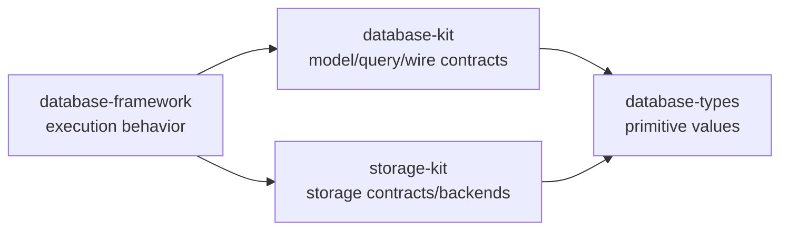

# Documentation

This directory contains the current, maintained documentation for
database-framework. Historical implementation notes and completed review
reports are intentionally not part of the public documentation tree.

## Start Here

- [Project README](../README.md) - installation, backend selection, quick start,
  modules, and ecosystem boundaries.
- [User Guide](guide.md) - model definition, contexts, transactions, queries,
  indexes, and migrations.
- [Backend Guide](backends.md) - FoundationDB, SQLite, PostgreSQL, custom
  engines, and Cloudflare composition.
- [Production Readiness](production-readiness.md) - deployment and release
  checklist.

## Runtime Contracts

- [Architecture and Ownership](architecture.md) - package responsibility,
  runtime forms, value ownership, transactions, and synchronization.
- [Security](security.md) - authentication context and model-level policies.
- [Base and Composition](base-composition.md) - implemented Base data
  boundaries, read-only Composition, unified Security Grants, physical
  placement, and federated paging contract.
- [Base and Composition Implementation](base-composition-implementation-design.md)
  - responsibility boundaries, Wire targeting, runtime leases, storage layout,
  implementation order, and production verification gates.
- [Ontology and Graph](ontology.md) - GraphIndex, OWL metadata, and ontology
  persistence.
- [Query and Fusion](query.md) - scalar, SQL/SPARQL, graph, and fusion query
  responsibilities.
- [Vector Storage](storage/vector-storage-and-hnsw.md) - binary vector payload
  and HNSW snapshot contract.

## Deployment

- [Cloud Run and Cloud SQL PostgreSQL](deployment/cloud-run-vapor-postgresql.md)
  - Vapor 5 service configuration and Cloud SQL socket usage.

## Remaining Work

[Roadmap](roadmap.md) records only work that is still genuinely open. It is
not a copy of historical design proposals.

## Documentation Boundaries

Backend adapters, web hosts, and application tools are documented as separate
repositories in the project README.
