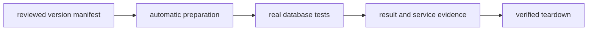
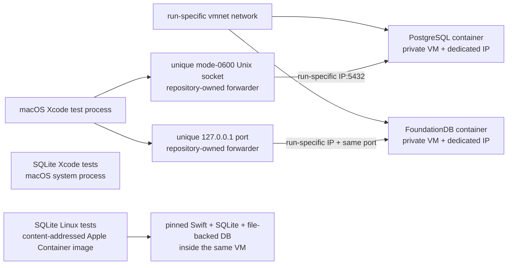
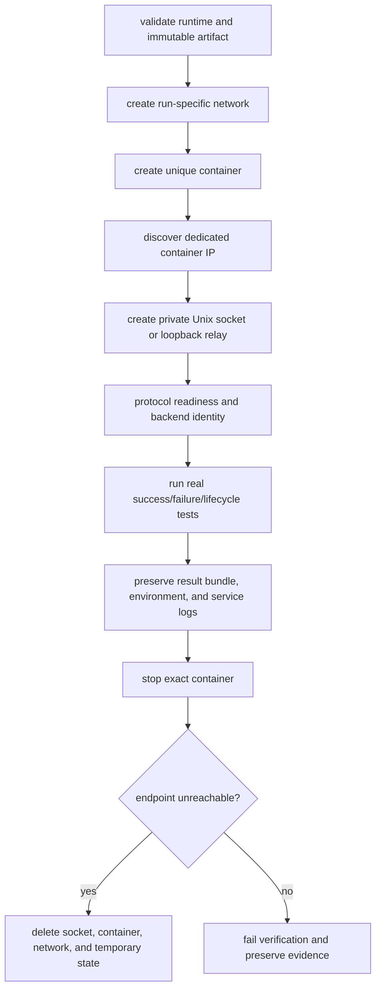

# Apple Container Backend Verification

The harness exists to make real backend verification reproducible and smooth,
independent of whichever database versions or services happen to exist on a
developer machine. One command prepares the pinned environment, executes the
real test path, preserves evidence, and tears the environment down. It does not
use Docker Desktop, Homebrew database services, launchd-managed FoundationDB,
a developer cluster, or a published host port.



## Pinned Environment

`scripts/apple-container/versions.env` is the single reviewed manifest for
mutable external artifacts. Image references use the Linux arm64 manifest
digest rather than a tag or a multi-platform index.

| Component | Pinned release | Verification |
|---|---:|---|
| Apple Container | 1.2.2 | CLI and API server version plus commit |
| PostgreSQL | 18.6 | OCI arm64 manifest digest and SQL identity query |
| FoundationDB | 7.3.77 | OCI arm64 manifest digest, client package checksum, cluster status |
| SQLite | 3.53.4 | amalgamation checksum, derived-image identity, runtime query |
| Swift on macOS | 6.4 snapshot 2026-08-14 | Xcode compiler path and version |
| Linux base | Ubuntu 24.04 | OCI arm64 manifest digest and OS identity |
| Swift on Linux | 6.4 snapshot 2026-08-14 | archive checksum and compiler commit |

An environment update changes this manifest and the evidence together. Do not
replace a digest with `latest`, a floating major tag, or an unverified local
image.

## Topology



SQLite is in-process storage. Running a separate SQLite service would not test
`SQLiteStorageEngine`, so its gate has two parts: the authoritative macOS Xcode
target and the same target inside a Linux Apple Container linked to the pinned
stable SQLite source. PostgreSQL and FoundationDB remain service containers
consumed by the host Xcode test process.

The Linux gate uses the same dated Swift 6.4 compiler snapshot as the macOS
gate. On the first run, the harness builds a derived image from the
digest-pinned Ubuntu base and checksum-verifies and compiles the SQLite source.
The image tag and required OCI labels are derived from every artifact identity
plus the Containerfile hash. The checksum-verified Swift archive is expanded
atomically into a content-addressed harness cache and mounted read-only at test
time. SwiftPM repository and incremental build caches are separated by
worktree, complete environment fingerprint, and trait selection; a harness
lock prevents concurrent mutation of one cache. Later runs reuse these assets
only when their identities match, so dependency setup does not repeat and
stale local state cannot silently become test state.
The harness never installs the Linux toolchain into the host operating system.

The harness creates a run-specific Apple Container network for PostgreSQL and
FoundationDB before starting the service. This gives the host a matching vmnet
route and prevents a stale default-network route from becoming test state.
The harness reads the container's dedicated IP after startup. PostgreSQL is
exposed only through a unique mode-0600 Unix socket backed by an unprivileged
forwarder compiled from the reviewed repository source with Xcode's `clang`;
the Xcode test process never receives a host TCP port. FoundationDB receives a
unique loopback endpoint through its generated cluster file and uses the same
repository-owned forwarder to reach the run-specific container IP. The
harness never changes host DNS, requests administrator privileges, passes
`--publish`, or depends on a separately installed forwarding utility.

## Host Prerequisites

The harness treats Apple Container as a host prerequisite and never installs,
updates, starts, or reconfigures it. Validate the prerequisite without changing
state:

```bash
scripts/apple-container-test-harness doctor
```

`doctor` is read-only and fails if the host is not Apple silicon macOS, the
runtime or API server differs from the manifest, the service is stopped, or the
pinned Darwin Swift toolchain is missing. Runtime installation and upgrades are
host-administration responsibilities outside this repository's test harness.

Database servers, client libraries, the host relay executable, and the derived
SQLite test image are prepared by the harness. No Homebrew package or locally
installed database is a prerequisite. The remaining commands (`curl`, `grep`,
`nc`, `perl`, `pkgutil`, `plutil`, `rsync`, `shasum`, and `tar`) are macOS/Xcode
system tools; the harness validates the command-specific subset before it
creates a container. SQLite additionally requires enough disposable disk space
for the copied source plus 8 GiB of Linux build headroom.

PostgreSQL administration and identity queries run with the client shipped in
the pinned PostgreSQL container. FoundationDB's native macOS client is
checksum-verified and expanded by the harness because the Xcode test process
exercises that actual client ABI. PostgreSQL, FoundationDB, SQLite, Linux,
Swift, and their versions all come from the reviewed manifest and disposable
harness lifecycle.

## Backend Commands

```bash
scripts/apple-container-test-harness sqlite
scripts/apple-container-test-harness sqlite --multi-base
scripts/apple-container-test-harness postgresql
scripts/apple-container-test-harness foundationdb
scripts/apple-container-test-harness foundationdb-run -- <command> [arguments...]
```

Run the complete matrix sequentially with:

```bash
scripts/apple-container-test-harness all
```

Each command creates a uniquely named container and result directory. The
PostgreSQL and FoundationDB paths execute a real protocol-level identity or
status probe before starting Xcode tests. The FoundationDB macOS client is
checksum-verified and expanded into the user cache; no launch daemon or system
client installation is created.

## Lifecycle And Failure Contract



Setup, readiness, test, timeout, teardown, or negative-readiness failures are
all failures. The harness does not skip tests, switch to an in-memory backend,
reuse a developer service, retain a stopped test container, or silently use a
host port or shared endpoint.

## Evidence

The default result root is
`${TMPDIR}/database-framework-apple-container-results`. Set
`APPLE_CONTAINER_RESULT_ROOT` or pass `--result-directory` to preserve it at a
different path.

| Backend | Required evidence |
|---|---|
| SQLite | macOS `.xcresult` and logs; Linux xUnit, test log, Swift/SQLite environment |
| PostgreSQL | image/container/network inspection, forwarder source/compiler identity and log, in-container server identity query, real test traffic through the Unix socket, `.xcresult`, service log, negative readiness |
| FoundationDB | image/container/network inspection, client checksum, cluster status, `.xcresult`, traces, negative readiness |

The Xcode path still uses `scripts/xcode-test-harness`: URL dependencies,
traits, expected test counts, zero skips, zero expected failures, zero runtime
warnings, testing-runtime injection, and internal-tool error detection remain
mandatory.
