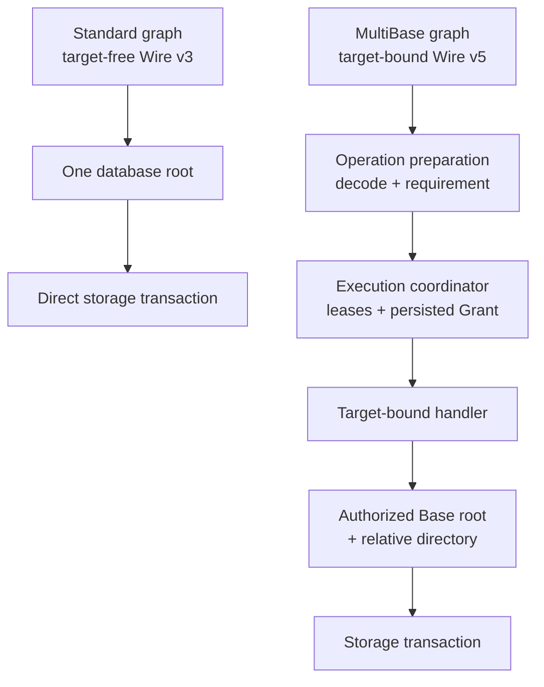
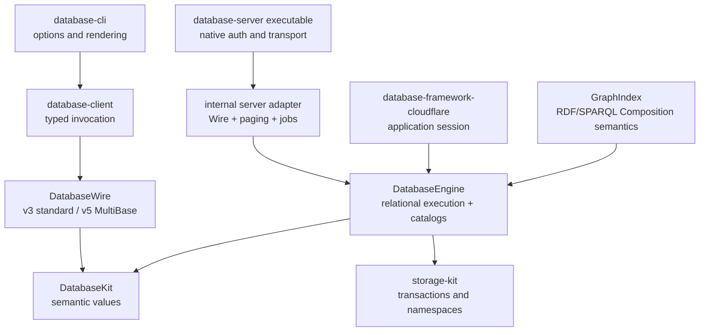
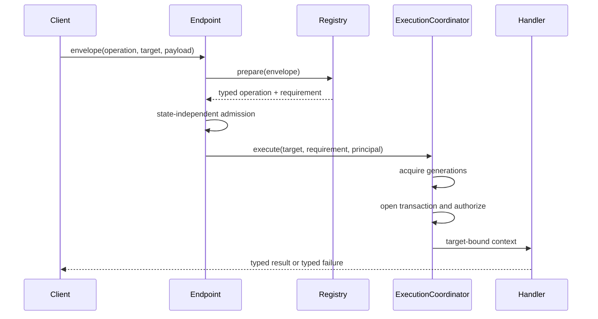
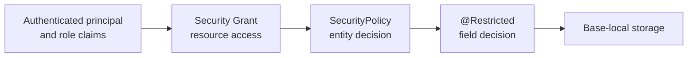
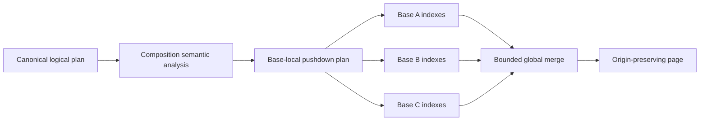
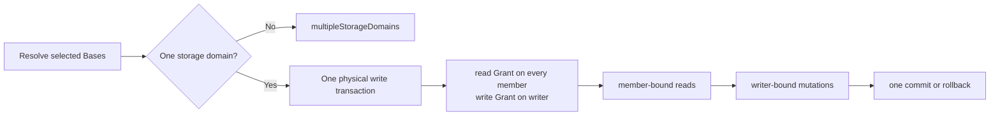
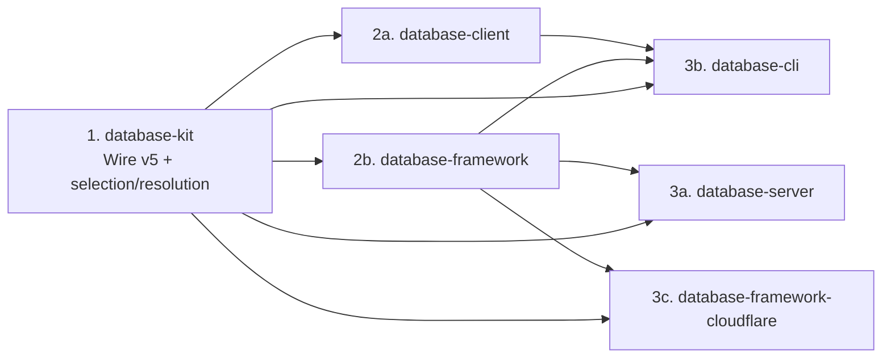

# Base and Composition Implementation Design

Status: implemented and behaviorally verified behind the non-default
`MultiBase` trait. The standard build uses one database data root.

This document translates the semantic contract in
[Base and Composition](base-composition.md) into package ownership, public API,
runtime state, transaction boundaries, execution flow, persistence layout, and
verification gates. The types named below are present in the current source
tree unless a paragraph explicitly describes optional future work.

## 1. Decision

Base isolation is an optional execution boundary, not a query predicate. The
standard package graph has one database root and compiles no Base target,
topology catalog, placement lease, Composition planner, or persisted Grant
store. When `MultiBase` is selected, every local or remote data operation
uses one explicit semantic target, acquires immutable Schema and data-root
leases, proves the required Grant in the data transaction, and receives only a
target-bound executor. `database-server` is one adapter over this execution
contract, not the owner of Composition semantics.



The critical optional-feature property is structural: the standard graph pays
no Base cost, while code compiled with `MultiBase` cannot select another
Base through a target-bound executor.

## 2. Confirmed Current Implementation

| Current fact | Evidence | Enforced consequence |
|---|---|---|
| The standard Wire v3 envelope has no target field; `DatabaseOperationTarget` and Wire v5 target encoding compile only with `MultiBase`. | `database-kit/Sources/DatabaseWire/DatabaseWireRequestEnvelope.swift`; `DatabaseOperationTarget.swift`; `EnvelopeWireFormat.swift` | A normal client or server does not carry dormant Base state. |
| The standard `DBContainer` claims one injected engine and resolves one database data root directly. | `Sources/DatabaseEngine/Core/DBConfiguration.swift`; `DBContainer.swift`; `DBContainer+DataRootTransaction.swift` | The hot path has no topology dictionary, catalog read, target lease, or persisted Grant lookup. |
| With `MultiBase`, a handler prepares the typed payload and exact access/transaction requirement before target execution. | `database-server/Sources/DatabaseServerRuntime/AnyDatabaseOperationHandler.swift`; `DatabaseOperationRequirement.swift` | Target compatibility and access are checked before handler invocation. |
| With `MultiBase`, `DatabaseOperationContext` contains a narrow executor and never exposes a raw container. | `database-server/Sources/DatabaseServerRuntime/DatabaseOperationContext.swift`; `DatabaseOperationExecutor.swift` | Data handlers cannot select a second Base. |
| With `MultiBase`, `DBContainer` claims a control domain and every data domain exactly once. | `Sources/DatabaseEngine/Topology`; `Sources/DatabaseEngine/Core/DBContainer.swift` | Catalog and Base storage lifecycles have one owner and one shutdown path. |
| Local operations use a database-bound context, or `DatabaseSession` with a Base or Composition selector when `MultiBase` is enabled. | `Sources/DatabaseEngine/Core/DBContainer.swift`; `Sources/DatabaseEngine/Base/DatabaseSession.swift` | A public unscoped context does not exist. |
| Base, Composition, placement, Grant, and layout records are persisted catalogs with immutable generations and leases. | `Sources/DatabaseEngine/Base`; `Sources/DatabaseEngine/Security` | Existence and lifecycle come from catalogs rather than backend namespace probes. |
| Direct and role Grants are unioned in the Base transaction; role-name administration bypasses are absent. | `DatabaseGrantStore.swift`; `DataStoreSecurityDelegate.swift` | Authentication claims alone never grant data access. |
| Composition reads hold one transaction per physical domain, authorize all members, and retain origin. | `CompositionDataSource.swift`; `CompositionQueryPlanner.swift` | Partial authorization and silent member omission are impossible. |
| RDF/SPARQL Composition semantics compile in `GraphIndex`, while relational semantics compile in `DatabaseEngine`. | `CompositionSPARQLQueryPlanner.swift`; `CompositionSPARQLPlanValidator.swift`; `CompositionRDFQueryPlanner.swift`; `CompositionRDFIdentity.swift`; `CompositionQueryPlanner.swift` | Optional graph semantics do not enter the core relational target. |
| Cross-domain remote continuation is a bounded durable snapshot spool owned by the server adapter. | `database-server/Sources/DatabaseServerRuntime/DatabaseQuerySnapshotStore.swift` | Client pages do not retain transactions or carry trusted continuation state; the framework does not own Wire paging. |
| Removed layouts and populated unformatted roots fail before data execution. | `Sources/DatabaseEngine/Format/DatabaseFormatCatalog.swift`; `DatabaseFormatDescriptor.swift` | No namespace probing, compatibility alias, or migration path is retained. |

## 3. `MultiBase` Invariants

The following invariants apply only to the graph compiled with
`MultiBase`. The standard graph has one database mutation and read root.

1. A Base is the only data mutation target.
2. A Composition is read-only and contains a canonical, non-recursive set of
   Base identities.
3. Target selection is explicit at every local and remote operation boundary.
4. A model identifier is Base-local; Base origin is never dropped from a
   Composition result.
5. `#Directory` is relative to the selected Base root.
6. A Security Grant, entity policy, and field policy are cumulative checks.
7. Roles are authenticated claims, not implicit permissions.
8. Authorization is checked inside the transaction that accesses Base data.
9. The Base Catalog is authoritative for existence and lifecycle. Backend
   namespace existence is only a physical fact.
10. A request uses one immutable Schema generation and one immutable Base or
    Composition generation for its complete lifetime.
11. Storage adapters do not import or interpret Base, Composition, Grant, or
    query semantics.
12. A federated result never claims single-domain transactional consistency.
13. Unsupported target, consistency, planner, or materialization behavior
    fails with a typed error; no Base is omitted and no weaker plan is selected
    silently.
14. Named and derived selections resolve to one immutable
    `CompositionResolution`; derived selections have no synthetic ID or
    generation.
15. Server adapters may spool and page framework results, but may not define
    relational, RDF, SPARQL, aggregate, DISTINCT, or provenance semantics.

## 4. Public API First

The application-facing value types remain minimal and Foundation-independent.
They belong to `DatabaseKit`.

```swift
public struct Base: Sendable, Hashable {
    public struct ID: Sendable, Hashable {
        public let value: String

        public init(_ value: String) throws(BaseIDError)
    }

    public let id: ID
}

public extension Base {
    struct Composition: Sendable, Hashable {
        public struct ID: Sendable, Hashable {
            public let value: String

            public init(_ value: String) throws(CompositionIDError)
        }

        public let id: ID
        public let bases: [Base.ID]

        public init(
            id: ID,
            bases: some Collection<Base.ID>
        ) throws(CompositionError)
    }
}
```

`Base.Composition` canonicalizes `bases` during initialization. It rejects an
empty set and duplicate identities rather than silently changing the caller's
definition. Stored and Wire encodings use the canonical ordering.

### 4.1 Explicit database session

An authorization value is bound once to a local session. The server creates one
session per request from the host-authenticated `AuthorizationContext`; direct
application use creates one explicitly. The raw container is not the data API.

```swift
let session = container.session(authorization: authorization)

let companyA = session.base(companyAID)
let operational = session.composition(operationalID)
let adHoc = try session.composition(bases: [worldID, companyAID])

let people = try await companyA.query(Person.self).execute()
let combined = try await operational.query(Person.self).execute()

let context = companyA.newContext()
context.insert(person)
try await context.save()
```

The public concrete selectors owned by `DatabaseEngine` are deliberately small:

```swift
public struct DatabaseSession: Sendable {
    public func base(_ id: Base.ID) -> BaseDataSource
    public func composition(_ id: Base.Composition.ID)
        -> CompositionDataSource
    public func composition(_ selection: CompositionSelection)
        -> CompositionDataSource
    public func composition(bases: [Base.ID]) throws
        -> CompositionDataSource
}

public struct BaseDataSource: Sendable {
    public let id: Base.ID
    public func newContext(
        autosaveEnabled: Bool = false
    ) -> DatabaseContext
    public func query<Model: Persistable>(_ type: Model.Type)
        -> QueryExecutor<Model>
}

public struct CompositionDataSource: Sendable {
    public let selection: CompositionSelection
    public func query<Model: Persistable>(_ type: Model.Type)
        -> CompositionQueryExecutor<Model>
    public func execute(
        _ query: SelectQuery,
        options: ReadExecutionOptions = .default
    ) async throws -> [CompositionResult<QueryRow>]
}
```

`DatabaseSession.base(_:)` and the Composition selectors return lightweight value
selectors. Selector construction is synchronous and performs no I/O.
Existence, lifecycle, placement, authorization, and generation are resolved
when an operation begins. Only `BaseDataSource` exposes mutation context
creation.

The optional `GraphIndex` target extends this selector with local `ask`,
`construct`, and `describe` entry points. A server handler adapts those same
planner results into Wire pages; it is not the only way to execute a
Composition.

`CompositionQueryExecutor` is a separate, read-only typed facade over the
existing `Query<Model>` value. The ordinary `QueryExecutor` and
`DatabaseContext` path remain unchanged, so the standard single-root execution
path does not gain type erasure or Composition dispatch. Both facades reuse the
same query syntax and result typing without granting the Composition a mutation
context.

### 4.2 Identity and result origin

`EntityReference` remains Base-relative. A separate address qualifies it:

```swift
public struct EntityAddress: Sendable, Hashable {
    public let baseID: Base.ID
    public let entity: EntityReference
}

public struct CompositionResult<Value: Sendable>: Sendable {
    public let composition: CompositionResolution
    public let origin: CompositionOrigin
    public let value: Value
}
```

Exact-Base reads may expose values directly because their origin is already
fixed by the source. Composition values use `.source(Base.ID)` for source-local
rows and `.derived(contributors:)` for aggregates, joins, and other derived
values. Named execution retains ID and generation in `CompositionResolution`;
derived execution retains only its canonical Base set. RDF quads, graph
vertices, and entity references are not mutated to carry an unrelated
execution concern. Their Composition result wrappers retain origin.

The canonical Wire page encodes its Base identity table once. Per-result origin
uses bounded ordinal references into that table, so repeated Base ID strings are
not copied into every row. Client APIs reconstruct the safe semantic wrappers at
the ownership boundary.

## 5. Package and Target Ownership



| Declaration or behavior | Owner | Reason to change |
|---|---|---|
| `Base`, nested identities, Composition validation | `database-kit / DatabaseKit` | Semantic definition changes. |
| `Security.Access`, `Resource`, `Subject`, `Grant` | `database-kit / DatabaseKit` | Authorization vocabulary changes. |
| `EntityAddress`, `CompositionSelection`, `CompositionResolution`, `CompositionResult`, `CompositionOrigin` | `database-kit / DatabaseKit` | Database identity, selection, and provenance semantics change. |
| `DatabaseOperationTarget`, Base/Composition/Grant operations, codecs | `database-kit / DatabaseWire` | Canonical protocol changes. |
| Session, data-source interfaces, catalogs, generation leases, placement, relational planner, decision transaction | `database-framework / DatabaseEngine` | In-process relational execution and lifecycle behavior changes. |
| RDF blank-node qualification and SPARQL/ASK/CONSTRUCT/DESCRIBE Composition planner | `database-framework / GraphIndex` | RDF or SPARQL execution semantics change. |
| Operation requirement resolution and target-bound handler context | `database-server / DatabaseServerRuntime` | Canonical operation dispatch changes. |
| Namespace resolution and backend transaction behavior | `storage-kit` | Storage semantics or backend behavior changes. |
| Credentials, TLS, database routing, process lifecycle | `database-server` | Native hosting changes. |
| Typed target facade and transport | `database-client` | Client invocation behavior changes. |
| `--base`, `--composition`, administration commands, output | `database-cli` | User interaction changes. |
| Durable Object admission and host lifecycle | `database-framework-cloudflare` | Cloudflare hosting changes. |

No new shared runtime package is required. The operation adapter and native
host are internal layers of the standalone `database-server` executable.
Platform adapters reuse database-framework execution directly and do not
consume either server layer. Base semantics are not primitive values and
must not enter `database-types`; resolved storage prefixes are not Wire values
and must not enter `database-kit`.

### 5.1 Non-negotiable Composition boundary

The framework package may grow only by behavior required to execute an
application-owned in-process database. Optional code must stay outside the
standard compiled graph.

| Layer | Owns | Must not own |
|---|---|---|
| `DatabaseKit` | selection/resolution values, Base-qualified QueryIR, provenance and Wire semantics | transactions, planning, storage, host lifecycle |
| `DatabaseEngine` under `MultiBase` | member snapshots, Grants, relational merge/aggregate/join semantics, request-local bounded exact DISTINCT, decision transaction | DatabaseWire dispatch, remote pages, durable jobs, RDF/SPARQL algebra |
| `GraphIndex` under `MultiBase` + `GraphIndexes` | RDF identity and SPARQL/ASK/CONSTRUCT/DESCRIBE Composition semantics | Wire pages, server jobs, relational planning |
| internal `database-server` adapter | semantic-event adaptation, result page/spool ownership, continuations, jobs, error mapping | query meaning, provenance rules, Base Grant decisions |
| platform host adapter | admission, process/runtime lifecycle, byte transfer, storage host ABI | database semantics |

`AllRuntimeFeatures` does not enable `MultiBase`. `DatabaseEngine` and
`GraphIndex` source is guarded by `DATABASE_MULTI_BASE`, and the ordinary
single-root product therefore does not compile the Composition planner,
catalog, Grant store, topology, or decision transaction.

## 6. Canonical Wire Contract

### 6.1 Target belongs only in the `MultiBase` envelope

When `MultiBase` is selected, the request envelope receives a required
semantic target. It is not metadata and has no optional encoding in Wire v5.
Without the trait, Wire v3 has no target property or encoded placeholder.

```swift
public enum DatabaseOperationTarget: Sendable, Hashable {
    case database
    case base(Base.ID)
    case composition(CompositionSelection)
}

public struct DatabaseWireRequestEnvelope: Sendable, Hashable {
    public let requestID: UInt64
    public let operation: DatabaseOperationIdentifier
    public let target: DatabaseOperationTarget
    public let metadata: OperationRequestMetadata
    public let payload: ByteString
}
```

The two build graphs intentionally expose different canonical protocols. The
standard graph uses target-free Wire v3. The `MultiBase` graph uses
target-bound Wire v5. A single binary never accepts both forms and neither
graph contains a compatibility decoder.

`DatabaseClient.execute` requires the target explicitly. Higher-level client
facades bind it once:

```swift
let companyA = client.base(companyAID)
let response = try await companyA.execute(
    DatabaseOperationCatalog.queryExecute,
    request: request
)
```

### 6.2 Administrative operations

Three focused operation families are added instead of one generic control
manifest:

| Operation | Invocation responsibility | Valid target |
|---|---|---|
| `baseExecute` | list, describe, create, retire, delete, placement transition | `.database` for create/list; `.base` for resource lifecycle |
| `compositionExecute` | list, describe, create, replace membership, delete | `.database` or the addressed `.composition` according to invocation |
| `grantExecute` | list effective/direct Grants, grant bits, revoke bits | the exact `.database` or `.base` resource |

The operation identifiers use the catalog/control family next to Schema
operations. Capabilities advertise `base.execute`, `composition.execute`, and
`grant.execute` independently.

The payload never repeats an identity already carried by the target. A create
request carries the new definition because no target exists yet; subsequent
operations address the resource through the envelope.

### 6.3 Per-operation requirement

One static access requirement per operation identifier is insufficient because
Ontology, SHACL, maintenance, and administrative families contain both read and
write invocations. The type eraser therefore prepares a request before an
execution context exists.

```swift
public struct DatabaseOperationRequirement: Sendable {
    public let acceptedTargets: DatabaseOperationTargetKinds
    public let access: Security.Access
    public let transaction: DatabaseOperationTransactionKind
}

package struct PreparedDatabaseOperation: Sendable {
    let identifier: DatabaseOperationIdentifier
    let requirement: DatabaseOperationRequirement
    let invoke: @Sendable (DatabaseOperationContext) async throws
        -> DatabaseOperationResult
}
```

`AnyDatabaseOperationHandler.prepare(...)` decodes and validates the typed
request, computes the requirement from the exact invocation, and captures it.
The endpoint then binds the target. Middleware and handlers run only after the
binding succeeds.



### 6.4 Target matrix

| Operation family | Database | Base | Composition |
|---|---:|---:|---:|
| capabilities | Yes, authenticated admission | No | No |
| schema describe | `.read` | No | No |
| schema execute | `.administer` | No | No |
| query | No | `.read` | `.read` on every member |
| mutation | No | `.write` | Never |
| graph algorithm | No | `.read` | `.read` when algorithm has defined merge semantics |
| ontology / SHACL describe or validate | No | `.read` | Only explicitly supported read invocations |
| ontology / SHACL mutation | No | `.write` | Never |
| application command | Declared by command registration | Declared by command registration | Read-only declarations only |
| maintenance | Invocation-specific | Invocation-specific | Read-only and generation-safe invocations only |
| job start | Same as embedded operation | Same as embedded operation | Same as embedded operation |

Unknown combinations fail before handler execution. A feature cannot advertise
Composition support until it defines provenance, merge, continuation, and
consistency semantics.

## 7. Runtime Responsibility Split

### 7.1 `DBContainer` remains the composition root

`DBContainer` owns lifecycle and coordinates components, but does not implement
their storage formats or policy decisions directly.

```text
DBContainer
|-- SchemaGenerationStore
|-- BaseCatalog
|-- BaseGenerationStore
|-- CompositionCatalog
|-- GrantStore
|-- DatabaseExecutionCoordinator
|-- DatabaseStorageTopology
`-- authoritative shutdown
```

| Component | Responsibility | Isolation |
|---|---|---|
| `DatabaseBaseCatalog` | Transaction-injected Base record reads/writes with revision checks | No process-local shared mutable state |
| `DatabaseCompositionCatalog` | Transaction-injected Composition record reads/writes with revision checks | No process-local shared mutable state |
| `DatabaseGrantStore` | Transaction-injected canonical Grant records | No process-local shared mutable state |
| `DatabaseBaseGenerationStore` | Publish/acquire immutable active Base generations and drain leases | `Mutex<State>` |
| `DatabaseBaseLeaseToken` | Finish one operation lease exactly once | `Mutex<Bool>` |
| `DatabaseStorageTopologyLifecycle` | Claim and shut down every engine exactly once | `Mutex<Phase>`; shutdown I/O occurs outside the lock |
| `DatabaseExecutionCoordinator` | Acquire leases, choose domain, open transaction, authorize, invoke | Stateless coordinator plus immutable request-local bindings |
| Persistent lifecycle jobs | Serialize resumable Base transitions through owner/checkpoint records | Storage transaction conflicts and persisted revision/owner checks |

Remote snapshot spooling is deliberately absent from this container graph.
`DatabaseQuerySnapshotStore` belongs to the internal `database-server` adapter
because its reasons to change are Wire paging, continuation lifetime, and
remote result delivery. Local framework execution streams semantic events and
does not manufacture a server continuation.

Base lifecycle ordering is durable and distributed: catalog revisions,
transaction conflicts, and persistent job ownership are authoritative. It is
not protected only by a process-local actor. Hot lease acquisition is a short
non-suspending `Mutex` operation. No lock is held across `await`, external
callback, logging, or event emission. Native, WASM, and Embedded sources use
the same declarations and access paths.

### 7.1.1 Native, WASM, and Embedded isolation matrix

| Logical state | Native | WASM | Embedded WASM | Read entry | Mutation entry | Shutdown or release |
|---|---|---|---|---|---|---|
| Storage topology phase | `Mutex<Phase>` | `Mutex<Phase>` | `Mutex<Phase>` | `withLock` admission check | `claim`, `finishOpening`, `requestShutdown` | async shutdown outside lock, then terminal `closed` |
| Base generation and lease counts | `Mutex<State>` | `Mutex<State>` | `Mutex<State>` | `acquire` / `snapshot` | `publish` / `stopAdmissionAndDrain` | exactly-once lease token decrements count and resumes waiters |
| Active Base binding | immutable `@TaskLocal` lease | same | same | request task only | `withBaseLease` binding boundary | task-local value ends with operation |
| Active transaction binding | immutable `@TaskLocal` binding | same | same | transaction attempt only | coordinator binding boundary | task-local value ends before transaction release |
| Authorization and field plan | immutable `@TaskLocal` values | same | same | current request only | admission/coordinator binding | cleared automatically at request boundary |
| Composition result collector | request-local actor | same | same | actor-isolated result read | semantic event callback | actor ends with the local call |
| Exact DISTINCT entries and lineage | request-local actor with hard byte limit | same | same | sealed actor iteration | actor-isolated insert | `removeAll` clears retained entries on success and failure |
| Decision capability admission | `TransactionOperationGate` / `Mutex<State>` | same | same | `enter` | `leave` / `closeAndWait` | closes before the physical transaction can finish |
| Ordered merge window and RDF sequence | short `Mutex<Value>` access | same | same | `withLock` | `withLock` | request-local owner release; no lock crosses `await` |
| Catalog and Grant state | storage transaction | same | same | bounded transactional read | revision-checked transactional write | backend-authoritative lifecycle |

There is no `hasFeature(Embedded)` or `canImport(Synchronization)` branch in
these sources. Embedded does not replace synchronized state with raw mutable
storage, weaken `Sendable`, or introduce a separate shutdown path.

### 7.2 One immutable operation lease

The execution coordinator constructs one internal lease for the complete
operation:

```swift
package struct DatabaseExecutionLease: Sendable {
    let schema: DatabaseSchemaLease
    let target: ResolvedDatabaseTarget
    let authorization: AuthorizationContext
}

package enum ResolvedDatabaseTarget: Sendable {
    case database(DatabaseControlLease)
    case base(ResolvedBaseLease)
    case composition(ResolvedCompositionLease)
}
```

`ResolvedBaseLease` retains the logical Base identity, catalog revision,
placement generation, storage-domain handle, owned root `Subspace`, and
lifecycle state. `DatabaseCompositionLease` retains a
`CompositionResolution` and its ordered `DatabaseBaseLease` values. A named
resolution retains its catalog generation; a derived resolution has no catalog
identity. Old named leases remain valid until their in-flight operation ends.

`DatabaseOperationContext` no longer exposes a public `container`. It contains
request metadata plus the target-bound lease and narrow execution services.
Handlers use the bound read or mutation executor. Control-plane handlers
receive a control executor, not a data executor.

The lease does not cache an authorization decision. `DatabaseExecutionCoordinator`
owns the operation transaction wrapper, and Grant evaluation runs inside every
transaction attempt before the target-bound handler body receives data access.
This includes retries after conflicts. The existing mutation idempotency and
transaction coordinator is moved behind this boundary rather than opening a
second transaction inside `MutationExecuteHandler`.

### 7.3 Data context versus control transaction

`DatabaseContext` is bound immutably to one `DatabaseDataRootLease` when an
operation begins. All store cache keys, pending identities, transactions,
relationship work, and index work are relative to that database or Base root.
There is no public unscoped initializer.

Schema, Base, Composition, Grant, migration, and catalog work uses a separate
package-internal `DatabaseControlTransactionExecutor`. It cannot create an
entity store. System work and data work therefore cannot share an unscoped
context path.

## 8. Persistence and Placement

### 8.1 Authoritative records

The control-domain metadata contains:

```text
metadata/
|-- schema/<generation>
|-- bases/by-id/<Base.ID> -> BaseCatalogRecord
|-- bases/by-ordinal/<UInt64> -> Base.ID
|-- placements/<Base.ID>/<generation> -> BasePlacementRecord
|-- compositions/<Composition.ID>/<generation> -> CompositionRecord
|-- grants/database/<subject> -> access bits
`-- jobs/...
```

Each Base root contains Base-local authority and data:

```text
base-root/
|-- metadata/grants/<subject> -> access bits
|-- metadata/partitions/...
|-- metadata/index-state/...
|-- entities/<relative-directory>/...
|-- indexes/<relative-directory>/...
|-- relationships/...
|-- graph-rdf/...
|-- ontology/...
`-- shacl/...
```

`BaseCatalogRecord` stores stable ID, compact ordinal, revision, lifecycle, and
placement reference. `BasePlacementRecord` stores an internal storage-domain
identity, logical namespace path, and generation. It does not store a client-
visible raw prefix as canonical state.

The runtime-derived `ResolvedBaseLease` owns the currently resolved `Subspace`
prefix. The Base Catalog, not `NamespaceResolver.namespaceExists`, determines
whether a logical Base exists.

### 8.2 Namespace construction

The only backend namespace lookup on the steady-state data path is Base
placement restoration or a placement-generation cache miss:

```text
Base Catalog
    -> logical placement path
        -> NamespaceResolver.resolveExisting(...)
            -> retained Base root Subspace
                -> synchronous subspace(relative directory)
                    -> synchronous entity/index branch
```

Base creation calls `resolveOrCreate` in the lifecycle transaction. FDB uses
Directory Layer there and retains its short allocated prefix. SQLite,
PostgreSQL, and deterministic backends derive a prefix through their existing
resolver. Entity and index hot paths only append tuple components to the
retained root.

The schema property is renamed to `relativeDirectoryPathComponents` in the
breaking semantic and manifest revision. Directory macros still emit the same
relative content. Base is never a macro argument and never a model field.

### 8.3 Index ownership

Every authoritative and derived index is Base-local by default. Its keyspace,
lifecycle state, partition catalog, mutation maintenance, rebuild, and
readability checks all live beneath the Base root. Existing global partition
catalog keys must not be reused for Base-aware data.

Materialized Composition indexes are optional derived state owned by the
Composition execution subsystem. They have an explicit source Composition
generation, Schema generation, per-Base high-water marks, and lifecycle state.
They cannot become an authoritative write path.

## 9. Security Execution

### 9.1 One model, three cumulative decisions



`Security.Access` is an `OptionSet` with independent `.read`, `.write`, and
`.administer` bits. Direct-principal and role-subject Grants are unioned. A
role name alone has no effect. `SecurityConfiguration.adminRoles` and the
`isAdmin` policy bypass are removed. Testing SPI may disable schema-driven
entity and field policy evaluation, but persisted database and Base Grants
remain mandatory.

Grant evaluation order for a Base operation is:

1. Resolve active Base and placement from immutable catalogs.
2. Open the Base's storage transaction.
3. Read Base-local direct and role Grants in that transaction.
4. Require the operation's exact access bits.
5. Construct the data namespace from the already authorized Base root.
6. Execute entity policy and field policy before returning or mutating data.
7. Commit or cancel the same transaction.

This order avoids a circular dependency: placement is public control state,
while permission state is inside the resolved Base root and is read before any
entity data namespace is exposed.

For Composition reads, the coordinator opens the required read transaction or
transactions, verifies every member before invoking the planner, and emits no
partial result. Reauthorization occurs on every continuation and persistent
job step.

Idempotency is target-qualified. Its canonical digest and storage key include
the operation identifier, encoded `DatabaseOperationTarget`, and request body.
Base mutation idempotency state is stored beneath that Base root. Reusing one
idempotency key against another Base cannot replay the first Base's response.

### 9.2 Base lifecycle authority

- `.database + .administer` creates Bases and Composition definitions.
- `.base(id) + .administer` manages that Base's Grants and lifecycle.
- Database access never implies Base access.
- Initial Base creation must establish one explicit Base administrator before
  the Base becomes active.

In a single storage domain, namespace allocation, initial Grant, and active
catalog publication commit in one transaction. In multiple domains, the Base
is first persisted as `provisioning`, the data-domain root and initial Grant
are created, and only then is an active control record published. Recovery is
idempotent; no operation can acquire a non-active Base.

## 10. Query and Composition Planning

Composition execution cannot run a complete SQL query independently in every
Base and concatenate results. That would change `ORDER BY`, `LIMIT`,
`DISTINCT`, aggregate, join, graph, and ranking semantics.

`DatabaseEngine.CompositionQueryPlanner` splits a supported relational plan
into Base-local pushdown and global merge stages. Its domain-neutral row merger
also accepts a feature-owned `CompositionMemberQueryExecutor` through SPI.
`GraphIndex` owns SPARQL source validation, Base-local SPARQL execution, and RDF
identity qualification, then delegates only global row merging to the engine.
The local typed executor and the server adapter invoke these same planners:



| Query feature | Required Composition behavior |
|---|---|
| Filter/projection | Push to every Base; preserve Base origin. |
| Ordered scan | Concurrent Base-local cursors plus bounded k-way merge. |
| Limit/offset | Apply globally after order semantics. |
| Distinct | Compare exact projected row values, retain the first representative row, and merge every contributing Base into its origin. Digest collisions never define equality. |
| Aggregate | Use decomposable partial aggregates only where mathematically valid; return multi-Base contributor provenance. Otherwise execute a bounded global aggregate or fail resource limits. |
| Join | Base-local joins preserve one source origin. The bounded cross-Base v1 shape is two explicitly Base-qualified tables joined by `INNER JOIN`; every output row carries both contributors. Outer, lateral, nested, or implicitly routed cross-Base joins fail explicitly. |
| Vector/full-text/rank | Normalize and merge only when index scoring contracts are comparable. |
| RDF | Preserve Base origin and Base-qualified blank-node identity. |
| Graph algorithm | Advertise only algorithms with defined cross-Base vertex/edge identity and merge semantics. |

The common ordered path holds one cursor head per Base plus one output page.
Operators that require global state retain only request-local state admitted by
the shared row/byte/work budget; the planner never falls back to unmetered
materialization.

Unsupported plan shapes return a typed `compositionPlanUnsupported` error.
They never fall back to an unbounded full scan or semantically different merge.

### 10.1 Read-decide-write transaction

Composition remains a read-only data source. The separate
`withDecisionTransaction(writingTo:)` capability addresses the common
"world + tenant read, then tenant write" workflow without pretending that a
multi-domain operation is atomic.



The capability exposes member-bound fetch and writer-bound save/delete only;
it does not expose a raw transaction or another Base mutation selector.
Concurrent capability use is rejected, and returning from the operation closes
the capability before commit. A selection spanning more than one storage
domain fails before application work begins.

### 10.2 Continuations

A Composition continuation is an opaque, unguessable identifier for a bounded
server-side snapshot record. Trusted state never round-trips through the
client:

```text
opaque continuation
    -> database-server control-domain snapshot manifest
        -> Composition resolution and every member placement generation
        -> Schema generation and plan fingerprint
        -> per-domain read points and watermark
        -> chunked origin-preserving result spool
```

The first page is returned only after the manifest is readable. Every later
page reloads the trusted record, reauthorizes every member Base, and rejects
expired, stale, revoked, or mismatched state. Partial spools are removed on
failure and cancellation and by scheduled expiry cleanup.

This continuation contract is a server-adapter responsibility. Framework
planners expose resolution, consistency, row/quad origin, and semantic result
events; they do not own opaque remote tokens, client page storage, or spool
accounting.

## 11. Storage Domains and Distributed Reads

Base placement is independent of Base semantics. The implementation owns an
explicit immutable registry containing one control domain and one or more data
domains without making StorageKit aware of Bases.

```swift
public struct DatabaseStorageTopology: Sendable {
    public let controlDomainID: DatabaseStorageDomain.ID
    public let domains: [DatabaseStorageDomain]
    public let placements: [DatabaseStoragePlacement]
    public let defaultPlacementID: Base.Placement.ID
}
```

The host injects the validated topology. `DBContainer` atomically claims its
engines and owns authoritative shutdown of every unique engine exactly once.

| Composition placement | Transaction model | Result contract |
|---|---|---|
| All Bases in one domain | One read transaction and one read version | Transactional snapshot |
| Bases in multiple domains | One retained read transaction per domain | Federated result with per-domain watermarks |

For a federated read, every domain authorization is completed before output.
Cancellation closes all cursors and transactions. Loss of one domain fails the
whole operation; it is not returned as an empty Base. Capability and result
metadata identify federated consistency explicitly.

## 12. Error Contract

Errors remain typed through DatabaseWire and are mapped without synthetic
success.

| Failure | Category | Retry rule |
|---|---|---|
| Invalid Base/Composition ID or target combination | invalid request | Never without changing request |
| Base/Composition missing or not active | not found/conflict | Retry only after lifecycle change |
| Missing required Grant | authorization | Retry only after Grant change |
| Stale Schema/Base/Composition/placement generation | conflict | Restart from a fresh operation |
| Ambiguous Base-local identity in Composition | conflict | Qualify the address |
| Unsupported Composition plan or consistency | unsupported | Change operation or capability |
| Work, row, byte, cursor, or member limit exceeded | resource limit | Change bounded request |
| Domain unavailable | unavailable | Follow advertised retryability |
| Cancellation | cancelled | Never converted to a partial page |

Catalog decode corruption, impossible generation transitions, and prefix
ownership violations are internal failures, not missing-resource results.

## 13. Lifecycle and State Matrix

| State | Created by | Owner | Lifetime | Isolation | Failure behavior |
|---|---|---|---|---|---|
| `Base` / Composition semantic value | App, CLI, Wire decoder | Caller value | Value lifetime | Immutable | Validation error |
| Base catalog record | Base lifecycle coordinator | Control-domain storage | Until explicit deletion | Storage transaction | Typed catalog failure |
| Placement record | Placement lifecycle coordinator | Control-domain storage | Placement generation | Storage transaction | Base not activated |
| Base root prefix | Namespace resolver | `ResolvedBaseLease` | Lease/generation | Immutable owned bytes | Resolution failure |
| Base Grant | Grant operation | Base-domain storage | Until revoke/delete | Same transaction domain as data | Authorization denial |
| Composition definition | Composition coordinator | Control-domain storage | Generation | Storage transaction | Typed conflict |
| Schema lease | Schema generation store | Request | Complete operation | `Mutex` publication, immutable lease | Stale continuation/conflict |
| Base/Composition lease | generation stores | Request | Complete operation | `Mutex` publication, immutable lease | Lifecycle conflict |
| `DatabaseContext` staged state | Base data source | Context | Unit of work | Existing `Mutex` state, one Base only | Context becomes unusable on unknown commit |
| Query cursor | executor | Operation/page | Until page/cancel | Task-owned | Close on every exit path |
| Domain engine | Host composition | `DBContainer` topology | Container | Backend contract | Authoritative shutdown awaited |

## 14. Required Changes by Repository

### `database-kit` with `MultiBase`

- Compile Base, Composition, persisted Grant vocabulary, EntityAddress,
  named/derived selection and resolution, and origin-preserving result values
  only into the `MultiBase` graph.
- Rename Schema directory metadata to its relative meaning and update macros,
  manifest JSON, compatibility analysis, and tests.
- Add required Wire v5 target encoding only in that graph; preserve target-free
  Wire v3 in the standard graph.
- Add Base, Composition, and Grant operation families and capabilities.
- Extend result pages and continuation contracts with provenance and generation
  binding.
- Qualify idempotency digesting and persistence by operation target.
- Update all golden vectors; retain no targetless compatibility decoder.

### `database-framework` with `MultiBase`

- Compile catalogs, records, lifecycle actors, immutable generation stores, leases,
  Grant authorizer, placement resolver, and storage topology.
- Bind every `DatabaseContext`, transaction, store cache, partition catalog,
  index state, relationship, graph, RDF, ontology, and SHACL path to one Base.
- Split control-plane transaction execution from Base data contexts.
- Remove role-name administrator bypass and enforce field rules on every
  production read/write projection path.
- Add the relational Composition planner, streaming merge, request-local
  bounded exact DISTINCT workspace, result provenance, consistency metadata,
  named/derived resolution,
  and same-domain decision transaction to `DatabaseEngine`.
- Add RDF blank-node qualification and SPARQL/ASK/CONSTRUCT/DESCRIBE
  Composition planning to the optional `GraphIndex` target.
- Expose semantic execution events for adapters; do not add DatabaseWire
  dispatch, opaque continuation storage, remote jobs, or host lifecycle.
- Reject removed global namespaces and descriptor versions explicitly. No
  migration job, reinterpretation, probe, or alias remains in the runtime.

### `storage-kit`

- Preserve existing namespace and transaction abstractions.
- Add only backend capabilities needed to prove namespace lifecycle or retained
  prefix ownership; do not add Base types.
- Verify Directory Layer allocation and root resolution in the caller's
  lifecycle transaction.

### `database-client` with `MultiBase`

- Require a target for raw Wire v5 execution and provide Base/Composition-bound typed
  facades.
- Preserve target and provenance across paging and cancellation.
- Keep HTTP, WebSocket, JavaScript, and framed-stream transports byte-oriented.

### `database-server`

- The package's internal operation adapter owns Wire dispatch, operation
  preparation, error mapping, opaque result paging/spooling, jobs, and schema
  administration; its internal native host owns credentials, TLS, routing,
  listeners, process lifecycle, and native engine construction.
- The standard host injects one engine. With `MultiBase`, it injects one or
  more named storage domains.
- Invoke framework/GraphIndex semantic planners and adapt their events. Do not
  evaluate Base Grants or implement relational, aggregate, DISTINCT, RDF,
  SPARQL, provenance, or transaction semantics.

### `database-cli` with `MultiBase`

- Require exactly one of `--base` or `--composition` for data reads and exactly
  `--base` for mutations.
- Add `base`, `composition`, and `grant` administration commands from the
  canonical CommandCatalog.
- Preserve Base origin in table, JSONL, JSON, CSV, and N-Quads output where the
  format can represent it; reject lossy formats otherwise.
- Display consistency and generation metadata without interpreting it.

### `database-framework-cloudflare` with `MultiBase`

- Carry application-owned opaque request and context bytes through the host
  boundary and let the application session select its database target.
- Enforce the same database-framework execution and storage contracts without
  installing the standalone server's operation registry.
- Advertise only the storage-domain and index capabilities actually available
  under the Worker memory budget.

## 15. Implementation Sequence

The implementation is split by authority boundary. A later phase cannot begin
its broad migration until the preceding contract is behaviorally verified.

```mermaid
flowchart LR
    A["A. Semantic + Wire contract<br/>3 days"] --> B["B. Catalog + placement core<br/>4 days"]
    B --> C["C. Target-bound execution<br/>4 days"]
    C --> D["D. Base-local data/index migration<br/>6 days"]
    D --> P1["Parity loop<br/>0.5 day / iteration"]
    P1 -->|all paths equivalent| E["E. Grant + field enforcement<br/>4 days"]
    P1 -->|difference found| D
    E --> P2["Security loop<br/>0.5 day / iteration"]
    P2 -->|no bypass| F["F. Composition planner<br/>6 days"]
    P2 -->|bypass found| E
    F --> G["G. Client + CLI + hosts<br/>3 days"]
    G --> H["H. Backend and release validation<br/>4 days"]
```



| Phase | Independent deliverable | Exit condition |
|---|---|---|
| A | Canonical semantic types, target envelope, operations, golden vectors | Native, WASM, and Embedded encode/decode identity and rejection tests pass. |
| B | Durable catalogs, lifecycle recovery, Base root leases | Create/restart/conflict/cancel/recovery tests pass on SQLite and FDB. |
| C | Prepared operation and target-bound context | No handler or middleware can access an unscoped data context. |
| D | Every entity and derived-data path is Base-local | Differential success/failure/results/index state match ordinary single-database behavior. |
| E | Explicit Grants plus entity and field policy | Every public and Wire path denies missing access and proves principal isolation. |
| F | Composition read planner and continuations | Supported plans match a reference global evaluation within budgets; unsupported plans fail. |
| G | Typed clients, CLI, native host, and platform adapters | Each host preserves the same framework semantics and typed failures through its owned protocol boundary. |
| H | URL-dependency release graph | Required backend counts, target builds, lifecycle, and artifact checks pass. |

Phase H is a staged publication, not one simultaneous manifest edit. A
downstream manifest must not name a version until that upstream tag exists and
resolves to its pushed main commit:



After each upstream tag is published, only its direct downstream manifests are
updated and resolved against URL dependencies. Local paths and nonexistent
future version requirements are not valid intermediate release states.

Estimated critical path before convergence loops is 34 engineer-days. Phases B
catalog encoding and client API scaffolding can proceed after A in parallel,
but production path migration and security review remain sequential because
they modify the same authority boundary.

The parity loop converges only when all built-in query, mutation, relationship,
index, graph, RDF, ontology, SHACL, command, maintenance, and job paths produce
the same single-Base semantics and typed failures. The security loop converges
only when direct, role, revoked, concurrent-principal, continuation, job,
cancel, and lifecycle races contain no bypass or partial result.

## 16. Verification Matrix

| Area | Required behavioral evidence |
|---|---|
| Semantic values | Invalid IDs, duplicate members, canonical encoding, equality, Hashable, bounded decode |
| Wire | Every operation/target combination, invalid target, golden vectors, metadata independence |
| Catalog | create, duplicate, restart recovery, provisioning recovery, retire/delete lease conflict |
| Placement | FDB Directory allocation once, retained prefix hot path, deterministic-backend catalog authority |
| Isolation | Same entity ID in two Bases, no cross-read, no cross-write, no global index collision |
| Security | direct/role Grant union, partial revoke, no role bypass, database/Base non-inheritance |
| Entity policy | list/get/create/update/delete success and denial inside bound transaction |
| Field policy | typed and schema-driven read/write projections, graph/RDF paths, remote operations |
| Composition | named/derived resolution, all-member authorization before output, ambiguity, origin, order, limit, distinct, aggregates |
| Decision transaction | same-domain shared snapshot and commit, rollback, writer confinement, multi-domain preflight failure |
| Cross-Base join | explicit qualification, INNER success and lineage, unsupported shape failure, row/byte/work budget failure, local/server semantic parity |
| Continuation | generation/target/plan mismatch, tampering, reauthorization, bounded per-Base cursors |
| Jobs | target persisted, every step reauthorized, cancel and result access |
| Consistency | one-domain snapshot and multi-domain watermark contract |
| Concurrency | generation publication, membership replacement, Grant revoke race, shutdown race |
| Performance | no per-entity Directory call, bounded cursor heads, measured allocations/copies |
| Platform | Native, standard WASM, Embedded WASM compile/link; runtime where executable |
| Backends | SQLite, PostgreSQL, FoundationDB real-service suites with expected counts |
| Lifecycle | cancel, timeout, broken transport, cursor close, transaction close, engine shutdown |

Performance evidence must measure Directory calls, allocations, retained bytes,
and page latency for one Base and representative Composition sizes. Merely using
`Subspace` or unsafe pointers is not evidence of zero-copy behavior.

## 17. Release Gates

The feature is not production-ready until all of the following are true:

- no production data operation can obtain an unrestricted `DBContainer` or
  create an unscoped `DatabaseContext`;
- no global partition, index, graph, ontology, SHACL, relationship, or job path
  remains for Base-aware data;
- no configured role bypasses Grants, entity policy, or field policy;
- all Composition output retains origin and is authorized before first byte;
- unsupported plans and backend capabilities fail explicitly;
- the exact Swift 6.4 toolchain and SDK build Native, WASM, and Embedded targets
  with identical shared-state isolation declarations;
- final verification uses URL dependencies and the reviewed backend harnesses;
- every package contains no `.package(path:)` release dependency; and
- release tags resolve to the same commit as `origin/main`.

## 18. Intentionally Unadvertised Composition Semantics

The runtime deliberately returns typed unsupported failures for the following
Composition operations because a backend-independent semantic contract is not
defined:

- cross-Base outer, lateral, nested, or implicitly routed joins beyond the
  bounded explicitly qualified two-table `INNER JOIN` contract;
- graph algorithms with cross-Base vertex or edge identity;
- heterogeneous full-text corpus ranking;
- vector search across different dimension, metric, or scoring contracts; and
- Composition mutation, ontology, SHACL, command, and maintenance operations.

Base movement across domains is implemented as a resumable offline job. Legacy
global-data migration is intentionally absent: a populated root without the
current format descriptor is rejected before runtime publication. Until each
unadvertised operation above has one precise provenance, consistency, budget,
and recovery contract, its capability remains absent; no placeholder branch
returns empty or synthetic success.
