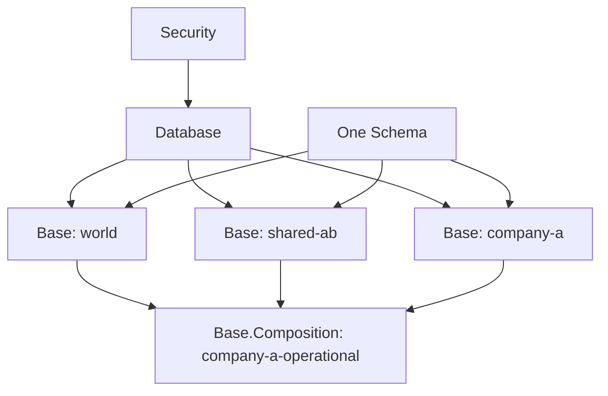
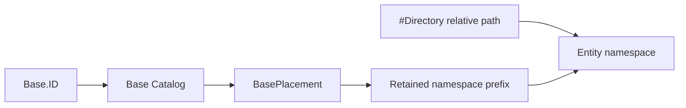

# Base and Composition

Status: implemented behind the non-default `MultiBase` SwiftPM trait.

The package ownership, runtime state, Wire contract, transaction boundaries,
implementation order, and verification gates are defined in
[Base and Composition Implementation Design](base-composition-implementation-design.md).

This document defines the optional contract for isolating and composing data
inside one logical database. The standard build retains one database data root.
Enabling `MultiBase` adds Base and Composition execution without replacing
the schema model. The default compiled path still has one engine and does not
carry a topology, target lease, Base catalog, persisted Grant store, or
Composition planner.

| Trait selection | Execution boundary |
|---|---|
| standard / `AllRuntimeFeatures` | One implicit database root; no target type or target field is compiled |
| `MultiBase` | Explicit `.database`, `.base(Base.ID)`, and `.composition(CompositionSelection)` targets |

`AllRuntimeFeatures` does not imply `MultiBase`.

## Design Conclusion

A `Base` is the database-native boundary for independently owned data. A
Composition is a read-only selection of Bases. It may be a durable named
`Base.Composition` or a request-scoped derived selection constructed directly
from a canonical Base set. Security treats a Base as a resource; it is not a
second authorization system. The model schema and `#Directory` metadata remain
reusable across any number of Bases.

The contract intentionally reserves `View` and `MaterializedView` for
relational views. A Base composition is not a stored SQL query and is not named
a View.

## Terminology

| Term | Contract |
|---|---|
| `Base` | Independent data, authorization, provenance, and placement boundary |
| `Base.ID` | Stable logical identity of one Base |
| `Base.Composition` | Named, read-only set of Bases |
| `Base.Composition.ID` | Stable identity of one Composition |
| `CompositionSelection` | Named ID or request-scoped canonical Base set selected by a caller |
| `CompositionResolution` | Immutable named generation or derived Base set fixed for one execution |
| `Security.Resource.base` | Security resource representing one Base |
| `BasePlacement` | Internal mapping from a Base to a storage namespace |
| `EntityAddress` | Base-qualified address of one persisted entity |

`Base` does not contain imports. Composition is owned only by
`Base.Composition`, so one Base can participate in multiple independent
compositions.

## Semantic Types

The public semantic shape is:

~~~swift
public struct Base: Sendable {
    public struct ID: Hashable, Sendable {
        public let value: String
    }

    public let id: ID
}

public extension Base {
    struct Composition: Sendable {
        public struct ID: Hashable, Sendable {
            public let value: String
        }

        public let id: ID
        public let bases: [Base.ID]
    }
}
~~~

`Base.Composition.bases` is the complete set of Bases in the Composition. Its
elements are unique and its stored encoding is canonical. Array order is not
precedence and has no query meaning.

A Composition:

- contains only Base identities;
- does not contain another Composition;
- contains no duplicate Base identity;
- does not own or copy entity data;
- is read-only;
- grants no authorization by itself; and
- has no generic resolution policy.

Composition membership changes publish a new immutable generation. In-flight
operations retain the generation acquired at operation start.

## Public Operation Surface

When `MultiBase` is enabled, an authenticated local session selects one
Base explicitly:

~~~swift
let session = container.session(authorization: authorization)
let companyA = session.base(companyAID)

let people = try await companyA
    .query(Person.self)
    .execute()
~~~

Mutation has exactly one Base target:

~~~swift
let context = companyA.newContext()
context.insert(person)
try await context.save()
~~~

A named Composition is selected explicitly:

~~~swift
let operational = session.composition(companyAOperationalID)

let people = try await operational
    .query(Person.self)
    .execute()
~~~

Applications may also execute canonical relational QueryIR directly through
`CompositionDataSource.execute(_:options:)`. When the optional `GraphIndex`
product is present it adds in-process `select`, `ask`, `construct`, and
`describe` methods for SPARQL and RDF graph forms. These entry points invoke
the same semantic planners used by a remote server adapter; Composition is not
a server-only capability.

A derived Composition does not require a catalog record and never receives a
synthetic ID or generation:

~~~swift
let operational = try session.composition(
    bases: [worldBaseID, companyABaseID]
)

let people = try await operational
    .query(Person.self)
    .execute()
~~~

`BaseDataSource` and `CompositionDataSource` expose parallel query builders.
Only `BaseDataSource` provides a mutation context.

| Target | Query | Mutation |
|---|---:|---:|
| `Base` | Yes | Yes |
| `Base.Composition` | Yes | No |

`database.base(id)`, `database.composition(id)`, and
`database.composition(bases:)` are lightweight logical selectors.
Authorization, resolution, and placement acquisition occur when an operation
executes. Constructing a selector does not prove that a resource exists or
that the caller may access it.

For CLI operations, `--base` and `--composition` are mutually exclusive:

~~~bash
database query sql 'SELECT * FROM Person' --base company-a

database query sql 'SELECT * FROM Person' \
  --composition company-a-operational
~~~

## Schema and Directory Contract

Schema is database-wide and is not copied into every Base. `#Directory`
defines an entity-relative layout inside a Base; it does not choose a Base and
does not encode authorization.

~~~swift
@Persistable
struct Person {
    #Directory<Person>("people")

    @ID
    var id: UUID

    var name: String
}
~~~

The physical namespace is resolved as:

~~~text
Base placement root
    + #Directory relative path
    + dynamic directory partitions
    + entity storage kind
    + entity identifier
~~~

The generated schema property should express this relative meaning. The target
naming is `relativeDirectoryPathComponents` rather than an apparently absolute
directory path.

## Identity and Provenance

An entity identifier is local to its complete storage address. The same model
identifier value may occur in different Bases without a storage collision.

~~~text
EntityAddress
    = Base.ID
    + schema entity identity
    + canonical directory partitions
    + model identifier
~~~

~~~text
(company-a, Person, 42)
(world, Person, 42)
~~~

These addresses are distinct. Equal model identifier values do not prove that
the records represent the same logical real-world entity. Cross-Base logical
identity must be explicit, for example through an IRI or a typed entity
reference.

A Composition preserves Base origin. It does not silently prefer one Base,
merge fields, or deduplicate records after dropping their Base identity.

~~~swift
public struct CompositionResult<Value: Sendable>: Sendable {
    public let composition: CompositionResolution
    public let origin: CompositionOrigin
    public let value: Value
}
~~~

This single-Base origin wrapper applies to source-local values. A global
aggregate or other result derived from multiple Bases carries the Composition
generation and the canonical set of contributing Base identities instead of a
fictitious single `baseID`.

An unqualified lookup by model identifier over a Composition may return
multiple `CompositionResult` values. An API that requires one result must fail
with a typed ambiguity error when more than one address matches. Entity, RDF,
graph, full-text, vector, and aggregate operations retain their own domain
semantics; Composition does not define one generic `ResolutionPolicy` for all
of them.

## Unified Security Model

Base authorization is expressed through the existing Security concept. There
is no `Base.Role`, `Base.Access`, or Base-owned reader list.

~~~swift
public enum Security {
    public struct Access: OptionSet, Hashable, Sendable {
        public let rawValue: UInt8

        public init(rawValue: UInt8) {
            self.rawValue = rawValue
        }

        public static let read = Self(rawValue: 1 << 0)
        public static let write = Self(rawValue: 1 << 1)
        public static let administer = Self(rawValue: 1 << 2)

        public static let readWrite: Self = [.read, .write]
        public static let all: Self = [.read, .write, .administer]
    }

    public enum Resource: Hashable, Sendable {
        case database
        case base(Base.ID)
    }

    public enum Subject: Hashable, Sendable {
        case principal(String)
        case principalRole(String)
    }

    public struct Grant: Hashable, Sendable {
        public let subject: Subject
        public let resource: Resource
        public let access: Access
    }
}
~~~

Access bits are independent:

| Access | Meaning |
|---|---|
| `.read` | Return data from the resource |
| `.write` | Attempt a mutation against the resource |
| `.administer` | Manage the resource lifecycle and Grants |

`.write` does not imply `.read`, and `.administer` does not imply either data
permission. The server may inspect an old value internally while validating a
write without returning that value to a caller who lacks `.read`.

Access and Resource are orthogonal axes. Resource containment creates no
implicit permission inheritance: a Grant on `.database` does not grant access
to every `.base`, and a Grant on one Base does not grant access to any other
Base. Each operation checks the Resource it actually targets.

| Operation | Resource checked | Required access |
|---|---|---|
| Read Base data | `.base(baseID)` | `.read` |
| Mutate Base data | `.base(baseID)` | `.write` |
| Manage one Base's Grants or lifecycle | `.base(baseID)` | `.administer` |
| Create a Base or manage a Composition definition | `.database` | `.administer` |
| Read through a Composition | Every participating `.base(baseID)` | `.read` on each |

Creating a Base must atomically establish its initial Base administrator. A
database administrator does not gain access to that Base's data unless an
explicit Base Grant also provides `.read` or `.write`.

Grant examples are:

~~~swift
try await database.security.grant(
    .read,
    to: .principal("alice"),
    on: .base(companyAID)
)

try await database.security.grant(
    [.read, .write],
    to: .principalRole("company-a-member"),
    on: .base(companyAID)
)

try await database.security.grant(
    .all,
    to: .principal("database-operator"),
    on: .database
)
~~~

`Principal.roles` are authenticated claims. A role string grants no database
access until a matching Grant binds it to a Security resource. Matching direct
and role-based Grants are unioned into one effective `Security.Access` value.

One canonical Grant record exists for each subject-resource pair. Granting
access unions bits; partial revocation removes selected bits. Changes are
revisioned and transactional.

### Authorization Order

Security is one model with multiple constraints:

~~~text
Security Grant permits the Base action
AND SecurityPolicy permits the entity operation
AND @Restricted permits the field operation
~~~

`SecurityPolicy` and `@Restricted` remain reusable with the same schema across
all Bases. Base identity is not added to `Principal`, `AuthorizationContext`,
model fields, or policy signatures.

Database-backed Grant evaluation occurs inside the operation transaction and
before the data namespace is opened. State-independent operation admission may
reject an operation family, but it is not the authority for a persisted Base
Grant.

Grant state is authoritative in the same transaction domain as its Base data.
This prevents a Grant change from racing authorization and data access.

### Composition Authorization

A Composition has no independent Grant. A read requires `.read` on every Base
in the retained Composition generation. Authorization completes before any
result is emitted. One denial fails the complete operation; inaccessible Bases
are never silently omitted.

Continuation requests and persistent job steps reauthorize their participating
Bases. They do not retain an authorization result indefinitely after a Grant
may have changed.

## Catalog and Physical Data

The control plane and data plane are separate:

~~~text
Database
|-- Schema generations
|-- Base Catalog
|-- Composition Catalog
|-- Placement Catalog
|-- database-resource Security Grants
`-- Storage partitions
    |-- Base company-a
    |   |-- Base-resource Security Grants
    |   |-- entities
    |   |-- indexes
    |   |-- relationships
    |   |-- graph and RDF
    |   `-- ontology and SHACL
    |-- Base shared-ab
    `-- Base world
~~~

An application model does not gain a `baseID` field. Base selection is an
operation input and a physical namespace prefix, so the planner never relies
on a late `baseID` row filter for isolation.

The Base Catalog stores stable identity, compact internal ordinal, revision,
lifecycle state, and a placement reference. The Composition Catalog stores its
identity, immutable generation, and canonical Base set. Placement records map
stable Base identity to a backend namespace generation without exposing the
physical prefix to clients.

## FoundationDB Placement

FoundationDB Directory Layer resolves a Base placement during Base creation,
movement, or runtime restoration. It is not called on every query. The runtime
retains the resolved Subspace prefix for the placement generation.

Conceptually, the path is:

~~~text
/databases/<database-id>/partitions/<partition-id>/bases/<base-id>
~~~

Entity data and every derived index remain below that Base root. A Base-local
query therefore reads one bounded prefix rather than scanning unrelated Bases
and filtering them afterward.

StorageKit receives resolved namespaces and transactions. It does not own or
interpret `Base`, `Base.Composition`, Security Grants, or Composition query
semantics.

## Composition Execution and Performance

A Composition selection is resolved once per execution. Named selections load
an immutable catalog generation; derived selections retain their canonical
Base set directly:

~~~text
CompositionResolution
|-- named identity and generation, or derived kind
|-- canonical Base identities
|-- Schema generation
|-- resolved Base ordinals
|-- retained namespace prefixes
`-- resolved index roots
~~~

The query-plan cache key includes the Composition generation, Schema
generation, and query fingerprint. A hot query does not traverse a Base graph,
open FDB directories, reconstruct strings, or reinterpret schema metadata.

For the common small Composition, the executor issues concurrent Base-local
index reads and performs a bounded streaming k-way merge. It retains one cursor
head per Base and the requested result page rather than materializing every
source result.

Large, frequently queried Compositions may use explicit materialized
Composition indexes. Such indexes are derived, generation-bound, rebuildable
state and never authoritative entity data. Their lifecycle must expose
`building`, `readable`, `stale`, and `failed`; execution must not silently use a
stale or semantically weaker result.

## Consistency

Bases in one storage transaction domain can participate in one transactional
snapshot. A Composition spanning independent transaction domains is a
federated read and cannot claim the same atomic snapshot guarantee.

~~~text
single transaction domain
    -> one transactional snapshot

multiple transaction domains
    -> versioned federated result with explicit watermarks
~~~

The capability and result metadata must expose this difference. The runtime
must not silently present a federated read as transactionally atomic.

## Package Ownership

| Package | Ownership |
|---|---|
| `database-kit` | Base, Composition, Security resource/Grant semantics, operation and Wire contracts |
| `database-framework` | Catalogs, generation leases, authorization execution, placement resolution, relational planning, and in-process Composition execution |
| `database-framework / GraphIndex` | RDF blank-node identity, SPARQL/ASK/CONSTRUCT/DESCRIBE Composition semantics when `GraphIndexes` is selected |
| `storage-kit` | Resolved namespaces, transactions, and backend adapters |
| `database-server` | DatabaseWire dispatch, remote page/spool/job lifecycle, error mapping, credential authentication, and native host lifecycle; no Composition query semantics |
| `database-client` | Typed Base and Composition operation invocation |
| `database-cli` | `--base` and `--composition` selection and administration UX |

## Implementation Invariants

- The database root or one Base can be a mutation target; a Composition is
  never writable.
- Base selection is explicit and never inferred from model data.
- `#Directory` remains relative to a Base.
- A Composition stores a canonical set of Base identities, not recursive
  Composition references.
- Composition results preserve Base origin.
- Equal model identifier values across Bases do not imply logical identity.
- Security uses one Grant model with independent Access bits.
- A Composition grants no access and requires read access to every Base.
- Grant evaluation and Base data access share a transaction domain.
- Query planning begins with authorized Base namespaces; Base authorization is
  not implemented as post-query filtering.
- Storage adapters receive resolved namespaces and do not interpret Base
  semantics.
- Unsupported consistency or materialization capabilities fail explicitly.

## Implemented Capability Boundary

The runtime implements Base lifecycle and offline placement movement,
target-bound request execution, Base-local Grants, field authorization,
Composition provenance, and durable federated paging. Removed storage layouts
are rejected; the MultiBase runtime does not probe, alias, or migrate them.
It only advertises Composition operations whose merge semantics are
implemented.

| Composition operation | Contract |
|---|---|
| Base-local filter and projection | Supported |
| Global order, limit, and offset | Bounded merge |
| Distinct and decomposable aggregates | Supported with contributor origin |
| Vector search | Supported only for identical scoring contracts |
| Explicitly Base-qualified two-table `INNER JOIN` | Bounded canonical execution with derived contributor origin |
| Outer/lateral/implicit cross-Base join, heterogeneous full-text rank, graph algorithms | Typed unsupported failure |
| Mutation, ontology, SHACL, command, maintenance | Not advertised |

Cross-domain continuation pages reference a durable, bounded snapshot spool.
The server retains the Composition resolution, every member placement
generation, plan fingerprint, read points, and watermark; the opaque client
continuation does not carry trusted state. Every page reauthorizes all member
Bases.

## Read-Decide-Write Transactions

Composition remains read-only as a data source. An application may explicitly
open a decision transaction when it must read several member Bases and write
one member Base:

~~~swift
try await operational.withDecisionTransaction(
    writingTo: companyABaseID
) { transaction in
    let rules = try await transaction.fetch(
        Query<Rule>(),
        from: worldBaseID
    )
    try await transaction.save(makeDecision(using: rules))
}
~~~

This API exists only when every selected Base shares the writer's physical
transaction domain. It checks `.read` for every member and `.write` for the
writer inside that one transaction. A multi-domain selection fails with
`CompositionDecisionError.multipleStorageDomains`; it never degrades into a
non-atomic read-modify-write sequence.
