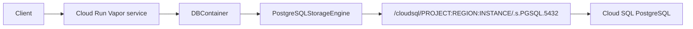

# Cloud Run Vapor PostgreSQL

This guide shows the intended Cloud Run deployment path for a Vapor service that
uses `database-framework` with Cloud SQL for PostgreSQL.

## Runtime Shape



## Package Requirements

The Vapor service must enable the PostgreSQL trait for `database-framework`.
The `storage-kit` version resolved by `database-framework` must include:

- `PostgreSQLConfiguration.cloudRunProduction(environment:)`
- `PostgreSQLConfiguration.init(cloudSQLInstanceConnectionName:username:password:database:)`
- `PostgreSQLStorageEngine.checkReadiness()`

The release dependency must point at a tagged `storage-kit` version that includes
Cloud SQL Unix socket configuration, bounded Cloud Run connection budgets, DDL
opt-out, and readiness checks.

## Cloud Run Environment

Configure the Cloud Run service with the Cloud SQL instance attachment and these
environment variables or secrets:

| Variable | Purpose |
|---|---|
| `STORAGE_KIT_POSTGRES_CLOUD_SQL_CONNECTION_NAME` | Cloud SQL instance connection name |
| `STORAGE_KIT_POSTGRES_USER` | PostgreSQL user |
| `STORAGE_KIT_POSTGRES_PASSWORD` | PostgreSQL password |
| `STORAGE_KIT_POSTGRES_DATABASE` | PostgreSQL database name |
| `STORAGE_KIT_POSTGRES_TABLE` | KV table name, defaults to `kv_store` |
| `STORAGE_KIT_POSTGRES_SCHEMA_MANAGEMENT` | `assumeExists` for IAM/DML-only deployments, `createIfNeeded` for bootstrap |
| `STORAGE_KIT_POSTGRES_POOL_MAX_CONNECTIONS` | Max connections per Cloud Run instance |
| `STORAGE_KIT_POSTGRES_POOL_MIN_CONNECTIONS` | Warm connections per instance, defaults to `0` |
| `STORAGE_KIT_CLOUD_RUN_MAX_INSTANCES` | Maximum Cloud Run instances |
| `STORAGE_KIT_CLOUD_SQL_MAX_CONNECTIONS` | Cloud SQL connection limit used for budget validation |
| `STORAGE_KIT_CLOUD_SQL_RESERVED_CONNECTIONS` | Non-application connection reserve, defaults to `10` |
| `PORT` | Provided by Cloud Run for the Vapor listener |

## DBContainer Factory

```swift
import Database
import DatabaseRuntime
import PostgreSQLStorage

func makeDatabaseContainer(
    schema: Schema,
    persistableTypes: [any Persistable.Type]
) async throws -> DBContainer {
    let postgresConfiguration = try PostgreSQLConfiguration.cloudRunProduction()
    let engine = try await PostgreSQLStorageEngine(configuration: postgresConfiguration)
    let runtime = try DatabaseFrameworkRuntime.configuration(
        persistableTypes: persistableTypes
    )

    return try await DBContainer.open(
        for: schema,
        configuration: DBConfiguration(backend: .custom(engine)),
        runtimeConfiguration: runtime,
        security: .enabled()
    )
}
```

## Vapor Listener

Cloud Run sends traffic to the port in `PORT`, and the container must listen on
`0.0.0.0`.

Vapor 5 uses the async `Application` initializer and `start()` entry point.

```swift
import Foundation
import Vapor

@main
enum Entrypoint {
    static func main() async throws {
        let port = ProcessInfo.processInfo.environment["PORT"].flatMap(Int.init) ?? 8080
        let app = try await Application(
            configuration: .init(address: .hostname("0.0.0.0", port: port))
        )

        let schema = try Schema(
            entities: [try User.schemaEntity],
            version: .init(1, 0, 0)
        )
        let database = try await makeDatabaseContainer(
            schema: schema,
            persistableTypes: [User.self]
        )
        try configureRoutes(app, database: database)

        try await app.start()
    }
}
```

## Deploy Shape

```bash
gcloud run deploy SERVICE_NAME \
  --image REGION-docker.pkg.dev/PROJECT/REPOSITORY/IMAGE:TAG \
  --region REGION \
  --add-cloudsql-instances PROJECT:REGION:INSTANCE \
  --set-env-vars STORAGE_KIT_POSTGRES_CLOUD_SQL_CONNECTION_NAME=PROJECT:REGION:INSTANCE,STORAGE_KIT_POSTGRES_POOL_MAX_CONNECTIONS=4,STORAGE_KIT_CLOUD_RUN_MAX_INSTANCES=10,STORAGE_KIT_CLOUD_SQL_MAX_CONNECTIONS=100,STORAGE_KIT_POSTGRES_SCHEMA_MANAGEMENT=assumeExists \
  --update-secrets STORAGE_KIT_POSTGRES_USER=DB_USER_SECRET:latest,STORAGE_KIT_POSTGRES_PASSWORD=DB_PASSWORD_SECRET:latest,STORAGE_KIT_POSTGRES_DATABASE=DB_NAME_SECRET:latest
```

## Production Notes

| Area | Requirement |
|---|---|
| Connection pool | Tune `PostgresClient.Configuration.options.maximumConnections` for Cloud Run concurrency. |
| Secrets | Store database credentials in Secret Manager, not plain environment variables. |
| IAM | Give the Cloud Run service account permission to connect to the Cloud SQL instance. |
| Lifecycle | Create one `DBContainer` at Vapor startup and reuse it for requests. |
| Shutdown | Call `container.engine.shutdown()` from Vapor shutdown hooks if the service owns the container lifecycle. |
| Schema | Use `assumeExists` when the Cloud SQL role is DML-only; provision the KV table separately. |
