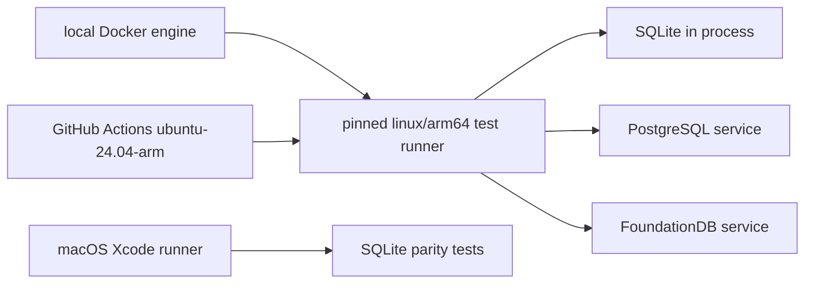
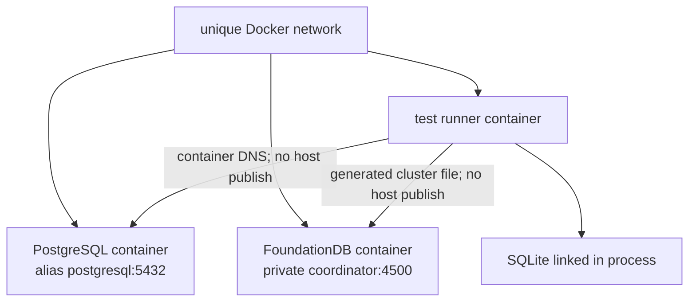
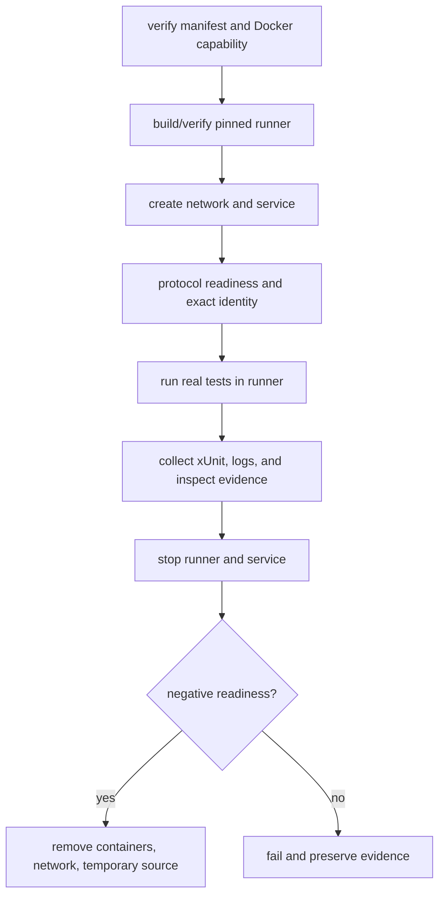

# Docker Backend Verification

The repository-owned Docker environment is the canonical Linux backend test
environment locally and in CI. macOS remains a separate Xcode parity lane; it
does not host the database services used by Linux integration tests.

## Environment Contract



`scripts/docker/versions.env` is the single reviewed artifact manifest. Every
service image uses an OCI manifest digest. The image build compares the complete
installed Debian package set against `scripts/docker/ubuntu-packages.lock` and
fails on any drift. The runner also verifies a checksum-pinned Swift archive,
FoundationDB client package, and SQLite amalgamation before use.

| Component | Pinned identity | Runtime assertion |
|---|---|---|
| Platform | `linux/arm64` | Docker image OS and architecture |
| Swift | 6.4 development snapshot 2026-08-14 | compiler commit |
| Ubuntu | 24.04 | image digest, full package lock, and `/etc/os-release` |
| SQLite | 3.53.4 | SQL runtime version |
| PostgreSQL | 18.6 | `SHOW server_version` |
| FoundationDB | 7.3.77 | client, server, and cluster status |

The Docker engine version is recorded rather than pinned because it is the
host execution capability. Reproducibility comes from the platform selection,
immutable images, checksummed toolchain/client/source artifacts, and the test
contract inside the runner.

## Topology



The test process and service live in the same network namespace topology. No
host port, relay, `.test` DNS registration, administrator privilege, Homebrew
service, or developer database is used. The runner receives only the disposable
service credentials and cluster file owned by that run.

## Commands

Docker must be installed and its Linux engine must be reachable. The harness
does not install or reconfigure it.

```bash
scripts/docker-test-harness doctor
scripts/docker-test-harness sqlite
scripts/docker-test-harness sqlite --multi-base
scripts/docker-test-harness postgresql
scripts/docker-test-harness foundationdb
scripts/docker-test-harness all
```

The separate macOS parity gate remains:

```bash
scripts/docker-test-harness macos-sqlite
scripts/docker-test-harness macos-sqlite --multi-base
```

FoundationDB benchmarks run inside the same Linux runner and service topology:

```bash
scripts/docker-test-harness foundationdb-run -- \
  swift test --package-path /workspace/Benchmarks \
    --only-use-versions-from-resolved-file
```

`foundationdb-client` is the only host-oriented support command. It extracts
the checksum-verified macOS client into an immutable user cache for the Xcode
benchmark compile gate; it does not install a launch daemon or system package.

## Lifecycle And Failure Contract



Setup, test, timeout, evidence, teardown, negative-readiness, or deletion
failure fails the command. A missing backend never becomes a skip or in-memory
fallback. Swift Testing xUnit must match the reviewed exact test count with zero
failures, errors, skips, compiler warnings, and runtime warnings.

## Evidence

The default result root is
`${TMPDIR}/database-framework-docker-results`. Override it with
`DATABASE_FRAMEWORK_DOCKER_RESULT_ROOT` or `--result-directory`.

| Evidence | Files or recorded values |
|---|---|
| Source | disposable source copy, URL dependency resolution in test log |
| Toolchain | Swift snapshot, compiler commit, target triple, image fingerprint |
| Service | pinned image, inspect JSON, exact server identity, private endpoint |
| Results | Swift Testing xUnit, complete test log, counts and warnings |
| Teardown | service stop and negative-readiness result |
| Removal | absence of runner, service container, and run network |

CI uses native `ubuntu-24.04-arm` runners for the canonical Docker lanes. A
local non-ARM Docker host may emulate `linux/arm64`, but the selected platform
and artifacts remain identical. The macOS Xcode lane continues to use
`scripts/xcode-test-harness`, exact `.xcresult` counts, and the pinned Darwin
Swift toolchain.
