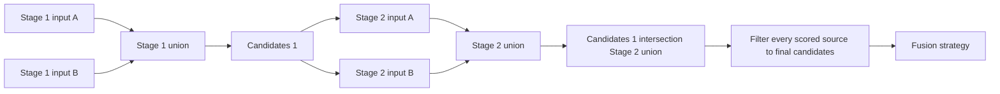
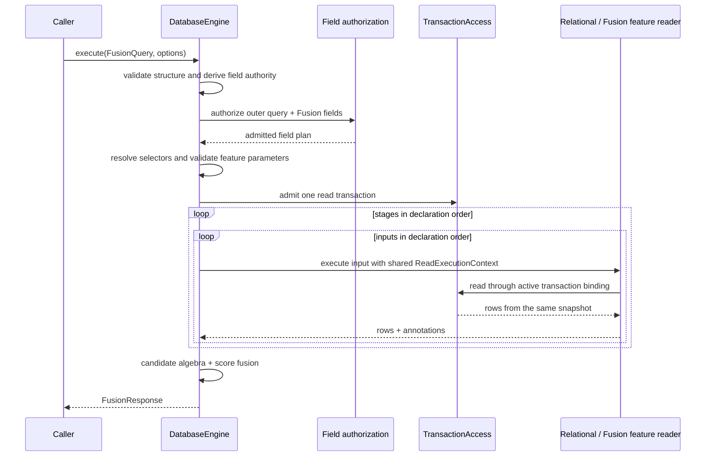

# Fusion Execution Design

## Status

This document is the implementation contract for the Fusion redesign. The
first production slice implements canonical `Filter -> Search -> Rank`
execution, including candidate-before-limit full-text reads. Vector, spatial,
bitmap, leaderboard, and graph inputs are context-free QueryIR values but are
not reported as executable until their feature-owned physical readers and
behavioral contracts are complete.

## Replaced Baseline

The redesign replaced two disconnected Fusion representations:

```text
DatabaseKit.AccessPath.fusion(FusionSource)
    -> serializable QueryIR value
    -> rejected by DatabaseEngine single-table execution

DatabaseEngine.FusionBuilder
    -> executable local DSL
    -> retains IndexQueryContext in every concrete query
    -> stores executable existentials and closures
    -> exposes Parallel as public query semantics
```

The canonical read path already owns the contracts that Fusion needs:

- `DatabaseContext.query` admits one storage transaction and installs it in
  `ActiveDatabaseTransactionContext`;
- nested canonical reads reuse that transaction and therefore one read
  snapshot;
- `ReadExecutionContext` owns one request-scoped `DatabaseWorkMeter`;
- feature modules register schema-authoritative `IndexReadExecutor` values;
- `IndexReadResult` retains index-native ordering and row annotations;
- the canonical relational pipeline owns field authorization, projection,
  filtering, ordering, pagination, continuation, and output materialization.

Before the redesign, no production caller outside database-framework used
`DatabaseContext.fuse`, `FusionBuilder`, or `Parallel`. Existing Fusion tests
exercise the local implementation directly, with Vector providing the only
database-backed behavioral coverage.

The removed executable inputs did not share one candidate contract. Most inputs performed
an unrestricted physical read and intersect candidates afterward, while
`Similar` computes distances inside the incoming candidate set before applying
`k`. That difference is observable: `topK(U) intersect C` is not equivalent to
`topK(C)`. Any replacement that routes every input through the ordinary
`IndexReadExecutor` contract loses the second behavior because that contract
deliberately leaves relational filtering to the dispatcher after the
index-native result has been produced.

The baseline evidence used to derive this design was:

| Fact | Source of truth |
|---|---|
| Fusion access paths enter DatabaseEngine before ordinary index dispatch | `Sources/DatabaseEngine/QueryExecution/DatabaseContext+CanonicalRows.swift` |
| Ordinary index readers produce native rows and leave SQL clauses to the dispatcher | `Sources/DatabaseEngine/Read/ReadExecutorRegistry.swift` |
| Nested reads reuse the active transaction binding | `Sources/DatabaseEngine/QueryExecution/DatabaseContext+CanonicalRows.swift` and `Sources/DatabaseEngine/Transaction/ActiveDatabaseTransactionContext.swift` |
| Vector's removed local DSL computed exact distances over incoming candidates | `git show HEAD:Sources/VectorIndex/Fusion/Similar.swift` |
| Full-text, spatial, bitmap, and leaderboard local inputs filtered candidates after native reads | their `Fusion/*.swift` files at `HEAD` |
| Connected previously resolved the graph index on the result entity rather than an explicit edge entity | `git show HEAD:Sources/GraphIndex/Fusion/Connected.swift` |
| The earlier whole-plan Fusion reader registry was removed because it misplaced execution ownership | commit `8818f857` |
| No non-test production caller outside this package uses the context-bound Fusion DSL | workspace call-site search before this design review |

## Ownership

| Concept | Owner | Reason to change |
|---|---|---|
| Fusion stages, inputs, score interpretation, strategy | DatabaseKit | Query meaning or wire contract changes |
| Typed, context-free Fusion query construction | DatabaseKit and feature input types | Public query syntax or feature parameters change |
| Transaction, candidate flow, resource accounting, fusion algebra | DatabaseEngine | In-process execution policy or correctness changes |
| Candidate-aware physical Fusion reads and index-native annotations | Owning index module | Persisted index layout or feature algorithm changes |
| Runtime reader registration | DatabaseRuntime | Selected SwiftPM trait graph changes |
| Wire dispatch and response framing | database-server | Remote operation or transport contract changes |

DatabaseEngine must not import a concrete index module. A feature module must
not retain `DatabaseContext`, `IndexQueryContext`, a transaction, or an
executable closure in a query value.

The ordinary `IndexReadExecutor` and a Fusion input reader have different
contracts and must not be conflated:

| Reader | Input domain | Limit ordering | Owner |
|---|---|---|---|
| `IndexReadExecutor` | One ordinary canonical query | Produce index-native rows; the relational dispatcher applies SQL clauses | Feature module |
| `FusionIndexReadExecutor` | One admitted Fusion index plus opaque candidate primary keys | Apply candidate restriction before input-native `k`, limit, or ranking | Feature module |

Both may share package-internal scanning and decoding code. One must not call
the other if doing so changes the ordering of candidate restriction and
truncation.

## Public Use

The final typed API is context-free until execution:

```swift
let query = FusionQuery<Product> {
    Filter(Product.fields.isAvailable, equals: true)
    Search(Product.fields.summary)
        .terms(searchTerms)
        .limit(candidateCount)
    Rank(Product.fields.popularity)
        .order(.descending)
}
.strategy(.weighted([0, 1]))
.limit(resultCount)

let response = try await context.execute(query)
```

Each top-level input is a one-input stage. `FusionStage` groups inputs that
belong to the same semantic candidate stage. There is no public `Parallel`
type. Stage membership remains stable if the executor later changes its
scheduling policy.

`FusionQuery`, `FusionStage`, and every feature input are immutable, `Sendable`
values. Constructing them does not access a database or depend on task-local
state. `DatabaseContext.execute` is the first runtime boundary.

## Canonical Query Model

DatabaseKit owns the following target-free values:

```text
FusionQuery<Item>
    -> SelectQuery(table: Item.persistableType)
        -> AccessPath.fusion(FusionSource)
            -> ordered [FusionStageSource]
                -> ordered [FusionInput]
```

A `FusionInput` contains:

- an operation:
  - an exact or schema-matched index read;
  - a canonical predicate;
  - canonical ordering;
- an optional score interpretation:
  - row position;
  - a named numeric annotation where higher values are better;
  - a named numeric annotation where lower values are better;
- whether an incoming candidate set is required;
- an optional input result limit.

`FusionInput.limit` is the single semantic output bound for the input and is
applied after candidate restriction. Feature parameter dictionaries do not
duplicate that bound under feature-specific `k` or `limit` keys. Parameters
that tune an algorithm without changing the requested output cardinality remain
feature-owned parameters.

`FusionSource` does not make row identity or the output score annotation
configurable. A Fusion result is a single persisted entity, so its canonical
`id` field is the identity and `fusion.score` is the reserved output annotation.
Keeping either name in the wire plan would create two sources of truth and
would allow a caller to reinterpret an arbitrary field as physical identity.

`FusionInputRequirement.unrestricted` means that an input can form the first
stage. It does not mean that a later execution may ignore incoming candidates.
When candidates exist, every input must compute its documented operation over
that candidate domain before applying an input-native limit. The
`.candidates` requirement means that execution without an incoming set is a
typed error. `Rank` uses this requirement.

Every stage is homogeneous: either every input is scored or no input is
scored. A mixed stage is rejected during plan validation. This prevents an
unscored `Filter` union from introducing identities that have no fused score.
Scalar `Filter` and `Bitmap` form unscored candidate stages; full-text, vector,
spatial, leaderboard, graph connectivity, and rank inputs form scored stages.
At least one scored stage is required.

Arbitrary Swift predicates are not representable because they cannot cross a
process boundary, cannot be structurally bounded, and cannot be reproduced by
the server.

Index selection is data, not a captured schema lookup. A feature input may
select a named index or request one schema index by semantic type and field
coverage. Execution fails if a schema match has zero or multiple results.

## Stage And Score Semantics



The rules are normative:

1. Stages execute in declaration order.
2. Every input in a stage receives the same incoming candidate set.
3. A candidate-aware physical reader applies that set before its native
   scoring, ordering, and limit. Post-limit filtering is not equivalent and is
   forbidden.
4. Identities returned by inputs in one stage are unioned.
5. The stage output is intersected with the preceding candidate set as a
   defensive algebra check, even though conforming readers already restrict
   their domain.
6. After the last stage, every scored source is filtered to the final
   candidate set.
7. The strategy combines only scored inputs, in declaration order.
8. Position and normalization are computed over the candidate-relative input
   result before later stages filter it. A later stage must not renumber an
   earlier ranking or change its normalization range.
9. Equal fused scores use canonical identity ordering as a deterministic tie
   breaker.
10. Duplicate identities within one input, inconsistent payloads for one
    identity, missing identities, nonnumeric or nonfinite signals, and score
    overflow are typed failures.

For stage `s`, let `C(s-1)` be its incoming candidates and `R(s,i)` be input
`i` evaluated over that domain. The set contract is:

```text
S(s) = union over i of identities(R(s,i))
C(0) = S(0)
C(s) = C(s-1) intersection S(s), for s > 0
```

Because scored and unscored inputs cannot be mixed in one stage, and the plan
contains at least one scored stage, every final candidate must have at least
one score contribution. A missing contribution is an invariant violation, not
an implicit zero or a silently dropped row.

Reciprocal-rank fusion uses declaration-order row position and contributes
`1 / (rankConstant + oneBasedRank)` for every scored input. Sum, maximum, and
weighted fusion normalize each scored input independently before accumulation:

- position scoring contributes `1 / oneBasedRank`;
- a numeric annotation is min-max normalized in its declared direction;
- one value, or several equal values, normalize to `1.0` rather than dividing
  by zero.

Weighted fusion requires exactly one finite, nonnegative weight per scored
input. Every accumulation operation checks for a finite result.

## Execution And Snapshot Contract



The executor initially runs inputs serially. This is a safety property, not a
public semantic promise. `TransactionAccess: Sendable` does not state that
overlapping operations on one transaction are supported, and existing
database transaction code deliberately rejects overlap. Parallel scheduling
may be introduced only behind an explicit storage capability and differential
behavior tests. It must never change stage membership or result order.

Every nested input reuses the outer `ActiveDatabaseTransactionContext`, the
explicitly passed transaction, and the same `ReadExecutionContext`. An input
must not create an independent snapshot, work meter, deadline, or continuation
scope.

For relational `Filter` and `Rank`, DatabaseEngine adds incoming candidates as
a canonical identity predicate before filtering or ordering. For feature index
inputs, DatabaseEngine passes candidates to the registered
`FusionIndexReadExecutor`; the feature reader must restrict the physical
domain before any input-native `k` or limit. The engine rechecks membership
after execution. A row outside the requested candidate domain is an executor
contract violation; it is never silently discarded. A canonical identifier
whose field value has no QueryIR literal representation fails with a typed
unsupported-identity error when the relational path requires an identity
predicate; it must not silently fall back to an unbounded physical read.

`FusionIndexReadExecutor` is a package-scoped DatabaseEngine extension contract
keyed by `IndexType`. DatabaseEngine first resolves and admits the declared
index. It then constructs a request containing the immutable Fusion source,
score interpretation, input limit, work meter, and a revocable read capability
confined to that exact physical index subspace.
Incoming candidates remain an opaque Engine-owned domain that exposes only
canonical primary keys and membership. Feature modules cannot observe rows,
open another index or transaction, mutate storage, or control transaction
lifetime.

StorageKit supplies the low-level read operations, but DatabaseEngine does not
erase the whole transaction to a feature-visible protocol. Its concrete
`FusionIndexReadSession` validates every point and range against the admitted
subspace, serializes operations, owns cursor cleanup, and revokes the capability
before the transaction advances to another input.

Admission is deliberately split so physical schema details are not observable
before field authorization:

```text
structural plan validation
    -> collect field authority without reporting selector resolution failures
        -> authorize the combined outer-query and Fusion field plan
            -> resolve index selectors and relational bindings
                -> validate the registered feature executor
                    -> open the read transaction and physical capability
```

A selector that is invalid or ambiguous requires whole-entity field authority
before its precise schema error is reported. A valid selector contributes all
fields represented by that physical index. Full-text postings combine every
field declared by one index, so `Search(field)` selects an exact single-field
index; a named multi-field full-text index is rejected rather than pretending
that its combined postings represent only the requested field.

The result is an exact, complete, reservation-owning sequence of physical
matches retained by the Engine-owned sink.
Unsupported candidate-aware execution and a resource or scan bound that
prevents the declared input result from being completed are typed failures.
Reaching an explicitly requested top-k count is successful completion, not
partial execution.

The public extension boundary has this semantic shape; exact declaration names
may differ only to follow the package's API naming rules:

```swift
package protocol FusionIndexReadExecutor: Sendable {
    var indexType: IndexType { get }

    func validate(_ request: FusionIndexValidationRequest) throws
    func executeUnrestricted(
        _ request: FusionIndexReadRequest,
        output: FusionMatchSink
    ) async throws -> FusionInputCoverage
    func executeRestricted(
        _ request: FusionIndexReadRequest,
        candidates: FusionCandidateDomain,
        output: FusionMatchSink
    ) async throws -> FusionInputCoverage
}

package struct FusionIndexReadRequest: Sendable {
    let source: FusionIndexSource
    let scoring: FusionScoring?
    let limit: Int
    let access: any FusionIndexReadAccess
    let workMeter: DatabaseWorkMeter
}
```

`FusionMatchSink` is the only feature output. It rejects keys outside the
incoming domain, duplicates, malformed or nonfinite signals, and writes beyond
the admitted limit before retaining them. Field authority is established
before feature validation or I/O. DatabaseEngine materializes rows only after
the feature capability has been revoked and performs row-policy evaluation on
that Engine-owned path.

`FusionReadExecutorRegistry` owns one immutable same-entity executor per
`IndexType` and rejects duplicates at bootstrap.
`DatabaseRuntimeConfiguration` owns the registry; `DatabaseRuntime` constructs
it from enabled traits. This avoids global registration and prevents a feature
module from taking ownership of the whole Fusion plan.

A conforming result is an ordered sequence of unique physical primary keys and
the declared numeric signal when scored. The Engine owns payload loading,
authorization, deterministic fused ordering, and the reserved `fusion.score`
annotation. Readers may report empty success only when the index is readable
and there are genuinely no matches; missing or unreadable required state
remains a typed failure according to the existing index lifecycle contract.

`Connected` is cross-entity: the property-graph index belongs to the edge
entity while returned models belong to the Fusion result entity. Its QueryIR
therefore names both the edge table/index and the result entity's node field.
GraphIndex owns traversal; DatabaseEngine owns mapping reached node values back
to result rows and the surrounding Fusion algebra. The edge reader uses the
same read-only transaction facade and work meter.

Connected is deliberately a two-phase exception to the same-entity reader
shape:

```text
incoming result identities
    -> DatabaseEngine projects candidate rows to allowed node values
        -> GraphIndex traverses the admitted edge index and returns node + hops
            -> DatabaseEngine maps nodes to result rows
                -> sort by hops, then canonical result identity
                    -> apply FusionInput.limit
```

Candidate restriction still precedes limit. The graph reader cannot apply the
final row limit because more than one result row may carry the same node value;
DatabaseEngine applies the limit only after the node-to-row mapping is known.

## Response Contract

`DatabaseContext.execute(FusionQuery)` returns `FusionResponse<Item>`, not a
bare array. It contains:

- scored, decoded results;
- the canonical query continuation, when present;
- canonical query metadata.

Resource exhaustion, cancellation, a partial physical scan, or an unsupported
reader is not converted into a partial or empty success. Physical coverage is
an internal proof (`exhausted` or an exactly satisfied limit), not a public
completion flag. Any future approximate or partial policy requires a separate
explicit API contract.

## Feature Mapping

| Feature input | Canonical operation | Score signal | Runtime owner | Status |
|---|---|---|---|---|
| `Search` | candidate-aware full-text read | `score`, higher is better | FullTextIndex | Executable |
| `Similar` | candidate-aware vector read | `distance`, lower is better | VectorIndex | QueryIR only; typed preflight failure |
| `Nearby` | candidate-aware spatial read | `distance`, lower is better | SpatialIndex | QueryIR only; typed preflight failure |
| `Rank` | canonical ordering over incoming candidates | position | DatabaseEngine relational executor | Executable after candidates exist |
| `Filter` | canonical predicate over incoming candidates, or the table when first | none | DatabaseEngine relational executor | Executable |
| `Bitmap` | candidate-aware bitmap read | none | BitmapIndex | QueryIR only; typed preflight failure |
| `Leaderboard` | candidate-aware leaderboard read | `score`, higher is better | LeaderboardIndex | QueryIR only; typed preflight failure |
| `Connected` | cross-entity property-graph traversal | `hops`, lower is better | GraphIndex | QueryIR only; typed preflight failure |

The ordinary canonical readers are reusable only where they satisfy the
candidate-before-limit contract. Otherwise the feature module supplies a
separate Fusion reader and shares lower-level scanner or decoder code
internally. Physical algorithms remain in their owning feature modules;
DatabaseEngine never imports them.

## Relation To Boolean DAG Retrieval

The referenced [ComputePN paper](https://arxiv.org/abs/2601.18747) concerns exact Boolean DAG evaluation over an
inverted index, including non-monotonic negation. Fusion is a staged hybrid
ranking plan, not that Boolean language. P1 applies the paper's architectural
lesson without pretending to implement its algorithm:

1. deterministic constraints stay inside the database execution path;
2. a candidate restriction is applied before downstream ranking and
   truncation, avoiding application-layer fetch-and-filter recall failure;
3. query values remain explicit and serializable rather than captured Swift
   closures;
4. result-set materialization is work-metered.

An arbitrary shared Boolean DAG, positive-negative set representation,
block-at-a-time memoization, and negation over a document universe require a
separate `BooleanRetrievalPlan` and feature-owned inverted-index executor. They
are not silently approximated by Fusion stages and are outside P1. Adding them
later must not change the stage algebra above.

## State, Ownership, And Lifetime Matrix

| State | Created by | Owner | Lifetime / isolation | Failure contract |
|---|---|---|---|---|
| Fusion plan | Caller / decoder | Value owner | Immutable, Sendable | Structural failure before authorization; schema and feature failure after authorization |
| Schema generation | DBContainer operation lease | DatabaseContext | Whole operation | Stale or missing schema is an error |
| Read transaction | DatabaseEngine | Transaction runner | Whole Fusion execution; serial access | Storage, cancellation, retry failure propagates |
| Candidate identities | Fusion executor | Request work meter | Until next stage / final filtering | Budget failure propagates |
| Physical matches | Feature Fusion reader through the Engine sink | Fusion executor | Until candidate algebra and scoring finish; reserve before sink retention | Partial, duplicate, out-of-domain, or corrupt matches fail |
| Candidate rows | DatabaseEngine materializer or relational executor | Fusion executor | Until the next stage and final composition finish | Missing or inconsistent canonical entities fail |
| Fused rows | Fusion executor | Canonical relational pipeline | Until response promotion | Overflow or inconsistency fails |
| Typed response | Caller | Caller | After transaction closes | Decode failure propagates |

Nested relational execution must return a reservation-owning internal result
to Fusion. Promoting a nested result to a public array and attempting to charge
it afterward is forbidden because allocation has already occurred. A bounded
copy at the Fusion ownership boundary is permitted only when the destination
builder reserves before each append and the source reservation remains alive
throughout the copy.

No global mutable Fusion state is introduced. Revocable request-local sinks,
sessions, and reservations use the same Mutex or actor isolation on Native,
WASM, and Embedded. There is no target-specific synchronization branch or
`nonisolated(unsafe)` escape. An internal exact-size byte owner may use
`@unchecked Sendable` only when it is immutable after initialization, performs
exactly one deallocation, exposes pointers only through a synchronous borrow,
and is required to detach an admitted value from an opaque or enclosing source
owner.

## Design Authority Comparison

| Contract area | Existing library design | Project rule | Decision |
|---|---|---|---|
| Query model | DatabaseKit owns serializable QueryIR values | Protocol/value boundaries, no captured runtime state | Aligned; keep Fusion values immutable and context-free |
| Physical index logic | Feature modules own persisted layouts and algorithms | Semantic owner must retain responsibility | Aligned; DatabaseEngine dispatches but does not implement feature algorithms |
| Transaction lifecycle | DatabaseEngine admits and owns one operation transaction | Capability and lifetime must be explicit | Compatible after adding StorageKit read-only capability; raw `TransactionAccess` is not exposed |
| Result memory | Canonical execution uses reservation-owning retained buffers | Reserve before retaining, no silent resource fallback | Aligned; Fusion preserves internal ownership and fails on incomplete work |
| Concurrency | Existing transactions reject overlapping operations | Actor for ordered suspension; no unchecked sharing | Aligned; initial Fusion execution is serial and scheduling is not public semantics |
| Compatibility | Repository is in initial development and does not preserve superseded APIs | Remove aliases and duplicate paths | Aligned; delete context-bound DSL and `Parallel` after callers migrate |
| Platform capability | Common DatabaseEngine path serves Native/WASM/Embedded | No target-specific weakening of synchronization | Aligned; no conditional Fusion state or concurrency conformance |
| Performance | Index-native order and retained byte ownership are deliberate | Zero-copy where repeated and measured | Compatible; correctness first, then benchmark copies and allocations |

## Required Changes

### database-kit

1. Replace the flat, string-strategy `FusionSource` with staged, typed values.
2. Add the context-free typed Fusion query and result builders.
3. Encode and decode every Fusion field in DatabaseWire.
4. Traverse every stage, input, predicate, ordering, and parameter in
   structural validation and query metadata collection.
5. Add round-trip, boundary, empty-plan, invalid-weight, and nested-expression
   tests.

### database-framework

1. Route table `.fusion` access paths before `SelectQueryPlanner` rejects them.
2. Execute all inputs through the active transaction and shared work meter.
3. Add bounded candidate and score algebra with deterministic ordering.
4. Add typed `FusionResponse` over canonical query continuation and metadata.
5. Replace each feature Fusion query with a pure input value.
6. Add and register candidate-aware Fusion readers without weakening the
   ordinary canonical reader contract.
7. Delete `FusionContext`, executable Fusion protocols, `Parallel`, and the
   independent local execution path after all callers and tests migrate.
8. Update `docs/query.md` to point at this contract.

### database-server and clients

No duplicate server-side Fusion planner or index implementation is added. The existing
QueryIR dispatch invokes DatabaseEngine. DatabaseWire carries the staged plan,
and the existing query page already carries the transaction read point. Any
adapter-specific projection remains an adapter responsibility.

## Verification Contract

The change is complete only after all of the following are true:

1. DatabaseKit model and DatabaseWire round-trip tests cover stage membership,
   scoring, requirements, limits, invalid tags, and structural limits.
2. DatabaseEngine tests cover union-within-stage, intersection-across-stages,
   homogeneous-stage rejection, required candidates, eligibility-only stages,
   every strategy, stable pre-filter rank and normalization, deterministic
   ties, duplicate identities, inconsistent rows, malformed signals, overflow,
   cancellation, work limits, and transaction reuse.
3. Each feature input has a pure-construction test proving it retains no
   runtime context and produces the expected canonical operation.
4. Every implemented feature reader has a regression proving candidate restriction occurs
   before its native limit. Spatial, leaderboard, and graph readers also cover
   missing indexes, malformed parameters, missing entities, and incomplete
   scan failure against real storage behavior.
5. The edited targets and their complete test targets pass with zero warnings.
6. SQLite, PostgreSQL, and FoundationDB backend harnesses pass their reviewed
   exact test counts with zero failures, skips, and runtime warnings.
7. Before commit, source searches confirm that `FusionContext`, public
   `Parallel`, and executable Fusion closures are absent. Every callable but
   unavailable physical feature remains explicitly marked and fails preflight;
   it is never counted as implemented coverage.

## Deliberately Deferred Optimization

The first correct implementation does not overlap operations on one
transaction and does not add an unsafe algorithmic fast path. Exact-size raw
owners are confined to the ownership boundaries defined above; they establish
bounded retention and are not themselves a performance claim. Benchmarking
begins only after the behavior and ownership tests pass. Candidate-set
encoding, further allocation reduction, Boolean DAG evaluation, and
capability-gated scheduling are optimization candidates; none may alter this
semantic contract.
