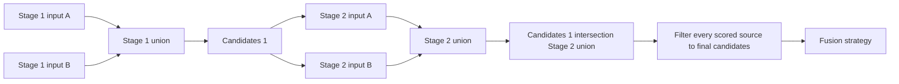
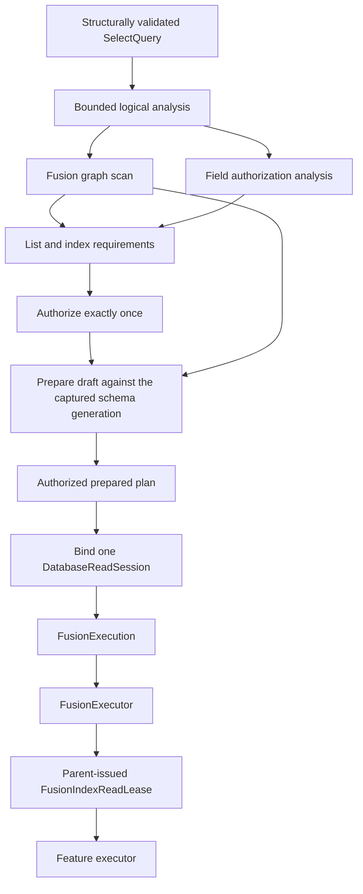
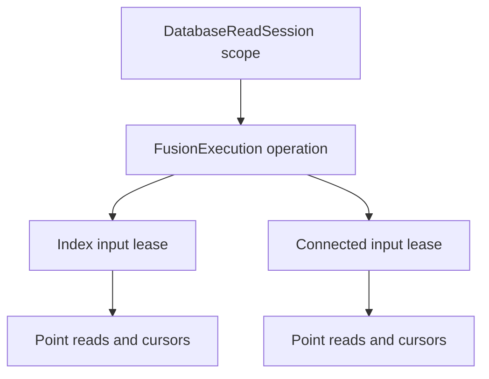

# Fusion Execution Design

## Status

This document is the implementation contract for the Fusion redesign. The
production implementation supports relational `Filter` and `Rank` plus
candidate-aware full-text, vector, spatial, bitmap, leaderboard, and graph
reads. Physical feature execution remains conditional on the package traits
selected by the host; an unregistered capability fails explicitly after
authorization.

The authorized-execution contract below is the target architecture. The
implementation is incomplete if validation can be represented by a Boolean,
authorization is carried only by ambient task-local state, a Fusion plan is
rebuilt after authorization, or a feature capability can be created without
explicit parent-session provenance. Passing behavioral tests does not make any
of those intermediate designs complete.

## Replaced Baseline

The redesign replaced two disconnected Fusion representations:

```text
DatabaseKit.AccessPath.fusion(FusionSource)
    -> serializable QueryIR value
    -> rejected by DatabaseEngine single-table execution

DatabaseEngine.FusionBuilder
    -> executable local DSL
    -> retains IndexQueryContext in every concrete query
    -> stores executable existentials and closures
    -> exposes Parallel as public query semantics
```

The canonical read path already owns the contracts that Fusion needs:

- `DatabaseContext.query` admits one storage transaction and installs it in
  `ActiveDatabaseTransactionContext`;
- nested canonical reads reuse that transaction and therefore one read
  snapshot;
- `ReadExecutionContext` owns one request-scoped `DatabaseWorkMeter`;
- feature modules register schema-authoritative `IndexReadExecutor` values;
- `IndexReadResult` retains index-native ordering and row annotations;
- the canonical relational pipeline owns field authorization, projection,
  filtering, ordering, pagination, continuation, and output materialization.

Before the redesign, no production caller outside database-framework used
`DatabaseContext.fuse`, `FusionBuilder`, or `Parallel`. Existing Fusion tests
exercise the local implementation directly, with Vector providing the only
database-backed behavioral coverage.

The removed executable inputs did not share one candidate contract. Most inputs performed
an unrestricted physical read and intersect candidates afterward, while
`Similar` computes distances inside the incoming candidate set before applying
`k`. That difference is observable: `topK(U) intersect C` is not equivalent to
`topK(C)`. Any replacement that routes every input through the ordinary
`IndexReadExecutor` contract loses the second behavior because that contract
deliberately leaves relational filtering to the dispatcher after the
index-native result has been produced.

The baseline evidence used to derive this design was:

| Fact | Source of truth |
|---|---|
| Fusion access paths enter DatabaseEngine before ordinary index dispatch | `Sources/DatabaseEngine/QueryExecution/DatabaseContext+CanonicalRows.swift` |
| Ordinary index readers produce native rows and leave SQL clauses to the dispatcher | `Sources/DatabaseEngine/Read/ReadExecutorRegistry.swift` |
| Nested reads reuse the active transaction binding | `Sources/DatabaseEngine/QueryExecution/DatabaseContext+CanonicalRows.swift` and `Sources/DatabaseEngine/Transaction/ActiveDatabaseTransactionContext.swift` |
| Vector's removed local DSL computed exact distances over incoming candidates | `git show HEAD:Sources/VectorIndex/Fusion/Similar.swift` |
| Full-text, spatial, bitmap, and leaderboard local inputs filtered candidates after native reads | their `Fusion/*.swift` files at `HEAD` |
| Connected previously resolved the graph index on the result entity rather than an explicit edge entity | `git show HEAD:Sources/GraphIndex/Fusion/Connected.swift` |
| The earlier whole-plan Fusion reader registry was removed because it misplaced execution ownership | commit `8818f857` |
| No non-test production caller outside this package uses the context-bound Fusion DSL | workspace call-site search before this design review |

## Ownership

| Concept | Owner | Reason to change |
|---|---|---|
| Fusion stages, inputs, score interpretation, strategy | DatabaseKit | Query meaning or wire contract changes |
| Typed, context-free Fusion query construction | DatabaseKit and feature input types | Public query syntax or feature parameters change |
| Transaction, candidate flow, resource accounting, fusion algebra | DatabaseEngine | In-process execution policy or correctness changes |
| Query-level list, field, and index authorization | DatabaseEngine security policy | Authorization meaning or policy changes |
| Read snapshot, transaction, work meter, and revocation | DatabaseEngine read session | Read lifecycle or storage capability changes |
| Authorized plan bound to one read session | DatabaseEngine Fusion execution | Fusion admission or execution-boundary changes |
| Candidate-aware physical Fusion reads and index-native annotations | Owning index module | Persisted index layout or feature algorithm changes |
| Runtime reader registration | DatabaseRuntime | Selected SwiftPM trait graph changes |
| Wire dispatch and response framing | database-server | Remote operation or transport contract changes |

DatabaseEngine must not import a concrete index module. A feature module must
not retain `DatabaseContext`, `IndexQueryContext`, a transaction, or an
executable closure in a query value.

The ordinary `IndexReadExecutor` and a Fusion input reader have different
contracts and must not be conflated:

| Reader | Input domain | Limit ordering | Owner |
|---|---|---|---|
| `IndexReadExecutor` | One ordinary canonical query | Produce index-native rows; the relational dispatcher applies SQL clauses | Feature module |
| `FusionIndexReadExecutor` | One admitted Fusion index plus opaque candidate primary keys | Apply candidate restriction before input-native `k`, limit, or ranking | Feature module |

Both may share package-internal scanning and decoding code. One must not call
the other if doing so changes the ordering of candidate restriction and
truncation.

## Public Use

The final typed API is context-free until execution:

```swift
let query = FusionQuery<Product> {
    Filter(Product.fields.isAvailable, equals: true)
    Search(Product.fields.summary)
        .terms(searchTerms)
        .limit(candidateCount)
    Rank(Product.fields.popularity)
        .order(.descending)
}
.strategy(.weighted([0, 1]))
.limit(resultCount)

let response = try await context.execute(query)
```

Each top-level input is a one-input stage. `FusionStage` groups inputs that
belong to the same semantic candidate stage. There is no public `Parallel`
type. Stage membership remains stable if the executor later changes its
scheduling policy.

`FusionQuery`, `FusionStage`, and every feature input are immutable, `Sendable`
values. Constructing them does not access a database or depend on task-local
state. `DatabaseContext.execute` is the first runtime boundary.

## Canonical Query Model

DatabaseKit owns the following target-free values:

```text
FusionQuery<Item>
    -> SelectQuery(table: Item.persistableType)
        -> AccessPath.fusion(FusionSource)
            -> ordered [FusionStageSource]
                -> ordered [FusionInput]
```

A `FusionInput` contains:

- an operation:
  - an exact or schema-matched index read;
  - a canonical predicate;
  - canonical ordering;
- an optional score interpretation:
  - row position;
  - a named numeric annotation where higher values are better;
  - a named numeric annotation where lower values are better;
- whether an incoming candidate set is required;
- an optional input result limit.

Relational Filter and Order expressions are row-local. Nested queries are not
Fusion inputs because they initiate another logical read with independent list
authorization and lifecycle. They fail with
`FusionExecutionError.relationalSubqueryNotSupported` before storage admission;
nested Fusion queries remain valid at ordinary `SelectQuery` boundaries.

`FusionInput.limit` is the single semantic output bound for the input and is
applied after candidate restriction. Feature parameter dictionaries do not
duplicate that bound under feature-specific `k` or `limit` keys. Parameters
that tune an algorithm without changing the requested output cardinality remain
feature-owned parameters.

`FusionSource` does not make row identity or the output score annotation
configurable. A Fusion result is a single persisted entity, so its canonical
`id` field is the identity and `fusion.score` is the reserved output annotation.
Keeping either name in the wire plan would create two sources of truth and
would allow a caller to reinterpret an arbitrary field as physical identity.

`FusionInputRequirement.unrestricted` means that an input can form the first
stage. It does not mean that a later execution may ignore incoming candidates.
When candidates exist, every input must compute its documented operation over
that candidate domain before applying an input-native limit. The
`.candidates` requirement means that execution without an incoming set is a
typed error. `Rank` uses this requirement.

Every stage is homogeneous: either every input is scored or no input is
scored. A mixed stage is rejected during plan validation. This prevents an
unscored `Filter` union from introducing identities that have no fused score.
Scalar `Filter` and `Bitmap` form unscored candidate stages; full-text, vector,
spatial, leaderboard, graph connectivity, and rank inputs form scored stages.
At least one scored stage is required.

Arbitrary Swift predicates are not representable because they cannot cross a
process boundary, cannot be structurally bounded, and cannot be reproduced by
the server.

Index selection is data, not a captured schema lookup. A feature input may
select a named index or request one schema index by semantic type and field
coverage. Execution fails if a schema match has zero or multiple results.

## Stage And Score Semantics



The rules are normative:

1. Stages execute in declaration order.
2. Every input in a stage receives the same incoming candidate set.
3. A candidate-aware physical reader applies that set before its native
   scoring, ordering, and limit. Post-limit filtering is not equivalent and is
   forbidden.
4. Identities returned by inputs in one stage are unioned.
5. The stage output is intersected with the preceding candidate set as a
   defensive algebra check, even though conforming readers already restrict
   their domain.
6. After the last stage, every scored source is filtered to the final
   candidate set.
7. The strategy combines only scored inputs, in declaration order.
8. Position and normalization are computed over the candidate-relative input
   result before later stages filter it. A later stage must not renumber an
   earlier ranking or change its normalization range.
9. Equal fused scores use canonical identity ordering as a deterministic tie
   breaker.
10. Duplicate identities within one input, inconsistent payloads for one
    identity, missing identities, nonnumeric or nonfinite signals, and score
    overflow are typed failures.

For stage `s`, let `C(s-1)` be its incoming candidates and `R(s,i)` be input
`i` evaluated over that domain. The set contract is:

```text
S(s) = union over i of identities(R(s,i))
C(0) = S(0)
C(s) = C(s-1) intersection S(s), for s > 0
```

Because scored and unscored inputs cannot be mixed in one stage, and the plan
contains at least one scored stage, every final candidate must have at least
one score contribution. A missing contribution is an invariant violation, not
an implicit zero or a silently dropped row.

Reciprocal-rank fusion uses declaration-order row position and contributes
`1 / (rankConstant + oneBasedRank)` for every scored input. Sum, maximum, and
weighted fusion normalize each scored input independently before accumulation:

- position scoring contributes `1 / oneBasedRank`;
- a numeric annotation is min-max normalized in its declared direction;
- one value, or several equal values, normalize to `1.0` rather than dividing
  by zero.

Weighted fusion requires exactly one finite, nonnegative weight per scored
input. Every accumulation operation checks for a finite result.

## Authorized Execution And Snapshot Contract

### Core Rule

Only one sealed `FusionExecution` value crosses the execution boundary. It is
the indivisible combination of an authorized, fully resolved Fusion plan and
one active DatabaseEngine read session. `FusionExecutor` does not accept a raw
`SelectQuery`, `DatabaseContext`, transaction, validation Boolean,
authorization map, or independently constructed feature session.

The canonical call shape is:

```swift
try await context.withFusionExecution(
    query,
    options: options
) { execution in
    try await FusionExecutor.execute(execution)
}
```

The exact internal names may follow package naming rules, but the accepted
values and construction authority must not be widened.



The trust transition is represented by construction authority, not by a flag.
`FusionExecution` has no public or package-visible memberwise initializer. Only
DatabaseEngine's authorized execution factory may create it, after all of the
following values are fixed:

- the exact table and Fusion source represented by each prepared entry;
- the retained schema lease and generation used to resolve it;
- the authorization context and, when enabled, resource and Grant admission;
- the resolved entity, index descriptors, and executor references;
- the read snapshot, data root, work meter, and lifecycle scope.

The prepared plan itself is executed. `FusionExecutor` never receives the
original query and does not reconstruct a plan from it. The canonical
dispatcher performs one bounded lookup of the prepared entry for the current
Fusion node before constructing the sealed execution; the input loop uses only
the retained plan and direct executor references.

### Single Analysis And Authorization

One bounded analysis phase constructs an immutable Fusion graph and the
complete field authorization plan. The Fusion graph scanner and the security
field analyzer each inspect the structurally validated query once; neither is
rerun after authorization. Later phases iterate retained Fusion nodes rather
than rebuilding them from the original query.

Authorization is deliberately completed before physical selector and executor
resolution can disclose schema details:

```text
bounded structural validation and logical analysis
    -> complete list / field / index requirements
        -> one query-level authorization decision
            -> disclose stored selector results and resolve executors
                -> one read-session binding
                    -> execution
```

Each selector is resolved once while constructing the draft, but a failure is
stored rather than disclosed. The failed selector requires conservative field
authority and its precise typed error is released only after authorization.
Executor lookup and feature validation then occur exactly once, and the
resolved descriptors and executor references are stored in the prepared plan.

"Authorize exactly once" applies to query-level list, field, and index
authority. A policy whose meaning depends on a materialized entity may still
perform row-level read authorization for each entity. That data-dependent
decision is not replaced by a query-level permit.

Task-local state is not an authorization proof. Sealed authorization evidence
travels with the execution; the parent session validates it and derives the
immutable field set used by Engine-owned materialization. A caller cannot
supply a replacement field map. A TaskLocal may carry tracing or other request
convenience, but its presence must never suppress authorization or widen a
read.

### Read Session Responsibility

`DatabaseReadSession.Scope` owns only the common read lifecycle:

- the exact read transaction and snapshot identity;
- the captured schema lease and data root;
- the request work meter and clocks;
- operation, descendant, cursor, cancellation, and revocation draining.

It does not compile Fusion or implement SPARQL, graph, index, or model
semantics. The `DatabaseReadSession` facade exposes Engine-owned admitted read
operations, while the policy and feature layers retain their respective
authorization, lookup, and execution semantics.

The lifecycle has one semantic root:



A feature capability is a child lease issued by the parent session for one
resolved input. It is not an independently rooted read session. Its initializer
accepts a private parent admission, not an arbitrary transaction. The child
contains only the resolved index, bounded subspace, shared snapshot and work
meter, and a parent-registered lifecycle node. Closing an input rejects new
operations, drains admitted descendants and cursors, and releases its parent
registration before the next input advances. Closing the parent drains every
remaining child before releasing the transaction.

Feature modules cannot open another index, create a transaction, mutate
storage, change runtime configuration, or control parent lifecycle. They
receive only the child `FusionIndexReadLease`, opaque incoming candidates, and
the Engine-owned output sink.

### Executor Boundary

The semantic extension boundary is:

```swift
package enum FusionExecutor {
    static func execute(
        _ execution: FusionExecution
    ) async throws -> IndexReadResult
}

package protocol FusionIndexReadExecutor: Sendable {
    var indexType: IndexType { get }

    func executeUnrestricted(
        _ request: FusionIndexReadRequest,
        output: FusionMatchSink
    ) async throws -> FusionInputCoverage

    func executeRestricted(
        _ request: FusionIndexReadRequest,
        candidates: FusionCandidateDomain,
        output: FusionMatchSink
    ) async throws -> FusionInputCoverage
}

package struct FusionIndexReadRequest: Sendable {
    let source: FusionIndexSource
    let scoring: FusionScoring?
    let limit: Int
    let access: FusionIndexReadLease
    let workMeter: DatabaseWorkMeter
}
```

Feature validation already occurred while constructing `FusionExecution`.
The feature executor cannot ask DatabaseEngine to resolve or authorize another
value. The request contains only values from its resolved plan input and the
parent-issued physical read lease.

`FusionMatchSink` remains the only feature output. It rejects keys outside the
incoming domain, duplicates, malformed or nonfinite signals, and writes beyond
the admitted limit before retaining them. DatabaseEngine materializes rows
only after the input lease is closed and performs any data-dependent row policy
evaluation on that Engine-owned path.

For relational `Filter` and `Rank`, DatabaseEngine applies incoming candidates
as a canonical identity predicate before filtering or ordering. For feature
inputs, the feature reader restricts the physical domain before its native
ranking or limit. DatabaseEngine rechecks membership. Out-of-domain output is
an execution contract failure, never a silently discarded row.

`FusionReadExecutorRegistry` owns one immutable executor per `IndexType` and
rejects duplicates at bootstrap. The authorized plan retains the exact
executor selected from the captured schema runtime generation. Hot execution
does not repeat a registry lookup.

The executor initially runs inputs serially. This is a safety property, not a
public semantic promise. Parallel scheduling may be introduced only behind an
explicit storage capability and differential behavior tests. It must never
change stage membership, candidate algebra, result order, or the single parent
lifecycle.

### Failure Contract

No failure is converted to a Boolean, empty success, fallback plan, or new
authorization decision.

| Condition | Required result | Before physical data I/O |
|---|---|---|
| Structural or resource-invalid query | Typed validation or work-limit error | Yes |
| Denied list, field, index, resource, or Grant authority | Typed authorization error | Yes |
| Invalid selector or missing executor after authorization | Typed plan preparation error | Yes |
| Plan and schema generation mismatch | Invalid execution admission | Yes |
| Plan and principal, resource, or Grant mismatch | Invalid execution admission | Yes |
| Plan bound to another read session or work meter | Invalid execution admission | Yes |
| Closed parent or child lease | Invalid operation context | Not applicable |
| Partial, corrupt, duplicate, or out-of-domain physical result | Typed execution contract error | No |
| Cancellation or cleanup failure | Preserve authoritative cancellation and cleanup failures | No |

The invalid combinations below are not accepted by `FusionExecutor`'s type
signature:

```text
raw query + read session
prepared plan + arbitrary transaction
authorization map + independently created feature session
validation Boolean + rebuilt plan
```

### Performance Contract

The design is intentionally direct:

- one bounded Fusion graph scan and one security field analysis;
- one query-level authorization decision over deduplicated requirements;
- one selector, index, and executor resolution per plan input;
- one parent read transaction, snapshot, data root, and work meter;
- one bounded prepared-entry lookup per Fusion node and no plan reconstruction;
- no TaskLocal or runtime-registry lookup in the input read loop;
- retained immutable plan arrays and direct executor references;
- zero-copy key and value borrowing through the existing bounded storage
  owners;
- locking only for lifecycle admission, revocation, and cursor ownership, not
  immutable plan reads.

Planning is `O(query nodes + Fusion inputs + authorization requirements)`.
Fusion graph traversal, retained plan storage, lookup storage, and validation
are charged to the request work meter; field analysis is bounded by the
structural query limits established before planning. Physical execution
preserves the feature algorithm's complexity and adds constant-time lifecycle
admission per operation. These are correctness bounds; a future optimization
must measure them and must not weaken the sealed execution or parent-child
lease contract.

### Connected Input

`Connected` remains cross-entity: the property-graph index belongs to the edge
entity while returned models belong to the Fusion result entity. Its prepared
input therefore retains both resolved entities, the admitted edge index, and
the result node-field mapping. GraphIndex owns traversal; DatabaseEngine owns
mapping reached node values back to result rows and the surrounding Fusion
algebra.

```text
incoming result identities
    -> DatabaseEngine projects candidate rows to authorized node values
        -> GraphIndex traverses the admitted edge-index lease
            -> DatabaseEngine maps nodes to result rows
                -> sort by hops, then canonical result identity
                    -> apply FusionInput.limit
```

Candidate restriction still precedes limit. The graph reader cannot apply the
final row limit because more than one result row may carry the same node value;
DatabaseEngine applies the limit only after the node-to-row mapping is known.

## Response Contract

`DatabaseContext.execute(FusionQuery)` returns `FusionResponse<Item>`, not a
bare array. It contains:

- scored, decoded results;
- the canonical query continuation, when present;
- canonical query metadata.

Resource exhaustion, cancellation, a partial physical scan, or an unsupported
reader is not converted into a partial or empty success. Physical coverage is
an internal proof (`exhausted` or an exactly satisfied limit), not a public
completion flag. Any future approximate or partial policy requires a separate
explicit API contract.

## Feature Mapping

| Feature input | Canonical operation | Score signal | Runtime owner | Status |
|---|---|---|---|---|
| `Search` | candidate-aware full-text read | `score`, higher is better | FullTextIndex | Executable when `FullTextIndexes` is selected |
| `Similar` | candidate-aware vector read | `distance`, lower is better | VectorIndex | Executable when `VectorIndexes` is selected |
| `Nearby` | candidate-aware spatial read | `distance`, lower is better | SpatialIndex | Executable when `SpatialIndexes` is selected |
| `Rank` | canonical ordering over incoming candidates | position | DatabaseEngine relational executor | Executable after candidates exist |
| `Filter` | canonical predicate over incoming candidates, or the table when first | none | DatabaseEngine relational executor | Executable |
| `Bitmap` | candidate-aware bitmap read | none | BitmapIndex | Executable when `BitmapIndexes` is selected |
| `Leaderboard` | candidate-aware leaderboard read | `score`, higher is better | LeaderboardIndex | Executable when `LeaderboardIndexes` is selected |
| `Connected` | cross-entity property-graph traversal | `hops`, lower is better | GraphIndex | Executable when `GraphIndexes` is selected |

The ordinary canonical readers are reusable only where they satisfy the
candidate-before-limit contract. Otherwise the feature module supplies a
separate Fusion reader and shares lower-level scanner or decoder code
internally. Physical algorithms remain in their owning feature modules;
DatabaseEngine never imports them.

## Relation To Boolean DAG Retrieval

The referenced [ComputePN paper](https://arxiv.org/abs/2601.18747) concerns exact Boolean DAG evaluation over an
inverted index, including non-monotonic negation. Fusion is a staged hybrid
ranking plan, not that Boolean language. P1 applies the paper's architectural
lesson without pretending to implement its algorithm:

1. deterministic constraints stay inside the database execution path;
2. a candidate restriction is applied before downstream ranking and
   truncation, avoiding application-layer fetch-and-filter recall failure;
3. query values remain explicit and serializable rather than captured Swift
   closures;
4. result-set materialization is work-metered.

An arbitrary shared Boolean DAG, positive-negative set representation,
block-at-a-time memoization, and negation over a document universe require a
separate `BooleanRetrievalPlan` and feature-owned inverted-index executor. They
are not silently approximated by Fusion stages and are outside P1. Adding them
later must not change the stage algebra above.

## State, Ownership, And Lifetime Matrix

| State | Created by | Owner | Lifetime / isolation | Failure contract |
|---|---|---|---|---|
| Fusion QueryIR | Caller / decoder | Value owner | Immutable, Sendable | Structural failure before authorization |
| Logical Fusion draft and requirements | Authorized execution factory | DatabaseEngine | Request planning phase; immutable after the single query walk | Budget failure or incomplete authority collection fails before physical resolution |
| Fusion execution | Authorized execution factory | DatabaseEngine | Exact prepared plan plus one active read-session scope | Any schema, authorization, session, or meter mismatch rejects admission |
| Schema generation | DBContainer operation lease | Database read session | Whole Fusion execution | Stale, missing, or mismatched schema is an error |
| Query-level field authority | DatabaseEngine security policy | Fusion execution | Whole execution; immutable explicit value | Missing or insufficient authority is a typed denial |
| Read transaction | DatabaseEngine | Database read session | Whole Fusion execution; serial access | Storage, cancellation, retry, and cleanup failure propagates |
| Feature read lease | Database read session | Parent session lifecycle | One resolved input including admitted descendants and cursors | Wrong index, escaped bounds, late operation, or cleanup failure propagates |
| Candidate identities | Fusion executor | Request work meter | Until next stage / final filtering | Budget failure propagates |
| Physical matches | Feature Fusion reader through the Engine sink | Fusion executor | Until candidate algebra and scoring finish; reserve before sink retention | Partial, duplicate, out-of-domain, or corrupt matches fail |
| Candidate rows | DatabaseEngine materializer or relational executor | Fusion executor | Until the next stage and final composition finish | Missing or inconsistent canonical entities fail |
| Fused rows | Fusion executor | Canonical relational pipeline | Until response promotion | Overflow or inconsistency fails |
| Typed response | Caller | Caller | After transaction closes | Decode failure propagates |

Nested relational execution must return a reservation-owning internal result
to Fusion. Promoting a nested result to a public array and attempting to charge
it afterward is forbidden because allocation has already occurred. A bounded
copy at the Fusion ownership boundary is permitted only when the destination
builder reserves before each append and the source reservation remains alive
throughout the copy.

No global mutable Fusion state is introduced. Revocable request-local sinks,
sessions, and reservations use the same Mutex or actor isolation on Native,
WASM, and Embedded. There is no target-specific synchronization branch or
`nonisolated(unsafe)` escape. An internal exact-size byte owner may use
`@unchecked Sendable` only when it is immutable after initialization, performs
exactly one deallocation, exposes pointers only through a synchronous borrow,
and is required to detach an admitted value from an opaque or enclosing source
owner.

## Design Authority Comparison

| Contract area | Existing library design | Project rule | Decision |
|---|---|---|---|
| Query model | DatabaseKit owns serializable QueryIR values | Protocol/value boundaries, no captured runtime state | Aligned; keep Fusion values immutable and context-free |
| Physical index logic | Feature modules own persisted layouts and algorithms | Semantic owner must retain responsibility | Aligned; DatabaseEngine dispatches but does not implement feature algorithms |
| Transaction lifecycle | DatabaseEngine admits and owns one operation transaction | Capability and lifetime must be explicit | Aligned when one read session owns the root and issues every feature child lease; raw `TransactionAccess` is not exposed |
| Authorization | Query and field policy execute before physical reads | Proof must be explicit and local to its scope | Replace TaskLocal proof and Boolean validation with one sealed Fusion execution |
| Result memory | Canonical execution uses reservation-owning retained buffers | Reserve before retaining, no silent resource fallback | Aligned; Fusion preserves internal ownership and fails on incomplete work |
| Concurrency | Existing transactions reject overlapping operations | Actor for ordered suspension; no unchecked sharing | Aligned; initial Fusion execution is serial and scheduling is not public semantics |
| Compatibility | Repository is in initial development and does not preserve superseded APIs | Remove aliases and duplicate paths | Aligned; delete context-bound DSL and `Parallel` after callers migrate |
| Platform capability | Common DatabaseEngine path serves Native/WASM/Embedded | No target-specific weakening of synchronization | Aligned; no conditional Fusion state or concurrency conformance |
| Performance | Index-native order and retained byte ownership are deliberate | Zero-copy where repeated and measured | Compatible; correctness first, then benchmark copies and allocations |

## Required Changes

### database-kit

1. Replace the flat, string-strategy `FusionSource` with staged, typed values.
2. Add the context-free typed Fusion query and result builders.
3. Encode and decode every Fusion field in DatabaseWire.
4. Traverse every stage, input, predicate, ordering, and parameter in
   structural validation and query metadata collection.
5. Add round-trip, boundary, empty-plan, invalid-weight, and nested-expression
   tests.

### database-framework

1. Replace query-wide Boolean validation with one sealed `FusionExecution`.
2. Build the logical draft and complete authorization requirements in one
   bounded query walk; never rebuild a Fusion plan from the original query.
3. Carry query-level authorization as an explicit immutable execution value;
   do not use TaskLocal state to suppress an authorization decision.
4. Reduce `DatabaseReadSession` to common snapshot, transaction, work-meter,
   and lifecycle ownership.
5. Make every Fusion physical read capability a child lease issued and drained
   by that parent session; an arbitrary transaction must not construct one.
6. Remove `DatabaseContext`, raw query, transaction, and runtime lookup from
   `FusionExecutor`'s accepted input.
7. Route table `.fusion` access paths before `SelectQueryPlanner` rejects them.
8. Execute all inputs through the active transaction and shared work meter.
9. Add bounded candidate and score algebra with deterministic ordering.
10. Add typed `FusionResponse` over canonical query continuation and metadata.
11. Replace each feature Fusion query with a pure input value.
12. Add and register candidate-aware Fusion readers without weakening the
   ordinary canonical reader contract.
13. Delete `FusionContext`, executable Fusion protocols, `Parallel`, and the
   independent local execution path after all callers and tests migrate.
14. Update `docs/query.md` to point at this contract.

### database-server and clients

No duplicate server-side Fusion planner or index implementation is added. The existing
QueryIR dispatch invokes DatabaseEngine. DatabaseWire carries the staged plan,
and the existing query page already carries the transaction read point. Any
adapter-specific projection remains an adapter responsibility.

## Verification Contract

The change is complete only after all of the following are true:

1. DatabaseKit model and DatabaseWire round-trip tests cover stage membership,
   scoring, requirements, limits, invalid tags, and structural limits.
2. DatabaseEngine tests cover union-within-stage, intersection-across-stages,
   homogeneous-stage rejection, required candidates, eligibility-only stages,
   every strategy, stable pre-filter rank and normalization, deterministic
   ties, duplicate identities, inconsistent rows, malformed signals, overflow,
   cancellation, work limits, and transaction reuse.
3. Contract tests reject or make unrepresentable a raw query plus session, a
   prepared plan plus arbitrary transaction, a mismatched schema generation,
   principal, resource, Grant, work meter, or read session, and any child read
   capability not issued by its active parent.
4. Instrumented tests prove one original-query walk, one query-level
   authorization decision, and one selector/executor resolution per input.
5. Tests prove that TaskLocal field state cannot grant or widen access and that
   row-level authorization still runs when policy meaning is data-dependent.
6. Each feature input has a pure-construction test proving it retains no
   runtime context and produces the expected canonical operation.
7. Every implemented feature reader has a regression proving candidate restriction occurs
   before its native limit. Spatial, leaderboard, and graph readers also cover
   missing indexes, malformed parameters, missing entities, and incomplete
   scan failure against real storage behavior.
8. The edited targets and their complete test targets pass with zero warnings.
9. SQLite, PostgreSQL, and FoundationDB backend harnesses pass their reviewed
   exact test counts with zero failures, skips, and runtime warnings.
10. Before commit, source searches confirm that `FusionContext`, public
   `Parallel`, and executable Fusion closures are absent. Every callable but
   unavailable physical feature remains explicitly marked and fails preflight;
   it is never counted as implemented coverage.

## Deliberately Deferred Optimization

The first correct implementation does not overlap operations on one
transaction and does not add an unsafe algorithmic fast path. Exact-size raw
owners are confined to the ownership boundaries defined above; they establish
bounded retention and are not themselves a performance claim. Benchmarking
begins only after the behavior and ownership tests pass. Candidate-set
encoding, further allocation reduction, Boolean DAG evaluation, and
capability-gated scheduling are optimization candidates; none may alter this
semantic contract.
