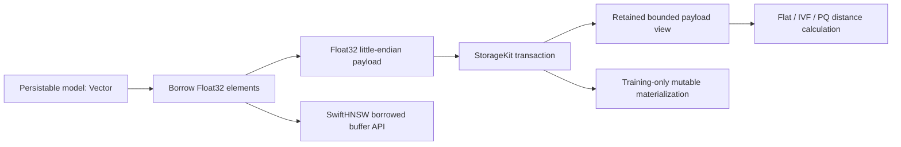

# Vector Storage And HNSW

## Goal

Vector indexes expose database-types `Vector` values while storing dense
Float32 payloads as compact binary data. Flat, HNSW, IVF, and PQ each own an
explicit persisted layout.

## Storage Contract

| Layer | User-Facing Shape | Physical Shape |
| --- | --- | --- |
| Model field | `Vector` | Borrowed Float32 elements at the index boundary |
| Debug / print | `[Float]` after explicit decode | Raw bytes only when inspecting storage directly |
| Flat index | `Vector` execution with `[Float]` convenience input | Borrowed `Float32` little-endian payload by primary key |
| HNSW index | `Vector` execution with `[Float]` convenience input | Borrowed vector owner plus label mappings and SwiftHNSW graph snapshot |
| IVF index | `Vector` query/result semantics | Trained centroids, inverted lists, and assignments |
| PQ index | `Vector` query/result semantics | Trained codebooks, byte codes, and retraining vectors |

## Current Physical Layout

| Algorithm | Keys | Values |
| --- | --- | --- |
| Flat | `[indexSubspace][primaryKey]` | Float32 little-endian vector payload |
| HNSW vectors | `[indexSubspace]/vectors/[label]` | Float32 little-endian vector payload |
| HNSW labels | `[indexSubspace]/labels/[primaryKey]` | Tuple-encoded label |
| HNSW primary keys | `[indexSubspace]/pks/[label]` | Tuple-encoded primary key |
| HNSW graph metadata | `[indexSubspace]/_graphMetadata` | Tuple(version, byteCount, chunkSize, chunkCount, revision) |
| HNSW graph chunks | `[indexSubspace]/_graphChunks/[chunk]` | SwiftHNSW versioned binary graph snapshot chunk |
| IVF centroids | `[subspace]/centroids/[clusterId]` | Float32 little-endian vector payload |
| IVF metadata | `[subspace]/metadata` | Structured training metadata |
| IVF lists | `[subspace]/lists/[clusterId]/[primaryKey]` | Float32 little-endian vector payload |
| IVF assignments | `[subspace]/assignments/[primaryKey]` | Tuple-encoded cluster id |
| PQ codebooks | `[subspace]/codebooks/[m]` | Flattened Float32 little-endian payload |
| PQ metadata | `[subspace]/metadata` | Structured training metadata |
| PQ codes | `[subspace]/codes/[primaryKey]` | Byte codes |
| PQ vectors | `[subspace]/vectors/[primaryKey]` | Float32 little-endian vector payload |

PQ search evaluates Euclidean, cosine, and dot-product distances from
query-specific lookup tables. The compressed vector is not reconstructed for
each candidate. Invalid codebook shapes and code ranges fail with
`ProductQuantizationError`.

Flat, IVF, PQ, HNSW, and Fusion search retain one owner for each query or
persisted payload and borrow its bounded storage synchronously. Persisted
Float32 values are read as unaligned little-endian elements so slicing does not
require alignment copies. PQ codebooks and compressed codes are each borrowed
once per evaluation. Only offline IVF/PQ training materializes mutable arrays,
because those algorithms revisit and mutate indexed elements across iterations.

## Copy Boundary Contract

| Path | Owner / View | Production Copy Budget |
| --- | --- | --- |
| `Vector` query builder | Retained canonical `Vector` owner | 0 copies at the builder boundary |
| Persisted Flat / IVF candidate | Retained `ByteString` plus `PersistedVectorView` | 0 copies and one synchronous borrow per distance evaluation |
| Persisted PQ codebook / code | Retained codebook owners plus flattened lookup table, bounded code borrow | 0 candidate reconstruction copies and one borrow per persisted payload |
| HNSW query / insert | Retained `Vector` owner borrowed by SwiftHNSW | 0 copies for finite Float32 values within backend magnitude limits |
| HNSW extreme cosine input | Explicit normalized `Vector` owner | 1 required copy because Float32 backend accumulation would otherwise become non-finite |
| Index persistence | Final little-endian `ByteString` owner | 1 required materialization at the persistence ownership boundary |
| IVF / PQ training | Independent mutable Float arrays | Intentional training-only materialization; never used by the production search path |
| Canonical wire / async driver boundary | Independently owned encoded buffer | Materialize only where the receiver may outlive the synchronous borrow |

The borrow-counting tests cover the production Flat, IVF, and PQ readers rather
than only conversion helpers. HNSW rejects extreme dot-product and Euclidean
inputs when rescaling would change their metric semantics; cosine may normalize
into a new owner because normalization preserves cosine distance.

## Shared-State Contract

There is no `hasFeature(Embedded)` or `canImport(Synchronization)` branch in the
reviewed DatabaseEngine and VectorIndex state paths. The same storage owner and
isolation primitive are compiled for every target.

| Logical state | Native | WASM | Embedded WASM | Read / mutation / release invariant |
| --- | --- | --- | --- | --- |
| HNSW graph cache entries and revision | `Mutex<State>` | `Mutex<State>` | `Mutex<State>` | Snapshot and replacement use `withLock`; graph search and external callbacks occur outside the state lock |
| HNSW non-thread-safe graph search | `Mutex<Void>` | `Mutex<Void>` | `Mutex<Void>` | The same serialized search entry point is used on every target |
| Context pending mutations and save state | `Mutex<ContextState>` | `Mutex<ContextState>` | `Mutex<ContextState>` | Staging and save transitions use the same mutation entry points; no lock crosses `await` |
| Storage lifecycle phase, operation count, waiters | `Mutex<State>` | `Mutex<State>` | `Mutex<State>` | Admission and shutdown transitions are identical; backend shutdown starts outside the lock |
| Operation lease exactly-once completion | `Mutex<Bool>` | `Mutex<Bool>` | `Mutex<Bool>` | Namespace borrows retain the concrete lease across `await`; release is idempotent and owner-scoped |

## Implementation History

| Milestone | Scope | Exit Criteria | Status |
| --- | --- | --- | --- |
| V0 Audit | Identify tuple-based vector payloads in VectorIndex. | Flat, HNSW, IVF, PQ, and Fusion direct reads are reviewed. | Done |
| V1 Binary Payloads | Store production vector payloads as Float32 little-endian bytes. | Flat, HNSW, IVF, and PQ dense values use binary payloads. | Done |
| V2 Strict Decode | Reject malformed payload lengths instead of silently skipping bytes. | Maintainer read paths create a validated retained `PersistedVectorView`; malformed length, non-finite values, and invalid element type are typed failures. | Done |
| V3 HNSW Snapshot Segmentation | Split large graph snapshots into storage-safe chunks. | Backend value-size limits are handled without changing user API. | Done |
| V4 HNSW Read Cache | Avoid per-query graph deserialization while preserving committed-update visibility. | Graph cache is keyed by metadata revision; write paths load fresh and readers refresh on metadata change. | Done |
| V5 Dependent Package Validation | Verify database-client and Cloudflare package paths do not assume tuple vector payloads. | Build and smoke tests pass across related packages. | Done |
| V6 Integration Release Gate | Run complete vector tests and dependent package builds. | Vector tests and dependent package builds pass with binary vector payloads. | Done |
| V7 Metric-Correct PQ | Preserve each configured metric without per-candidate reconstruction. | Euclidean, cosine, and dot-product lookup-table tests pass. | Done |
| V8 Borrowed Search Payloads | Remove candidate and codebook array materialization from all production search paths. | Owner identity, one-borrow counters, unaligned payloads, malformed lengths, non-finite values, Native FDB behavior, WASM, and Embedded WASM builds pass. | Done |

## Validation Log

Current validation follows the repository-wide Xcode test and Swift 6.4 WASI
build gates documented in [Production Readiness](../production-readiness.md).

| Date | Scope | Result |
| --- | --- | --- |
| 2026-08-01 | Consolidated `xcodebuild test` with per-test timeouts, Swift 6.4 snapshot `2026-07-23-a` | Passed: 98 tests, 0 failures, 0 skips; vector behavior, retraining, Fusion, namespace ownership, orphaned-index typed failure, and live FoundationDB paths |
| 2026-08-01 | `swift build --swift-sdk ..._wasm --disable-default-traits --traits VectorIndexes --product Database` | Passed: normal WASM `Database` product compile and link |
| 2026-08-01 | Cloudflare AllRuntimeFeatures feasibility gate with `..._wasm-embedded` | Passed: 8,319,476-byte final reactor, ABI verification, Node instantiate, startup vector write/index/query/delete, canonical DB operations, workerd RPC, and SQLite persistence after restart |
| 2026-08-01 | Embedded runtime budgets | Passed: 2,920,173 compressed bytes, 64 MiB address space, 43.942 ms startup |
| 2026-07-27 | `xcodebuild test -scheme VectorIndexFocused` with Swift 6.4 | Passed: 75 tests; includes explicit layout selection, metric-correct PQ, malformed payloads, and typed PQ failures |
| 2026-06-29 | `swift build --traits SQLite --target VectorIndex` with Swift 6.4 | Passed |
| 2026-06-29 | `swift test --traits SQLite --filter VectorConversionTests` with Swift 6.4 | Passed: 6 tests |
| 2026-06-29 | `swift test --filter VectorConversionTests` with Swift 6.4 | Passed: 6 tests |
| 2026-06-29 | `swift test --filter HNSWBasicBehaviorTests` with Swift 6.4 | Passed: 8 tests |
| 2026-06-29 | Legacy filtered-search suite with Swift 6.4 | Passed: 9 tests; the API was subsequently renamed to describe post-filter semantics accurately |
| 2026-06-29 | `swift test --traits SQLite --filter VectorAlgorithmMaintainerTests` with Swift 6.4 | Passed: 4 tests / 1 suite |
| 2026-06-29 | `swift test --traits SQLite --filter VectorIndexTests` with Swift 6.4 | Passed: 56 tests / 9 suites |
| 2026-06-29 | `swift test --filter VectorIndexTests` with Swift 6.4 and local FoundationDB | Passed: 65 tests / 11 suites |
| 2026-06-29 | `database-client`: `swift build +6.3.1` | Passed |
| 2026-06-29 | `database-framework-cloudflare`: `swift build +6.3.1` | Passed |
| 2026-06-29 | `swift build --build-tests` with Swift 6.4 | Passed with no compiler warnings |
| 2026-06-29 | `swift build --build-tests --traits SQLite` with Swift 6.4 | Passed with no compiler warnings |
| 2026-06-29 | `swift test --traits SQLite` with Swift 6.4 | Passed |

## Design Rules

- Use database-types `Vector` as the portable user-facing and schema value.
- Borrow contiguous vector elements when computing distance or writing binary
  payloads; materialize an array only at an explicit API ownership boundary.
- Store persisted vector payloads as Float32 little-endian bytes.
- Use structured values only for metadata and mappings, not for dense vector payloads.
- Decode to arrays for debug output, print-oriented inspection, and algorithms
  that explicitly require independent mutable training storage. Search paths
  retain the owner and borrow bounded views instead.
- Treat malformed vector payloads as index corruption and throw typed errors.
- Keep algorithm-specific runtime snapshots versioned and separate from model storage.
