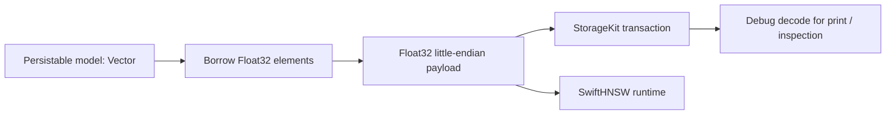

# Vector Storage And HNSW

## Goal

Vector indexes expose database-types `Vector` values while storing dense
Float32 payloads as compact binary data. Flat, HNSW, IVF, and PQ each own an
explicit persisted layout.

## Storage Contract

| Layer | User-Facing Shape | Physical Shape |
| --- | --- | --- |
| Model field | `Vector` | Borrowed Float32 elements at the index boundary |
| Debug / print | `[Float]` after explicit decode | Raw bytes only when inspecting storage directly |
| Flat index | `[Float]` query/result semantics | `Float32` little-endian payload by primary key |
| HNSW index | `[Float]` query/result semantics | Label mappings plus SwiftHNSW graph snapshot and binary vector payloads |
| IVF index | `Vector` query/result semantics | Trained centroids, inverted lists, and assignments |
| PQ index | `Vector` query/result semantics | Trained codebooks, byte codes, and retraining vectors |

## Current Physical Layout

| Algorithm | Keys | Values |
| --- | --- | --- |
| Flat | `[indexSubspace][primaryKey]` | Float32 little-endian vector payload |
| HNSW vectors | `[indexSubspace]/vectors/[label]` | Float32 little-endian vector payload |
| HNSW labels | `[indexSubspace]/labels/[primaryKey]` | Tuple-encoded label |
| HNSW primary keys | `[indexSubspace]/pks/[label]` | Tuple-encoded primary key |
| HNSW graph metadata | `[indexSubspace]/_graphMetadata` | Tuple(version, byteCount, chunkSize, chunkCount, revision) |
| HNSW graph chunks | `[indexSubspace]/_graphChunks/[chunk]` | SwiftHNSW versioned binary graph snapshot chunk |
| IVF centroids | `[subspace]/centroids/[clusterId]` | Float32 little-endian vector payload |
| IVF metadata | `[subspace]/metadata` | Structured training metadata |
| IVF lists | `[subspace]/lists/[clusterId]/[primaryKey]` | Float32 little-endian vector payload |
| IVF assignments | `[subspace]/assignments/[primaryKey]` | Tuple-encoded cluster id |
| PQ codebooks | `[subspace]/codebooks/[m]` | Flattened Float32 little-endian payload |
| PQ metadata | `[subspace]/metadata` | Structured training metadata |
| PQ codes | `[subspace]/codes/[primaryKey]` | Byte codes |
| PQ vectors | `[subspace]/vectors/[primaryKey]` | Float32 little-endian vector payload |

PQ search evaluates Euclidean, cosine, and dot-product distances from
query-specific lookup tables. The compressed vector is not reconstructed for
each candidate. Invalid codebook shapes and code ranges fail with
`ProductQuantizationError`.

## Implementation History

| Milestone | Scope | Exit Criteria | Status |
| --- | --- | --- | --- |
| V0 Audit | Identify tuple-based vector payloads in VectorIndex. | Flat, HNSW, IVF, PQ, and Fusion direct reads are reviewed. | Done |
| V1 Binary Payloads | Store production vector payloads as Float32 little-endian bytes. | Flat, HNSW, IVF, and PQ dense values use binary payloads. | Done |
| V2 Strict Decode | Reject malformed payload lengths instead of silently skipping bytes. | Maintainer read paths use `decodeFloatArray(_:expectedCount:)`. | Done |
| V3 HNSW Snapshot Segmentation | Split large graph snapshots into storage-safe chunks. | Backend value-size limits are handled without changing user API. | Done |
| V4 HNSW Read Cache | Avoid per-query graph deserialization while preserving committed-update visibility. | Graph cache is keyed by metadata revision; write paths load fresh and readers refresh on metadata change. | Done |
| V5 Dependent Package Validation | Verify database-client and Cloudflare package paths do not assume tuple vector payloads. | Build and smoke tests pass across related packages. | Done |
| V6 Integration Release Gate | Run complete vector tests and dependent package builds. | Vector tests and dependent package builds pass with binary vector payloads. | Done |
| V7 Metric-Correct PQ | Preserve each configured metric without per-candidate reconstruction. | Euclidean, cosine, and dot-product lookup-table tests pass. | Done |
| V8 Performance Snapshot Refresh | Refresh published VectorIndex benchmark numbers. | A current benchmark report is committed before updating public latency/throughput claims. | Open |

## Validation Log

This table is a historical record of the commands used for the 2026-06-29
snapshot. Current validation follows the repository-wide Xcode test and Swift
6.4 WASI build gates documented in [Production Readiness](../production-readiness.md).

| Date | Scope | Result |
| --- | --- | --- |
| 2026-07-27 | `xcodebuild test -scheme VectorIndexFocused` with Swift 6.4 | Passed: 75 tests; includes explicit layout selection, metric-correct PQ, malformed payloads, and typed PQ failures |
| 2026-06-29 | `swift build --traits SQLite --target VectorIndex` with Swift 6.4 | Passed |
| 2026-06-29 | `swift test --traits SQLite --filter VectorConversionTests` with Swift 6.4 | Passed: 6 tests |
| 2026-06-29 | `swift test --filter VectorConversionTests` with Swift 6.4 | Passed: 6 tests |
| 2026-06-29 | `swift test --filter HNSWBasicBehaviorTests` with Swift 6.4 | Passed: 8 tests |
| 2026-06-29 | Legacy filtered-search suite with Swift 6.4 | Passed: 9 tests; the API was subsequently renamed to describe post-filter semantics accurately |
| 2026-06-29 | `swift test --traits SQLite --filter VectorAlgorithmMaintainerTests` with Swift 6.4 | Passed: 4 tests / 1 suite |
| 2026-06-29 | `swift test --traits SQLite --filter VectorIndexTests` with Swift 6.4 | Passed: 56 tests / 9 suites |
| 2026-06-29 | `swift test --filter VectorIndexTests` with Swift 6.4 and local FoundationDB | Passed: 65 tests / 11 suites |
| 2026-06-29 | `database-client`: `swift build +6.3.1` | Passed |
| 2026-06-29 | `database-framework-cloudflare`: `swift build +6.3.1` | Passed |
| 2026-06-29 | `swift build --build-tests` with Swift 6.4 | Passed with no compiler warnings |
| 2026-06-29 | `swift build --build-tests --traits SQLite` with Swift 6.4 | Passed with no compiler warnings |
| 2026-06-29 | `swift test --traits SQLite` with Swift 6.4 | Passed |

## Design Rules

- Use database-types `Vector` as the portable user-facing and schema value.
- Borrow contiguous vector elements when computing distance or writing binary
  payloads; materialize an array only at an explicit API ownership boundary.
- Store persisted vector payloads as Float32 little-endian bytes.
- Use structured values only for metadata and mappings, not for dense vector payloads.
- Decode to arrays for debug output, print-oriented inspection, and public result materialization.
- Treat malformed vector payloads as index corruption and throw typed errors.
- Keep algorithm-specific runtime snapshots versioned and separate from model storage.
